# Web Platform Experiments

A gallery of standalone experiments exploring native capabilities of the Web Platform through HTML, CSS, SVG, Canvas, Web APIs, graphics, animation, interaction, and related browser technologies.

Experiments are grouped by run version and model. When available, each entry links to its runnable demo, technical report, development journal, and primary visual result.

---

# v1

[View prompt](v1/PROMPT.md)

## gemini-3.8

**42 experiments**

|  | [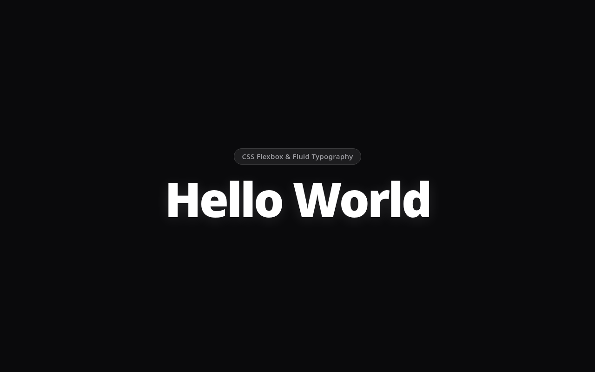](v1/gemini-3.8/002/002.html) | [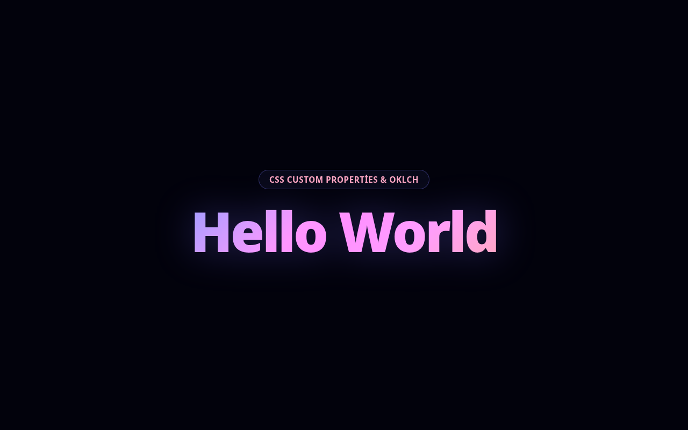](v1/gemini-3.8/003/003.html) |
| :---: | :---: | :---: |
| **001 — Yalın Semantik HTML ile Başlangıç Referansı** [Demo](v1/gemini-3.8/001/001.html) · [Report](v1/gemini-3.8/001/report.md) · [Journal](v1/gemini-3.8/001/journal.md) | **002 — CSS Flexbox ve Akışkan Tipografi ile Esnek Odak** [Demo](v1/gemini-3.8/002/002.html) · [Report](v1/gemini-3.8/002/report.md) · [Journal](v1/gemini-3.8/002/journal.md) | **003 — CSS Custom Properties ve OKLCH Algısal Renk Uzayı ile Işıltılı Tipografi** [Demo](v1/gemini-3.8/003/003.html) · [Report](v1/gemini-3.8/003/report.md) · [Journal](v1/gemini-3.8/003/journal.md) |

| [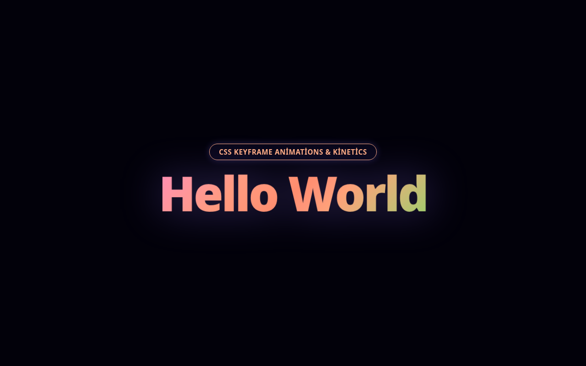](v1/gemini-3.8/004/004.html) | [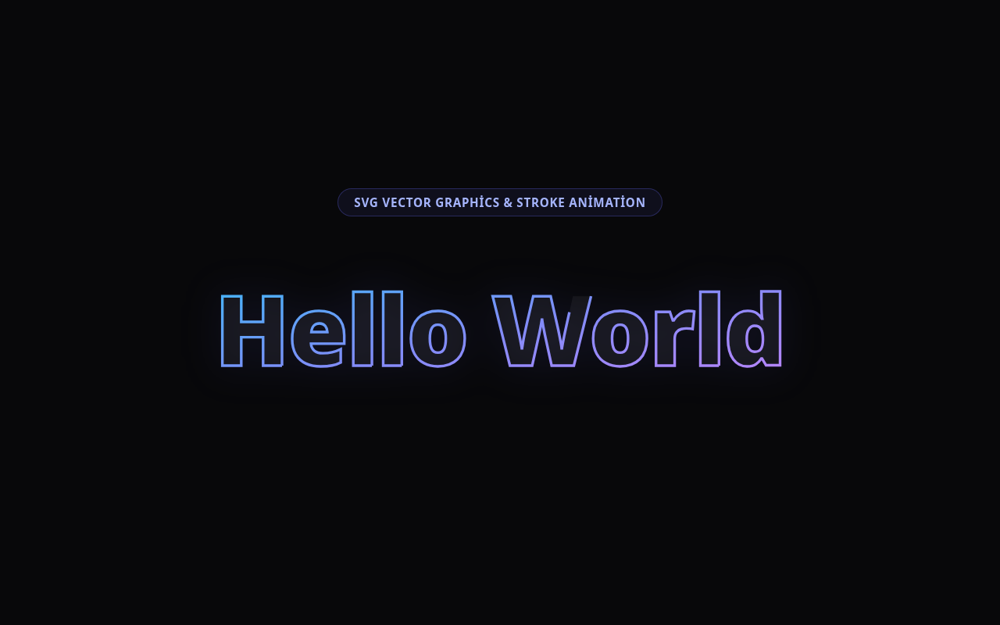](v1/gemini-3.8/005/005.html) |  |
| :---: | :---: | :---: |
| **004 — CSS Keyframe Animasyonları ve Kinetik Tipografi** [Demo](v1/gemini-3.8/004/004.html) · [Report](v1/gemini-3.8/004/report.md) · [Journal](v1/gemini-3.8/004/journal.md) | **005 — SVG Vektörel Kontur Çizimi ve Geometrik Tipografi** [Demo](v1/gemini-3.8/005/005.html) · [Report](v1/gemini-3.8/005/report.md) · [Journal](v1/gemini-3.8/005/journal.md) | **006 — Canvas 2D API ve İnteraktif Parçacık Tipografisi** [Demo](v1/gemini-3.8/006/006.html) · [Report](v1/gemini-3.8/006/report.md) · [Journal](v1/gemini-3.8/006/journal.md) |

| [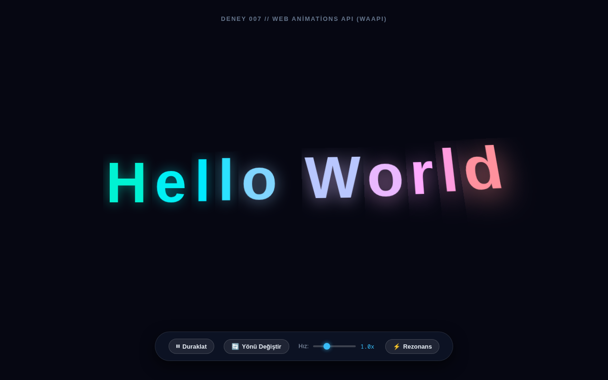](v1/gemini-3.8/007/007.html) | [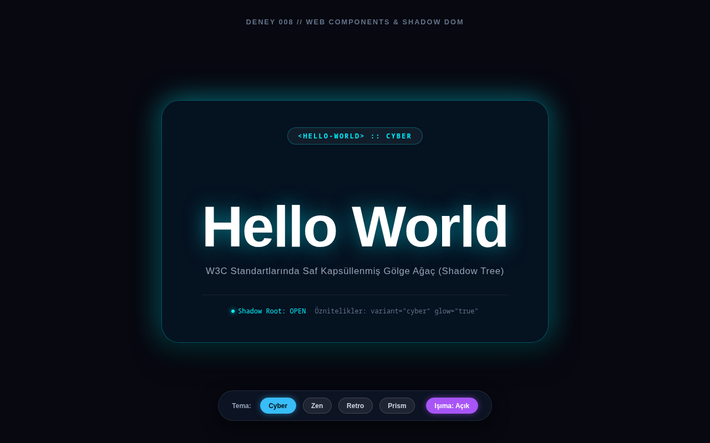](v1/gemini-3.8/008/008.html) | [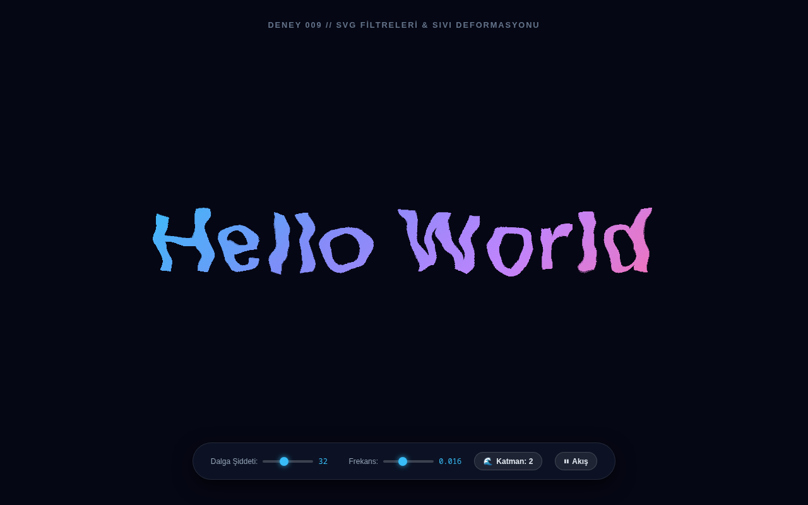](v1/gemini-3.8/009/009.html) |
| :---: | :---: | :---: |
| **007 — Web Animations API (WAAPI) ve Koreografik Tipografi** [Demo](v1/gemini-3.8/007/007.html) · [Report](v1/gemini-3.8/007/report.md) · [Journal](v1/gemini-3.8/007/journal.md) | **008 — Web Components ve Shadow DOM Mimarisi** [Demo](v1/gemini-3.8/008/008.html) · [Report](v1/gemini-3.8/008/report.md) · [Journal](v1/gemini-3.8/008/journal.md) | **009 — SVG Filtreleri ve Sıvı Deformasyonu** [Demo](v1/gemini-3.8/009/009.html) · [Report](v1/gemini-3.8/009/report.md) · [Journal](v1/gemini-3.8/009/journal.md) |

| [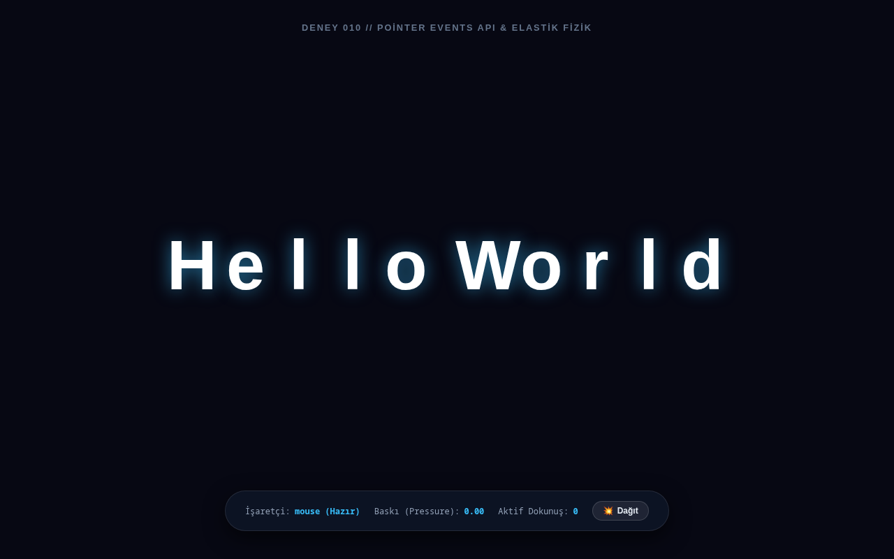](v1/gemini-3.8/010/010.html) | [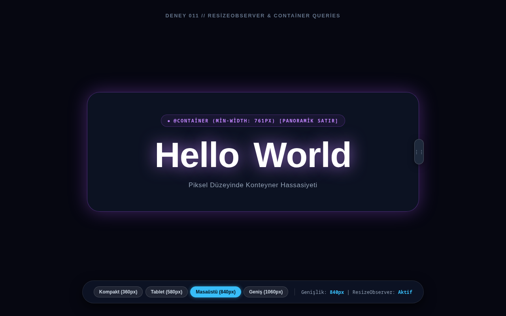](v1/gemini-3.8/011/011.html) | [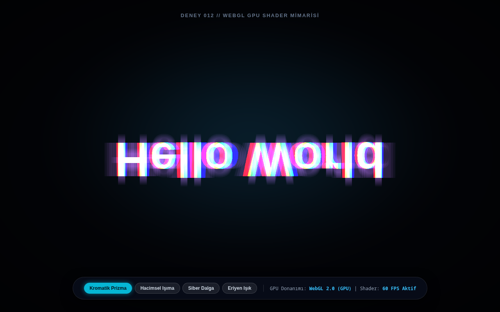](v1/gemini-3.8/012/012.html) |
| :---: | :---: | :---: |
| **010 — Pointer Events API ve Elastik Fizik** [Demo](v1/gemini-3.8/010/010.html) · [Report](v1/gemini-3.8/010/report.md) · [Journal](v1/gemini-3.8/010/journal.md) | **011 — ResizeObserver ve Container Queries** [Demo](v1/gemini-3.8/011/011.html) · [Report](v1/gemini-3.8/011/report.md) · [Journal](v1/gemini-3.8/011/journal.md) | **012 — WebGL Shader ve 3D Hacimsel Tipografi** [Demo](v1/gemini-3.8/012/012.html) · [Report](v1/gemini-3.8/012/report.md) · [Journal](v1/gemini-3.8/012/journal.md) |

| [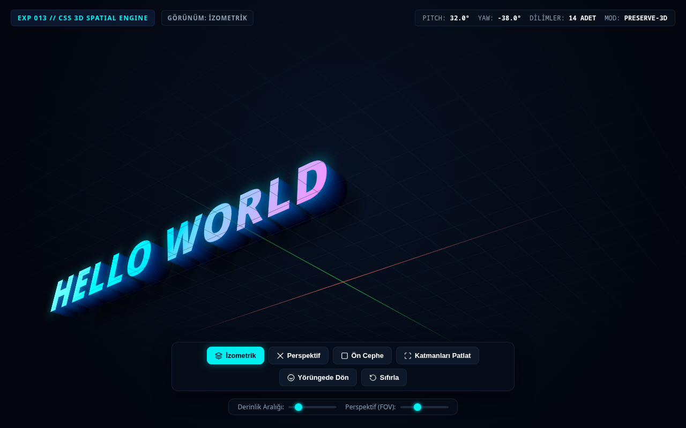](v1/gemini-3.8/013/013.html) |  | [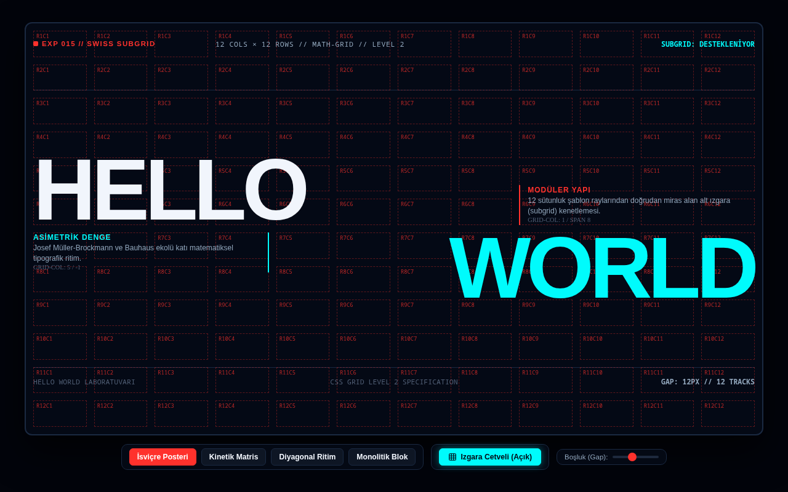](v1/gemini-3.8/015/015.html) |
| :---: | :---: | :---: |
| **013 — CSS 3D Transforms ve Uzamsal İzometrik Tipografi** [Demo](v1/gemini-3.8/013/013.html) · [Report](v1/gemini-3.8/013/report.md) · [Journal](v1/gemini-3.8/013/journal.md) | **014 — Web Audio API ve Akustik Dalga Tipografisi** [Demo](v1/gemini-3.8/014/014.html) · [Report](v1/gemini-3.8/014/report.md) · [Journal](v1/gemini-3.8/014/journal.md) | **015 — CSS Grid & Subgrid Mimarisi ile Modüler İsviçre Tipografisi** [Demo](v1/gemini-3.8/015/015.html) · [Report](v1/gemini-3.8/015/report.md) · [Journal](v1/gemini-3.8/015/journal.md) |

|  |  | [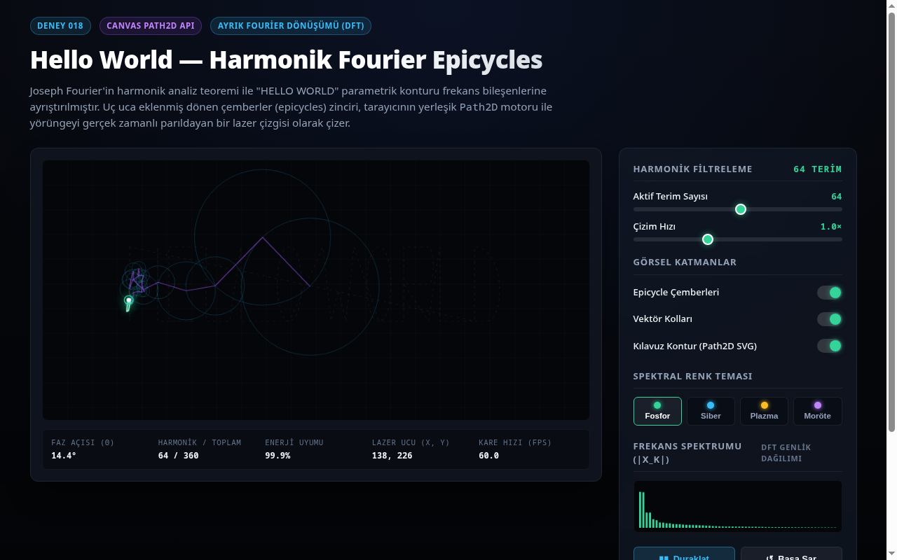](v1/gemini-3.8/018/018.html) |
| :---: | :---: | :---: |
| **016 — Web Cryptography API ve Matris Şifre Çözücü Tipografi** [Demo](v1/gemini-3.8/016/016.html) · [Report](v1/gemini-3.8/016/report.md) · [Journal](v1/gemini-3.8/016/journal.md) | **017 — Web Workers API ve Çok İş Parçacıklı Boids Sürü Tipografisi** [Demo](v1/gemini-3.8/017/017.html) · [Report](v1/gemini-3.8/017/report.md) · [Journal](v1/gemini-3.8/017/journal.md) | **018 — Canvas Path2D ve Fourier Epicycles ile Harmonik Tipografi** [Demo](v1/gemini-3.8/018/018.html) · [Report](v1/gemini-3.8/018/report.md) · [Journal](v1/gemini-3.8/018/journal.md) |

| [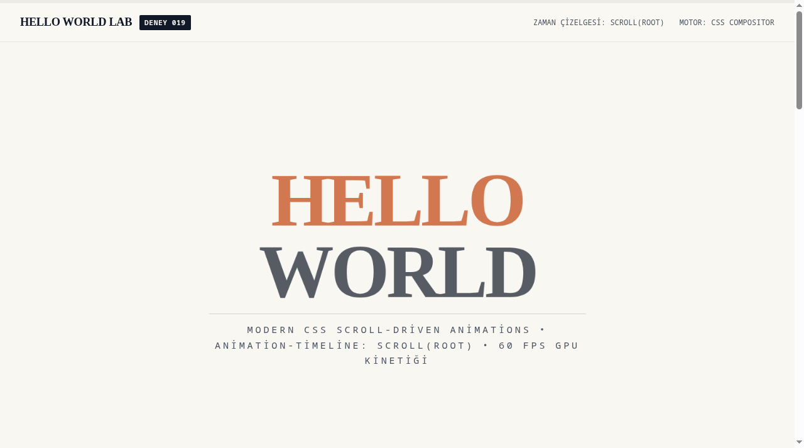](v1/gemini-3.8/019/019.html) | [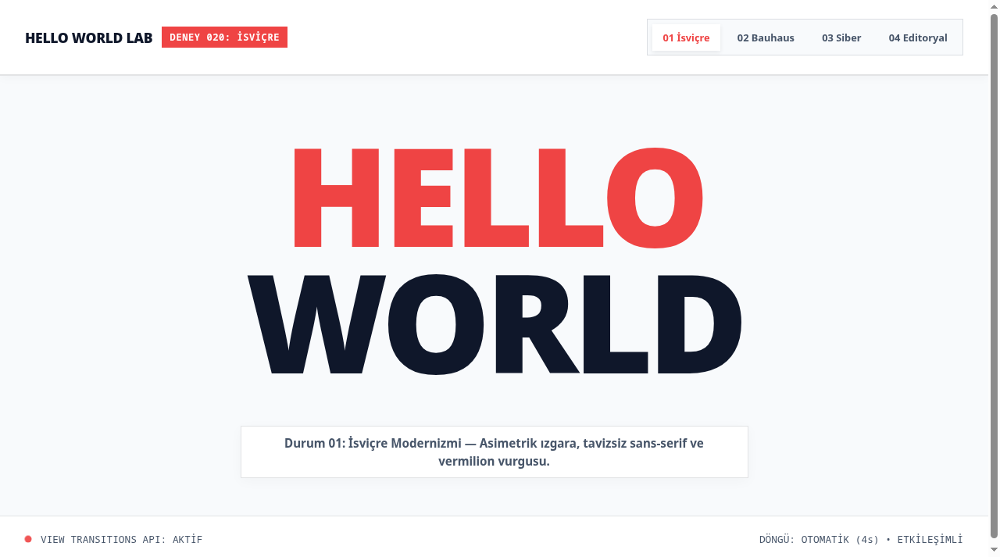](v1/gemini-3.8/020/020.html) | [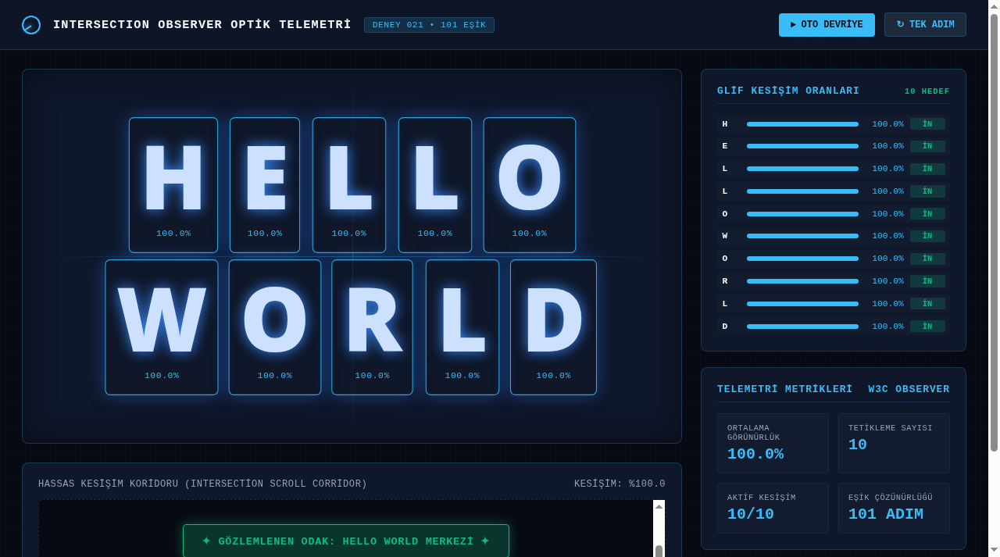](v1/gemini-3.8/021/021.html) |
| :---: | :---: | :---: |
| **019 — Modern CSS Scroll-Driven Animations ve Kinetik Editoryal Tipografi** [Demo](v1/gemini-3.8/019/019.html) · [Report](v1/gemini-3.8/019/report.md) · [Journal](v1/gemini-3.8/019/journal.md) | **020 — View Transitions API ve Çok Durumlu Morfolojik Tipografi** [Demo](v1/gemini-3.8/020/020.html) · [Report](v1/gemini-3.8/020/report.md) · [Journal](v1/gemini-3.8/020/journal.md) | **021 — IntersectionObserver API ve Çok Eşikli Kinetik Tipografik Telemetri** [Demo](v1/gemini-3.8/021/021.html) · [Report](v1/gemini-3.8/021/report.md) · [Journal](v1/gemini-3.8/021/journal.md) |

| [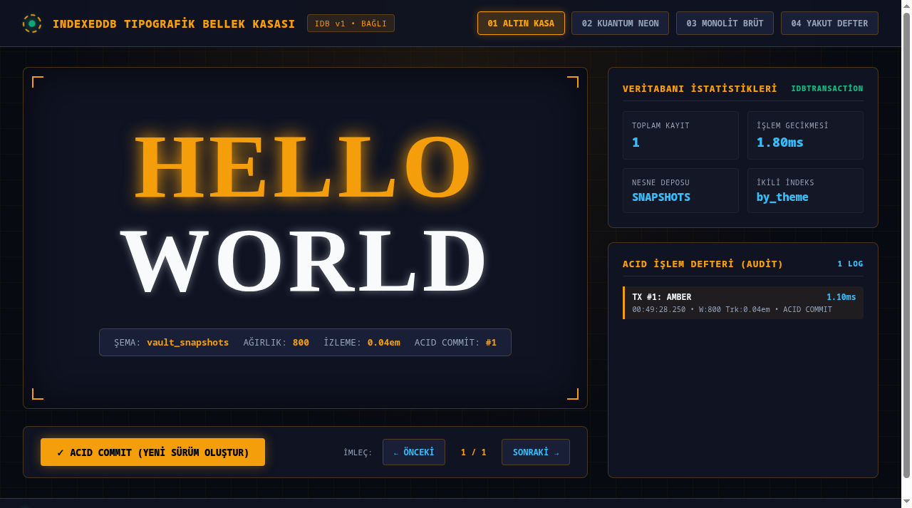](v1/gemini-3.8/022/022.html) | [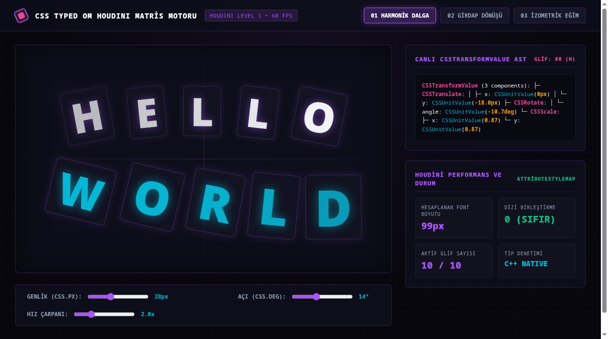](v1/gemini-3.8/023/023.html) | [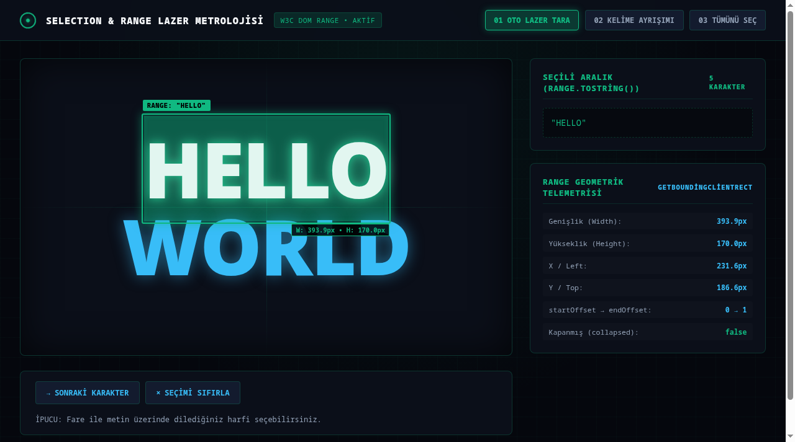](v1/gemini-3.8/024/024.html) |
| :---: | :---: | :---: |
| **022 — IndexedDB API ve Kalıcı Tipografik Bellek Kasası** [Demo](v1/gemini-3.8/022/022.html) · [Report](v1/gemini-3.8/022/report.md) · [Journal](v1/gemini-3.8/022/journal.md) | **023 — CSS Typed Object Model (CSS Typed OM) API ve Tip Güvenli Houdini Tipografik Matris Motoru** [Demo](v1/gemini-3.8/023/023.html) · [Report](v1/gemini-3.8/023/report.md) · [Journal](v1/gemini-3.8/023/journal.md) | **024 — Selection & Range API ve Tipografik Lazer Dilimleme Geometrisi** [Demo](v1/gemini-3.8/024/024.html) · [Report](v1/gemini-3.8/024/report.md) · [Journal](v1/gemini-3.8/024/journal.md) |

| [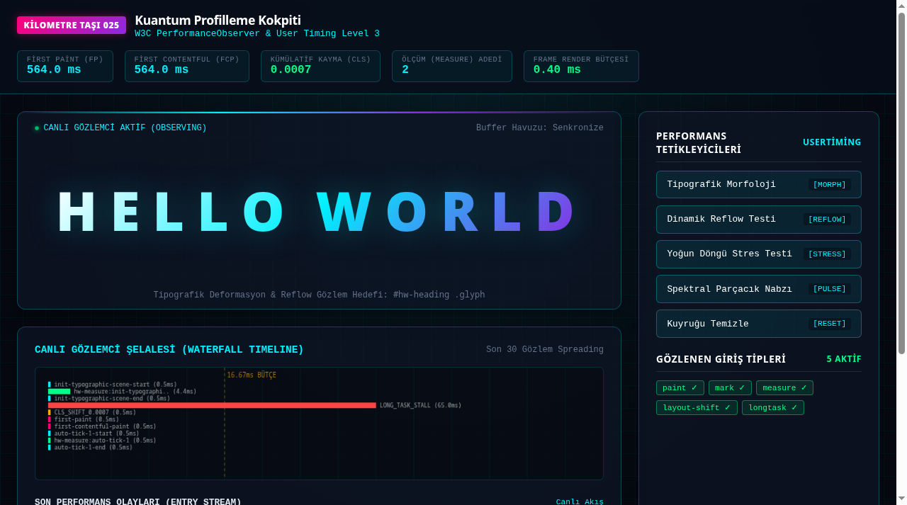](v1/gemini-3.8/025/025.html) | [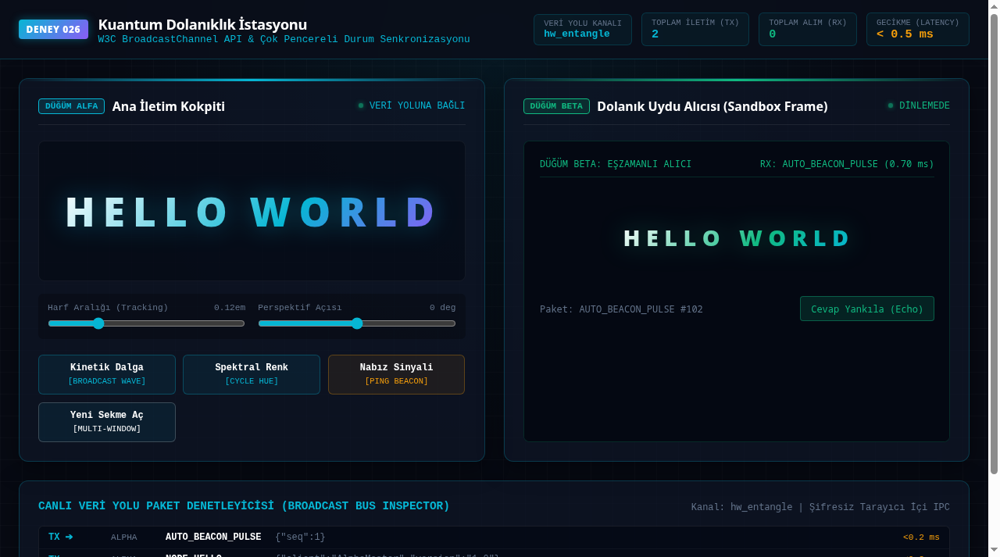](v1/gemini-3.8/026/026.html) | [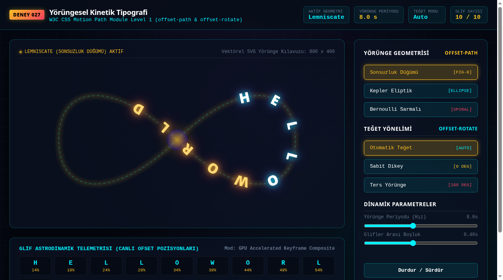](v1/gemini-3.8/027/027.html) |
| :---: | :---: | :---: |
| **025 — PerformanceObserver API & Yüksek Çözünürlüklü Tipografik Profilleme Kokpiti** [Demo](v1/gemini-3.8/025/025.html) · [Report](v1/gemini-3.8/025/report.md) · [Journal](v1/gemini-3.8/025/journal.md) | **026 — BroadcastChannel API & Çok Düğümlü Kuantum Dolanık Tipografi** [Demo](v1/gemini-3.8/026/026.html) · [Report](v1/gemini-3.8/026/report.md) · [Journal](v1/gemini-3.8/026/journal.md) | **027 — CSS Motion Path API & Yörüngesel Kinetik Tipografi** [Demo](v1/gemini-3.8/027/027.html) · [Report](v1/gemini-3.8/027/report.md) · [Journal](v1/gemini-3.8/027/journal.md) |

| [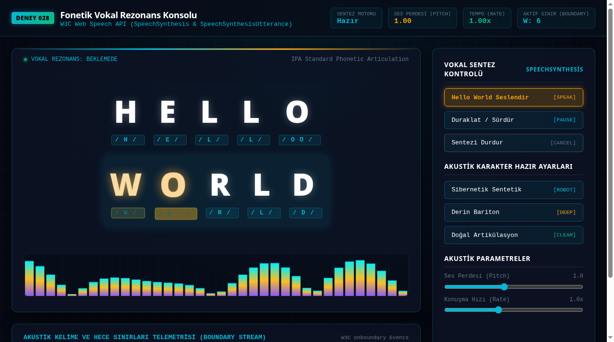](v1/gemini-3.8/028/028.html) | [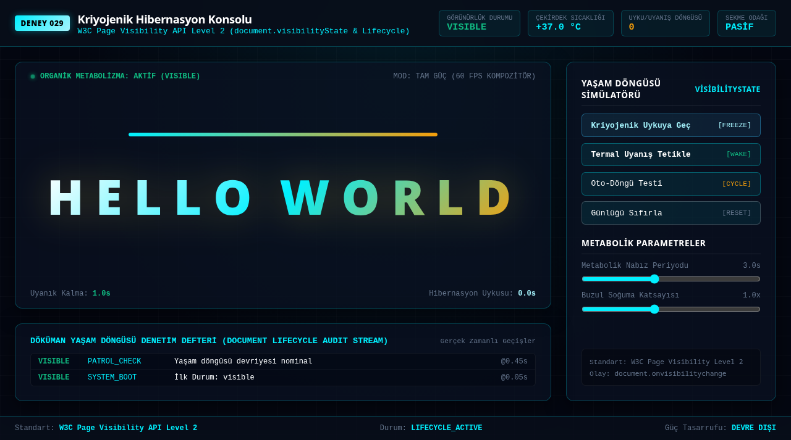](v1/gemini-3.8/029/029.html) | [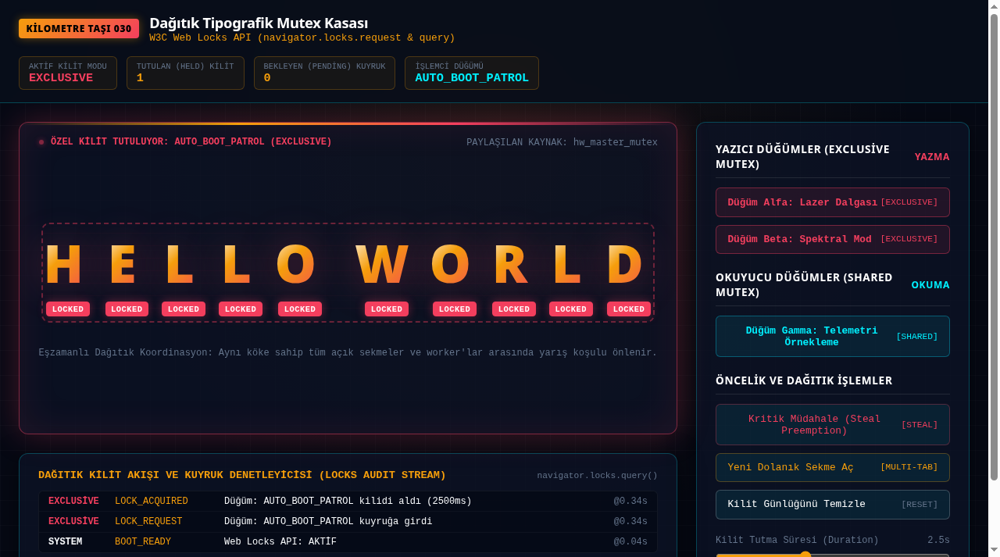](v1/gemini-3.8/030/030.html) |
| :---: | :---: | :---: |
| **028 — Web Speech API & Fonetik Akustik Vokal Tipografisi** [Demo](v1/gemini-3.8/028/028.html) · [Report](v1/gemini-3.8/028/report.md) · [Journal](v1/gemini-3.8/028/journal.md) | **029 — Page Visibility API & Kriyojenik Hibernasyon Tipografisi** [Demo](v1/gemini-3.8/029/029.html) · [Report](v1/gemini-3.8/029/report.md) · [Journal](v1/gemini-3.8/029/journal.md) | **030 — Deney 030** [Demo](v1/gemini-3.8/030/030.html) · [Report](v1/gemini-3.8/030/report.md) · [Journal](v1/gemini-3.8/030/journal.md) |

| [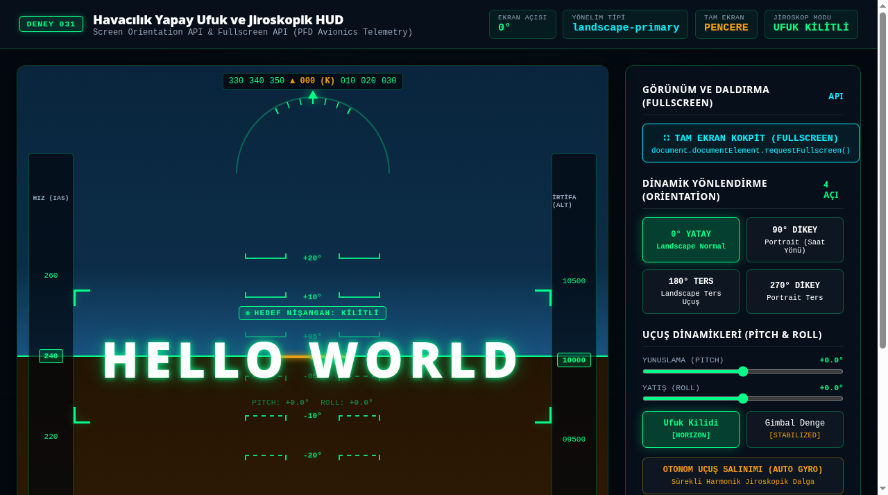](v1/gemini-3.8/031/031.html) | [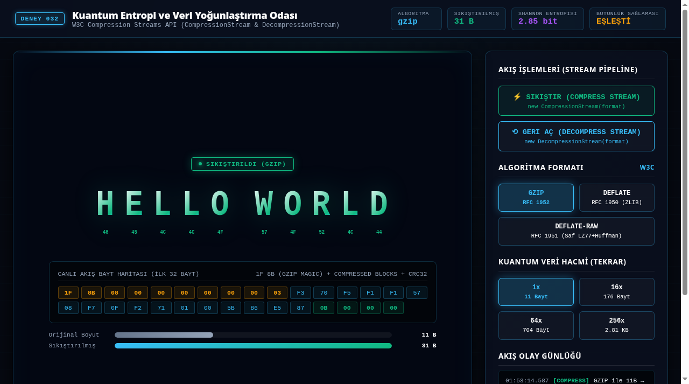](v1/gemini-3.8/032/032.html) | [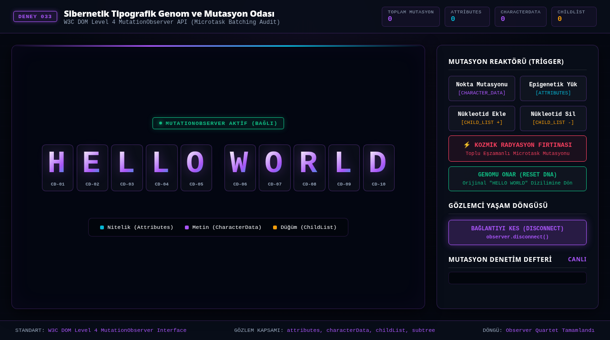](v1/gemini-3.8/033/033.html) |
| :---: | :---: | :---: |
| **031 — Deney 031** [Demo](v1/gemini-3.8/031/031.html) · [Report](v1/gemini-3.8/031/report.md) · [Journal](v1/gemini-3.8/031/journal.md) | **032 — Deney 032** [Demo](v1/gemini-3.8/032/032.html) · [Report](v1/gemini-3.8/032/report.md) · [Journal](v1/gemini-3.8/032/journal.md) | **033 — Deney 033** [Demo](v1/gemini-3.8/033/033.html) · [Report](v1/gemini-3.8/033/report.md) · [Journal](v1/gemini-3.8/033/journal.md) |

| [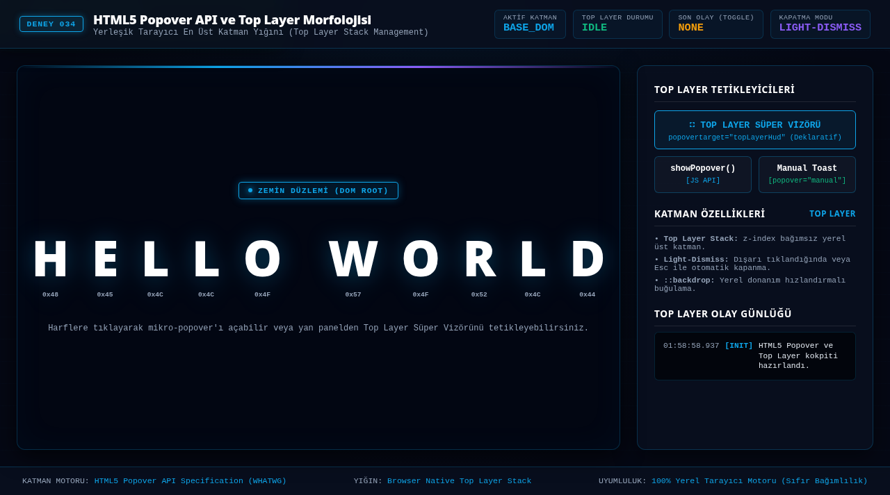](v1/gemini-3.8/034/034.html) | [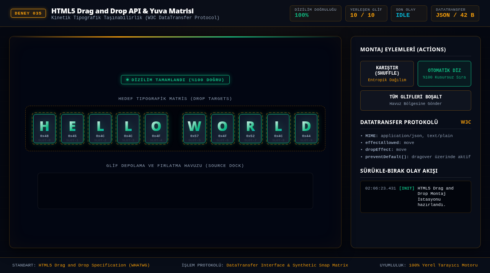](v1/gemini-3.8/035/035.html) | [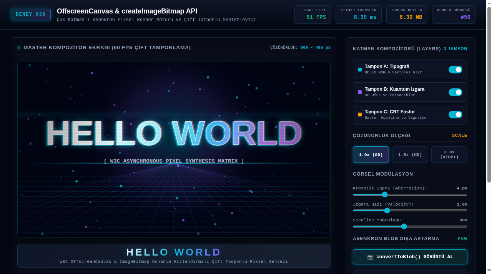](v1/gemini-3.8/036/036.html) |
| :---: | :---: | :---: |
| **034 — Deney 034** [Demo](v1/gemini-3.8/034/034.html) · [Report](v1/gemini-3.8/034/report.md) · [Journal](v1/gemini-3.8/034/journal.md) | **035 — Deney 035** [Demo](v1/gemini-3.8/035/035.html) · [Report](v1/gemini-3.8/035/report.md) · [Journal](v1/gemini-3.8/035/journal.md) | **036 — Deney 036** [Demo](v1/gemini-3.8/036/036.html) · [Report](v1/gemini-3.8/036/report.md) · [Journal](v1/gemini-3.8/036/journal.md) |

| [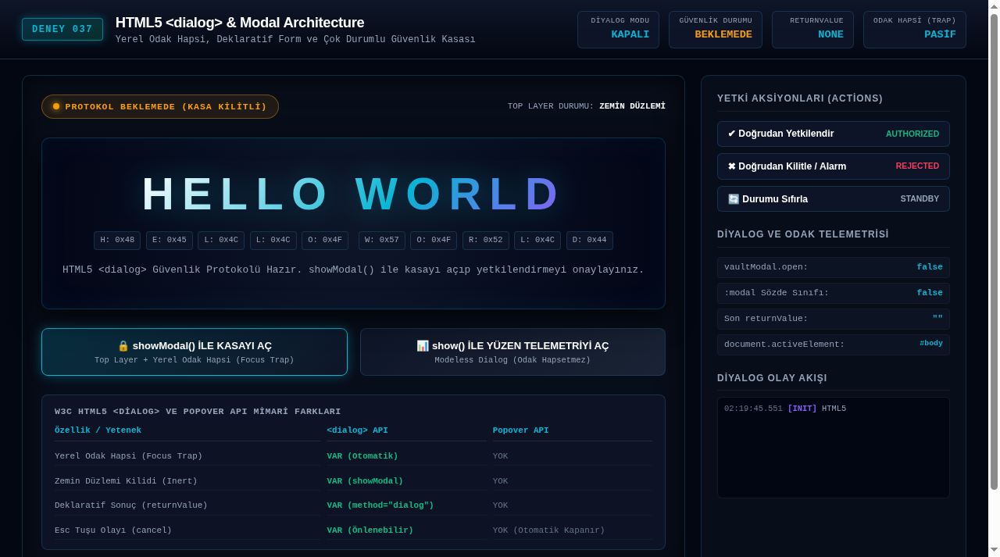](v1/gemini-3.8/037/037.html) | [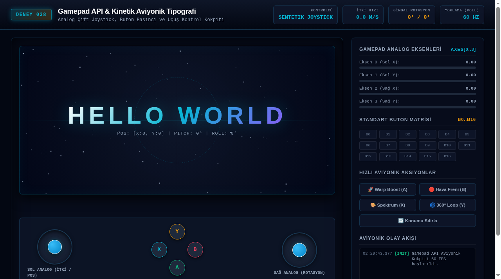](v1/gemini-3.8/038/038.html) | [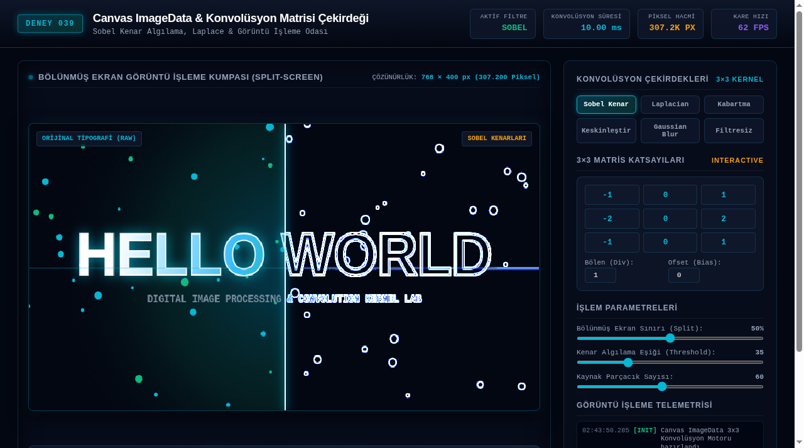](v1/gemini-3.8/039/039.html) |
| :---: | :---: | :---: |
| **037 — Deney 037** [Demo](v1/gemini-3.8/037/037.html) · [Report](v1/gemini-3.8/037/report.md) · [Journal](v1/gemini-3.8/037/journal.md) | **038 — Deney 038** [Demo](v1/gemini-3.8/038/038.html) · [Report](v1/gemini-3.8/038/report.md) · [Journal](v1/gemini-3.8/038/journal.md) | **039 — Canvas ImageData & Konvolüsyon Matrisi Çekirdeği** [Demo](v1/gemini-3.8/039/039.html) · [Report](v1/gemini-3.8/039/report.md) · [Journal](v1/gemini-3.8/039/journal.md) |

| [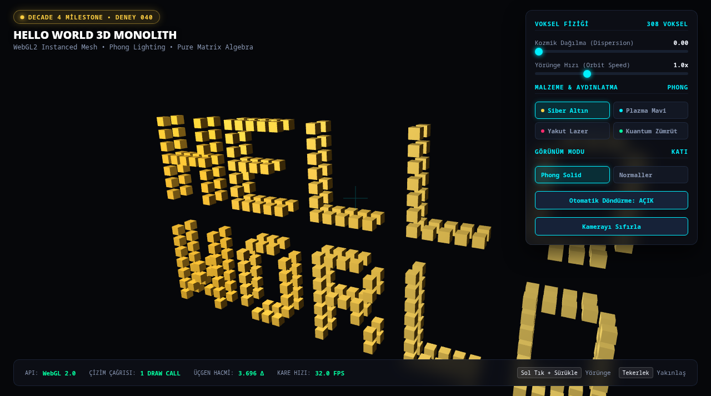](v1/gemini-3.8/040/040.html) | [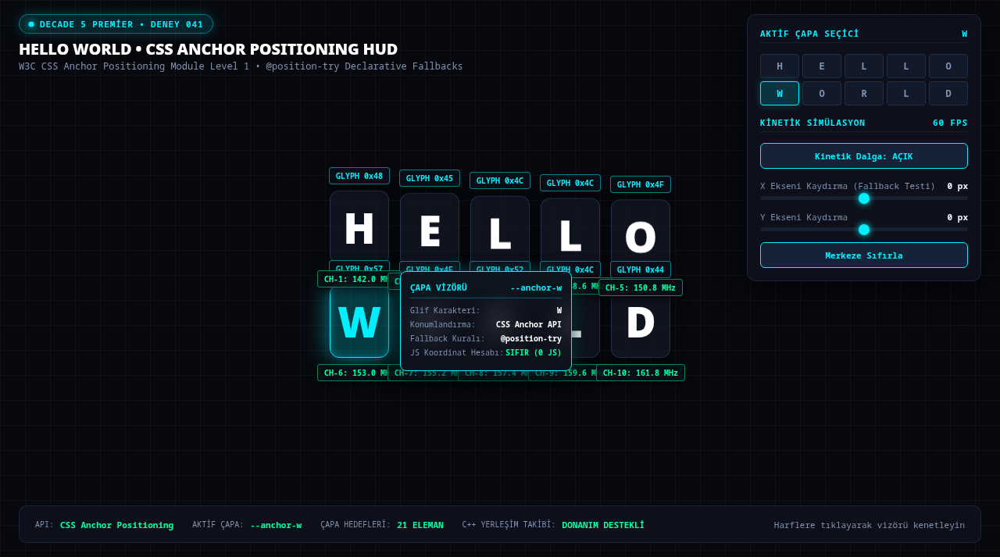](v1/gemini-3.8/041/041.html) | [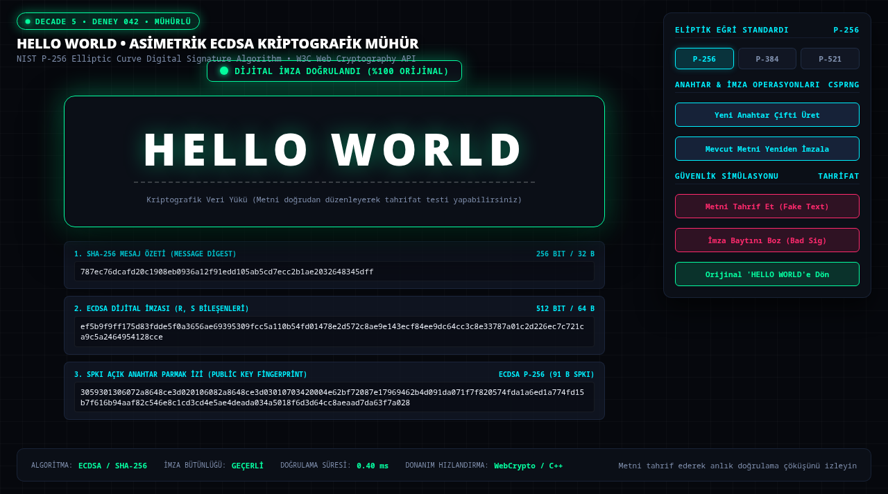](v1/gemini-3.8/042/042.html) |
| :---: | :---: | :---: |
| **040 — WebGL2 Instanced 3D Voksel Tipografisi & Phong Işık Monoliti (Decade 4 Milestone)** [Demo](v1/gemini-3.8/040/040.html) · [Report](v1/gemini-3.8/040/report.md) · [Journal](v1/gemini-3.8/040/journal.md) | **041 — CSS Anchor Positioning API & Kuantum Aviyonik Telemetri Ağı** [Demo](v1/gemini-3.8/041/041.html) · [Report](v1/gemini-3.8/041/report.md) · [Journal](v1/gemini-3.8/041/journal.md) | **042 — Web Cryptography API & Asimetrik ECDSA Dijital İmza Monoliti** [Demo](v1/gemini-3.8/042/042.html) · [Report](v1/gemini-3.8/042/report.md) · [Journal](v1/gemini-3.8/042/journal.md) |

## luna-5.6

**10 experiments**

|  | [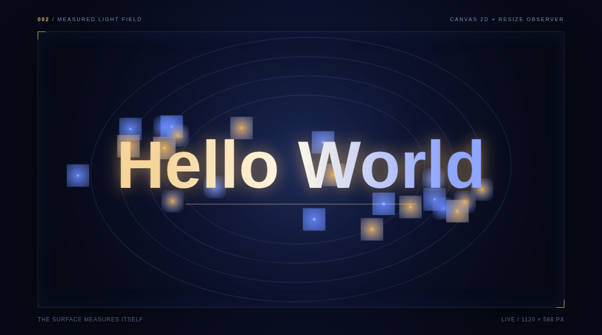](v1/luna-5.6/002/002.html) | [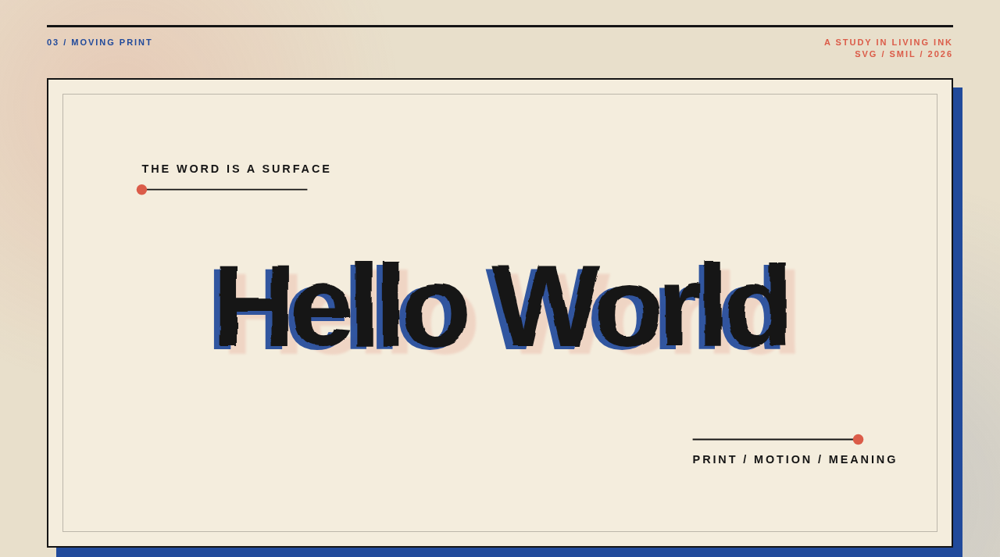](v1/luna-5.6/003/003.html) |
| :---: | :---: | :---: |
| **001 — Yalın semantik Hello World** [Demo](v1/luna-5.6/001/001.html) · [Report](v1/luna-5.6/001/report.md) · [Journal](v1/luna-5.6/001/journal.md) | **002 — Ölçülen ışık alanında Hello World** [Demo](v1/luna-5.6/002/002.html) · [Report](v1/luna-5.6/002/report.md) · [Journal](v1/luna-5.6/002/journal.md) | **003 — Hareketli baskı yüzeyinde Hello World** [Demo](v1/luna-5.6/003/003.html) · [Report](v1/luna-5.6/003/report.md) · [Journal](v1/luna-5.6/003/journal.md) |

| [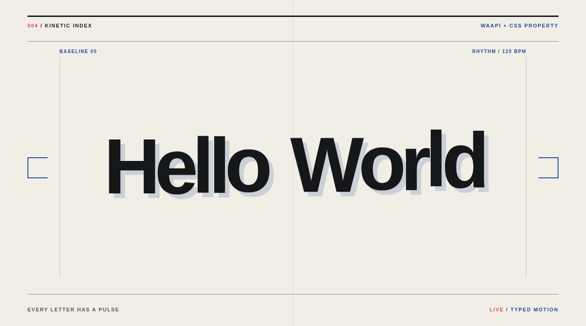](v1/luna-5.6/004/004.html) | [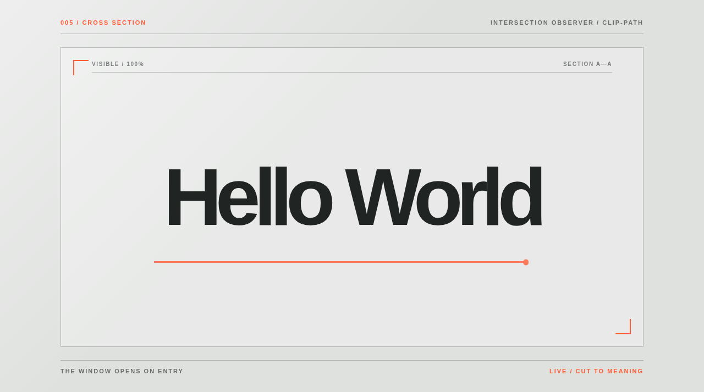](v1/luna-5.6/005/005.html) | [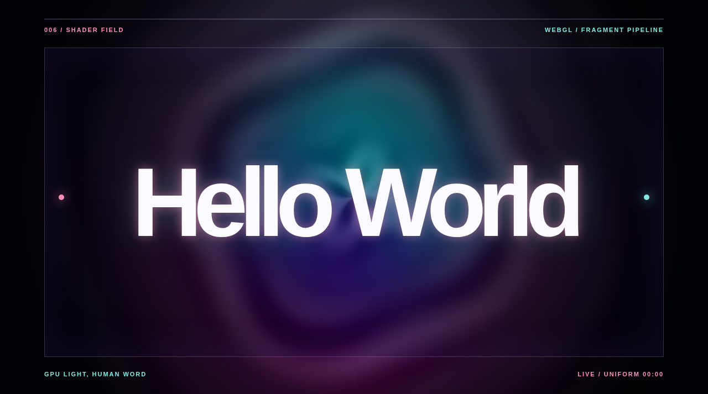](v1/luna-5.6/006/006.html) |
| :---: | :---: | :---: |
| **004 — Kinetik indeks: Hello World** [Demo](v1/luna-5.6/004/004.html) · [Report](v1/luna-5.6/004/report.md) · [Journal](v1/luna-5.6/004/journal.md) | **005 — Kesit içinden Hello World** [Demo](v1/luna-5.6/005/005.html) · [Report](v1/luna-5.6/005/report.md) · [Journal](v1/luna-5.6/005/journal.md) | **006 — Shader alanında Hello World** [Demo](v1/luna-5.6/006/006.html) · [Report](v1/luna-5.6/006/report.md) · [Journal](v1/luna-5.6/006/journal.md) |

| [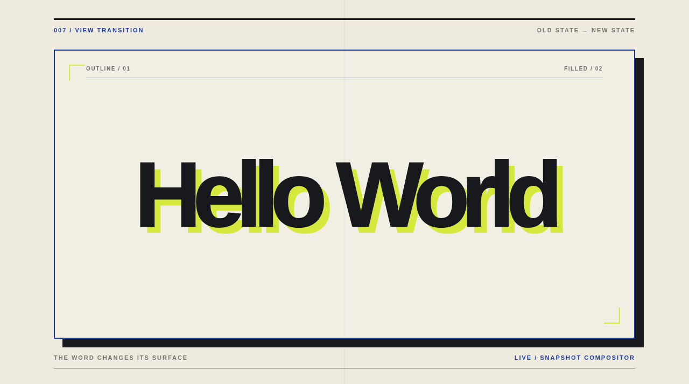](v1/luna-5.6/007/007.html) | [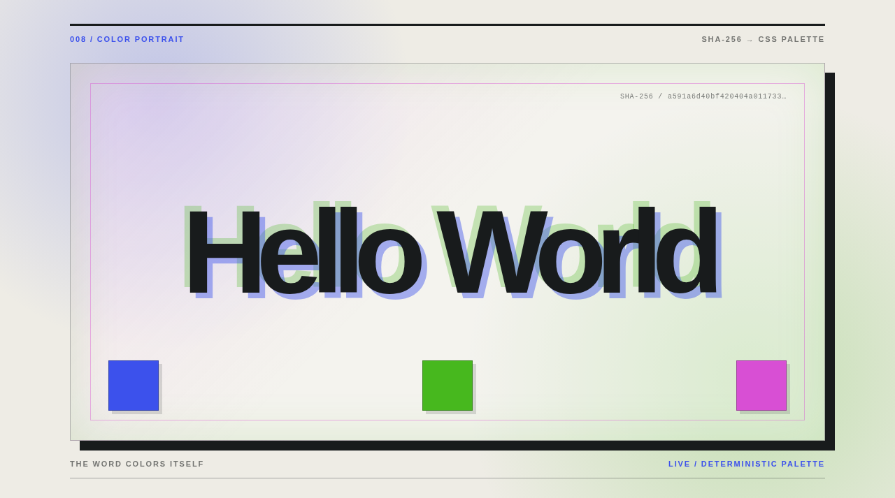](v1/luna-5.6/008/008.html) | [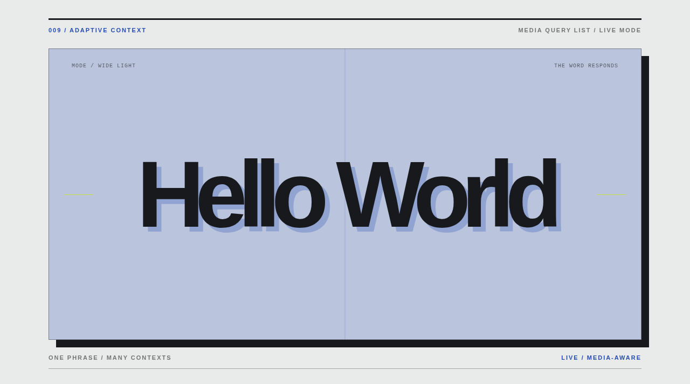](v1/luna-5.6/009/009.html) |
| :---: | :---: | :---: |
| **007 — Geçişte Hello World** [Demo](v1/luna-5.6/007/007.html) · [Report](v1/luna-5.6/007/report.md) · [Journal](v1/luna-5.6/007/journal.md) | **008 — İçeriğin renk portresi: Hello World** [Demo](v1/luna-5.6/008/008.html) · [Report](v1/luna-5.6/008/report.md) · [Journal](v1/luna-5.6/008/journal.md) | **009 — Ortama uyarlanan Hello World** [Demo](v1/luna-5.6/009/009.html) · [Report](v1/luna-5.6/009/report.md) · [Journal](v1/luna-5.6/009/journal.md) |

| [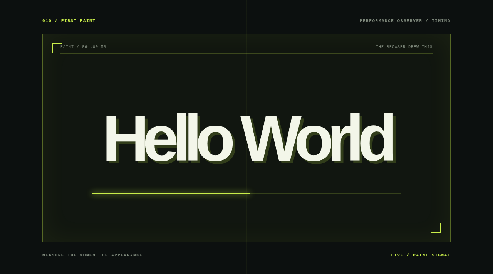](v1/luna-5.6/010/010.html) | | |
| :---: | :---: | :---: |
| **010 — İlk çizimden sonra Hello World** [Demo](v1/luna-5.6/010/010.html) · [Report](v1/luna-5.6/010/report.md) · [Journal](v1/luna-5.6/010/journal.md) | | |

---

# v2

[View prompt](v2/PROMPT.md)

## agy-gemini-3.8

**59 experiments**

|  | [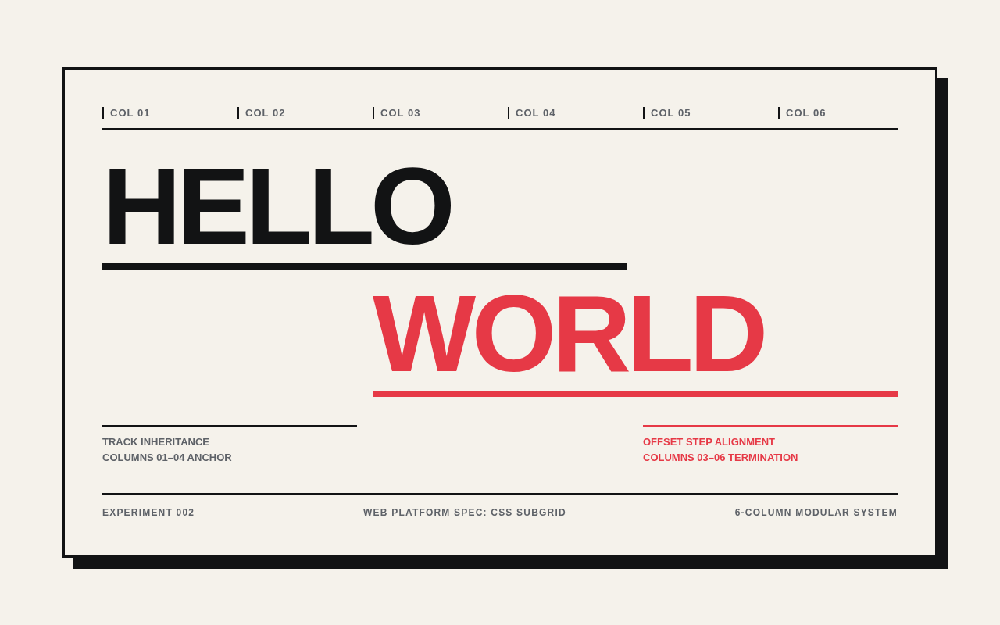](v2/agy-gemini-3.8/002/002.html) | [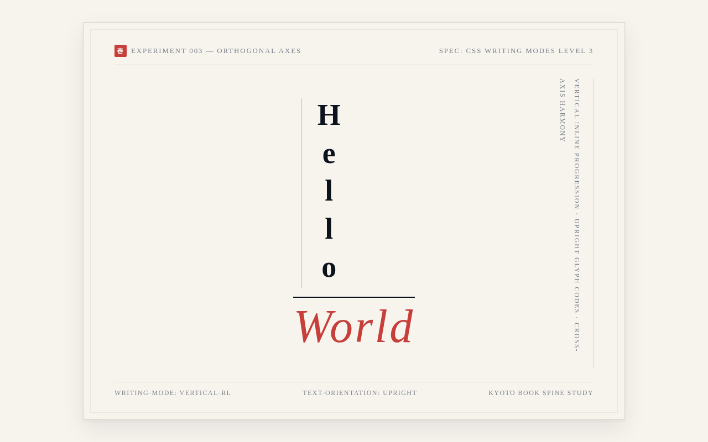](v2/agy-gemini-3.8/003/003.html) |
| :---: | :---: | :---: |
| **001 — Minimal Semantic HTML Baseline** [Demo](v2/agy-gemini-3.8/001/001.html) · [Report](v2/agy-gemini-3.8/001/report.md) · [Journal](v2/agy-gemini-3.8/001/journal.md) | **002 — CSS Grid & Subgrid Modular Typographic Lockup** [Demo](v2/agy-gemini-3.8/002/002.html) · [Report](v2/agy-gemini-3.8/002/report.md) · [Journal](v2/agy-gemini-3.8/002/journal.md) | **003 — Orthogonal Writing Modes & Vertical Typographic Stacking** [Demo](v2/agy-gemini-3.8/003/003.html) · [Report](v2/agy-gemini-3.8/003/report.md) · [Journal](v2/agy-gemini-3.8/003/journal.md) |

| [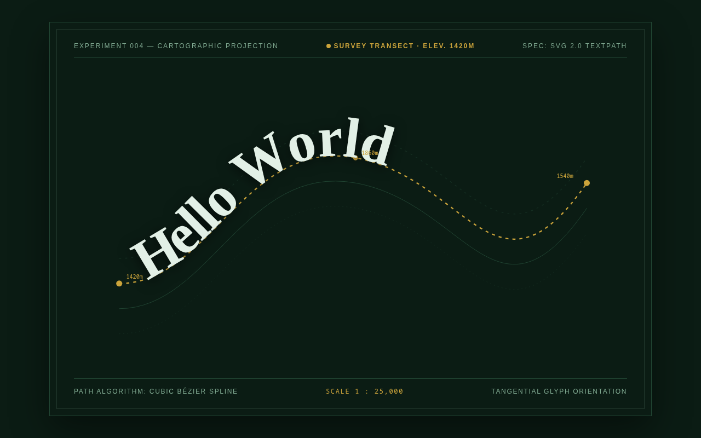](v2/agy-gemini-3.8/004/004.html) | [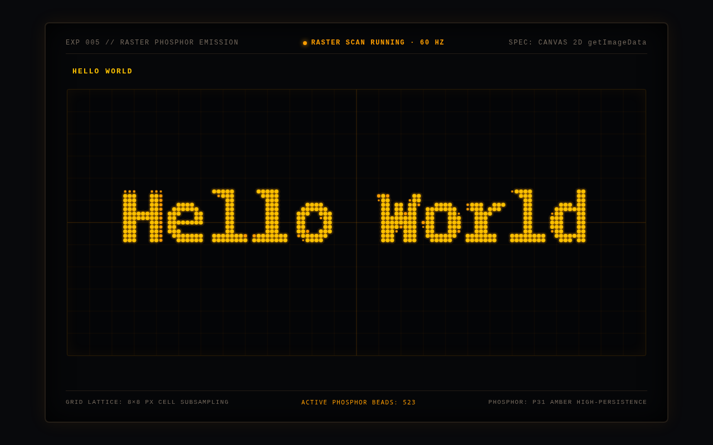](v2/agy-gemini-3.8/005/005.html) | [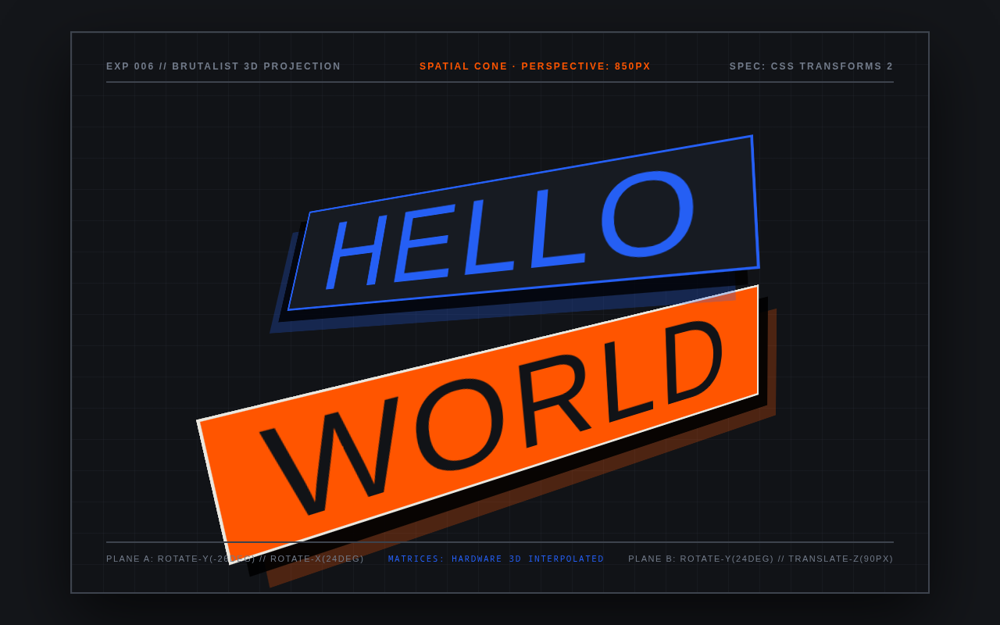](v2/agy-gemini-3.8/006/006.html) |
| :---: | :---: | :---: |
| **004 — SVG Vector Geometry & Curvilinear Path Projection** [Demo](v2/agy-gemini-3.8/004/004.html) · [Report](v2/agy-gemini-3.8/004/report.md) · [Journal](v2/agy-gemini-3.8/004/journal.md) | **005 — Canvas 2D Direct Rasterization & Pixel Sampling** [Demo](v2/agy-gemini-3.8/005/005.html) · [Report](v2/agy-gemini-3.8/005/report.md) · [Journal](v2/agy-gemini-3.8/005/journal.md) | **006 — CSS 3D Transforms & Spatial Perspective Projection** [Demo](v2/agy-gemini-3.8/006/006.html) · [Report](v2/agy-gemini-3.8/006/report.md) · [Journal](v2/agy-gemini-3.8/006/journal.md) |

| [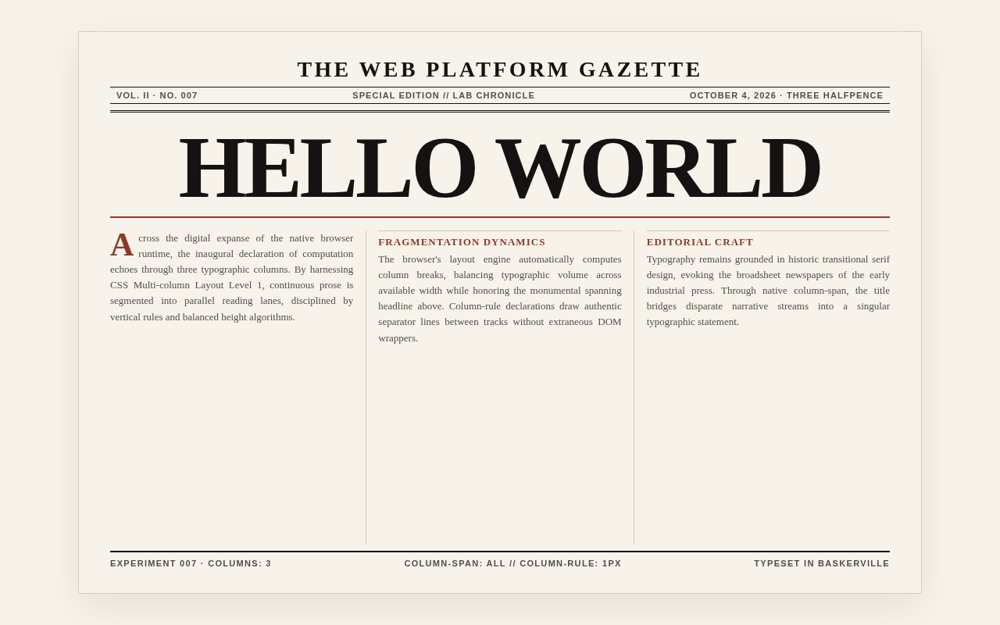](v2/agy-gemini-3.8/007/007.html) | [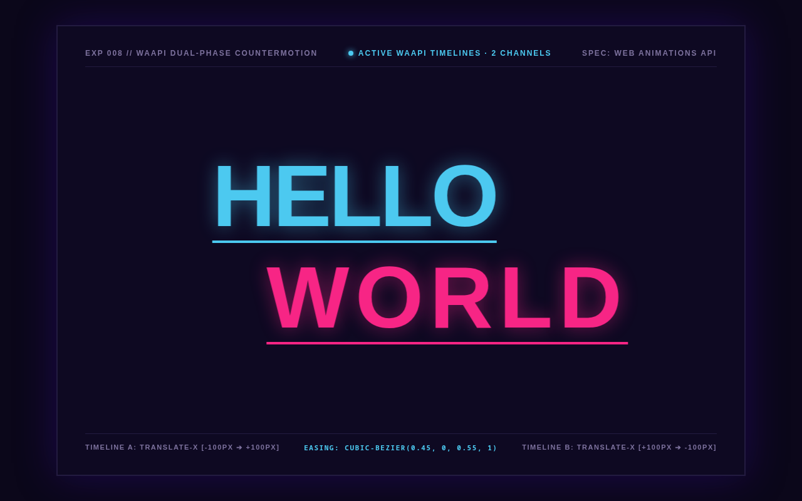](v2/agy-gemini-3.8/008/008.html) | [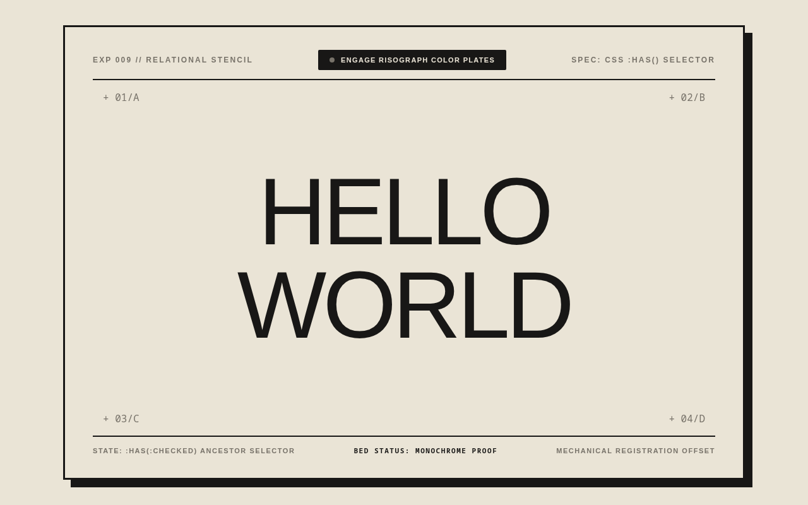](v2/agy-gemini-3.8/009/009.html) |
| :---: | :---: | :---: |
| **007 — CSS Multi-column Fragmentation & Spanning Layout** [Demo](v2/agy-gemini-3.8/007/007.html) · [Report](v2/agy-gemini-3.8/007/report.md) · [Journal](v2/agy-gemini-3.8/007/journal.md) | **008 — Web Animations API (WAAPI) Typographic Countermotion** [Demo](v2/agy-gemini-3.8/008/008.html) · [Report](v2/agy-gemini-3.8/008/report.md) · [Journal](v2/agy-gemini-3.8/008/journal.md) | **009 — CSS :has() Relational Stencil & Interactive Registration** [Demo](v2/agy-gemini-3.8/009/009.html) · [Report](v2/agy-gemini-3.8/009/report.md) · [Journal](v2/agy-gemini-3.8/009/journal.md) |

| [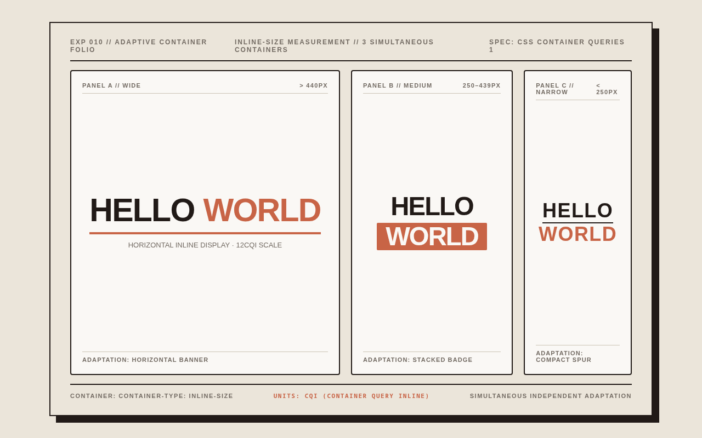](v2/agy-gemini-3.8/010/010.html) | [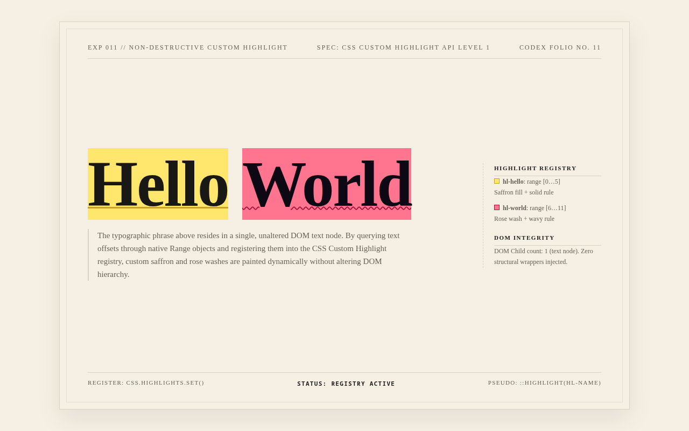](v2/agy-gemini-3.8/011/011.html) | [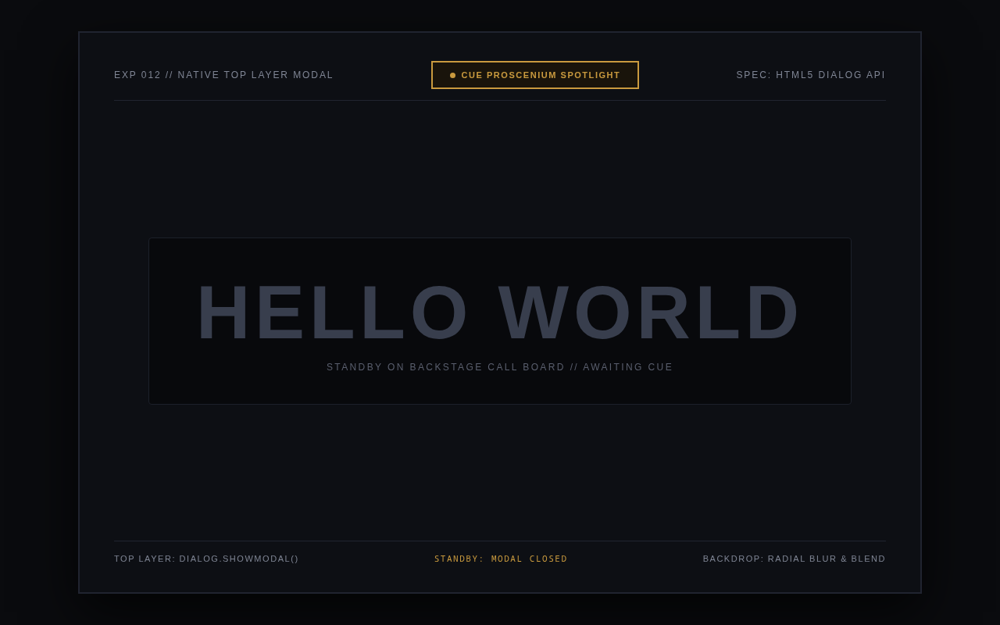](v2/agy-gemini-3.8/012/012.html) |
| :---: | :---: | :---: |
| **010 — CSS Container Queries & Container Query Units** [Demo](v2/agy-gemini-3.8/010/010.html) · [Report](v2/agy-gemini-3.8/010/report.md) · [Journal](v2/agy-gemini-3.8/010/journal.md) | **011 — CSS Custom Highlight API & Non-Destructive Text Styling** [Demo](v2/agy-gemini-3.8/011/011.html) · [Report](v2/agy-gemini-3.8/011/report.md) · [Journal](v2/agy-gemini-3.8/011/journal.md) | **012 — HTML <dialog> Element & Native Top Layer Promotion** [Demo](v2/agy-gemini-3.8/012/012.html) · [Report](v2/agy-gemini-3.8/012/report.md) · [Journal](v2/agy-gemini-3.8/012/journal.md) |

| [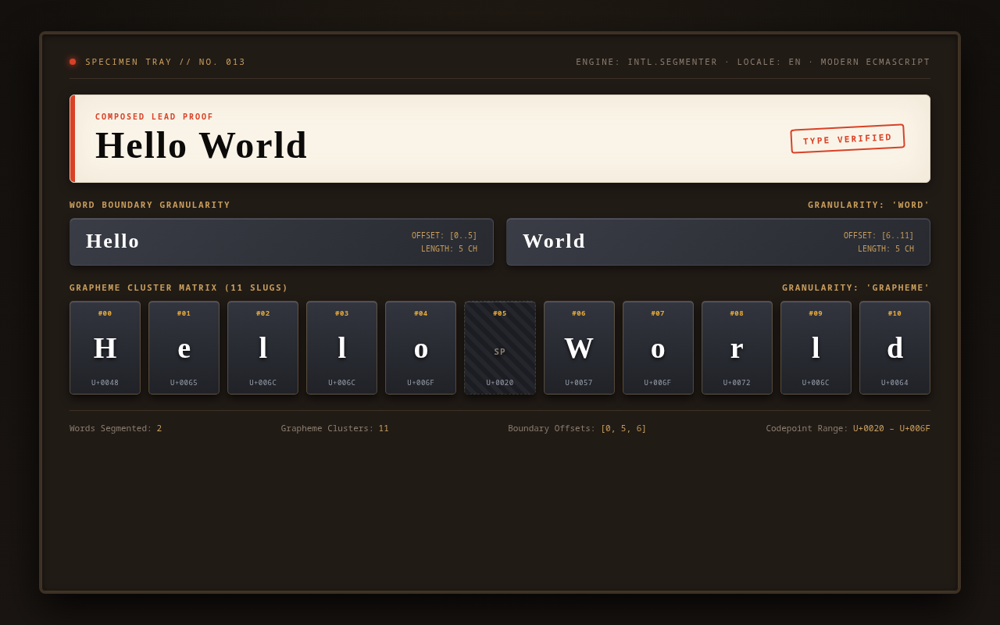](v2/agy-gemini-3.8/013/013.html) | [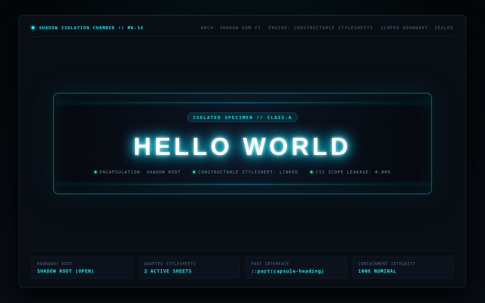](v2/agy-gemini-3.8/014/014.html) | [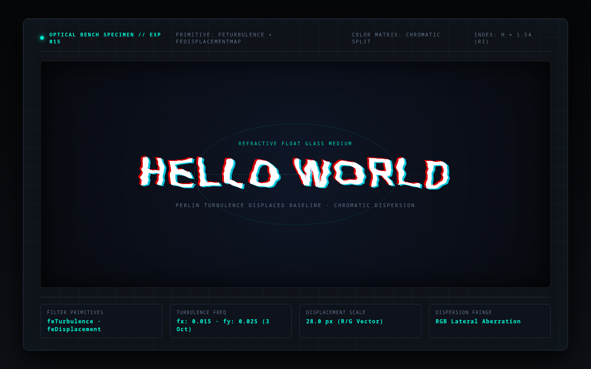](v2/agy-gemini-3.8/015/015.html) |
| :---: | :---: | :---: |
| **013 — ECMAScript Intl.Segmenter Typesetter Drawer** [Demo](v2/agy-gemini-3.8/013/013.html) · [Report](v2/agy-gemini-3.8/013/report.md) · [Journal](v2/agy-gemini-3.8/013/journal.md) | **014 — Shadow DOM v1 & Constructable Stylesheets** [Demo](v2/agy-gemini-3.8/014/014.html) · [Report](v2/agy-gemini-3.8/014/report.md) · [Journal](v2/agy-gemini-3.8/014/journal.md) | **015 — SVG Filter Displacement & Prismatic Refraction** [Demo](v2/agy-gemini-3.8/015/015.html) · [Report](v2/agy-gemini-3.8/015/report.md) · [Journal](v2/agy-gemini-3.8/015/journal.md) |

| [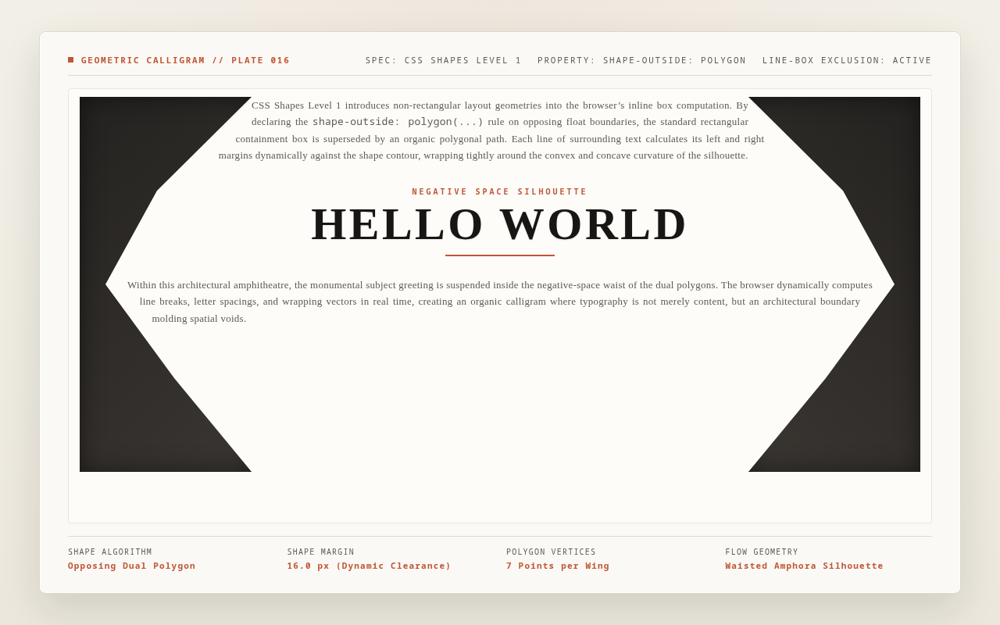](v2/agy-gemini-3.8/016/016.html) | [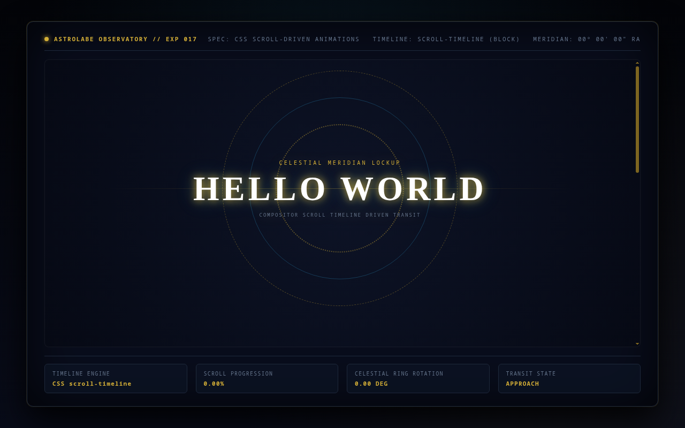](v2/agy-gemini-3.8/017/017.html) | [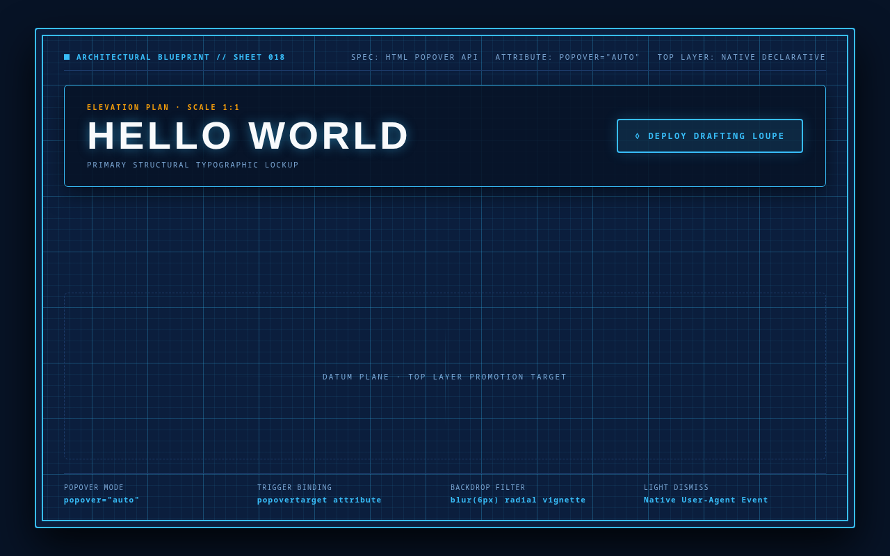](v2/agy-gemini-3.8/018/018.html) |
| :---: | :---: | :---: |
| **016 — CSS Shapes Level 1 Polygon Exclusion** [Demo](v2/agy-gemini-3.8/016/016.html) · [Report](v2/agy-gemini-3.8/016/report.md) · [Journal](v2/agy-gemini-3.8/016/journal.md) | **017 — CSS Scroll-driven Animations Astrolabe Observatory** [Demo](v2/agy-gemini-3.8/017/017.html) · [Report](v2/agy-gemini-3.8/017/report.md) · [Journal](v2/agy-gemini-3.8/017/journal.md) | **018 — HTML Popover API Blueprint Table** [Demo](v2/agy-gemini-3.8/018/018.html) · [Report](v2/agy-gemini-3.8/018/report.md) · [Journal](v2/agy-gemini-3.8/018/journal.md) |

| [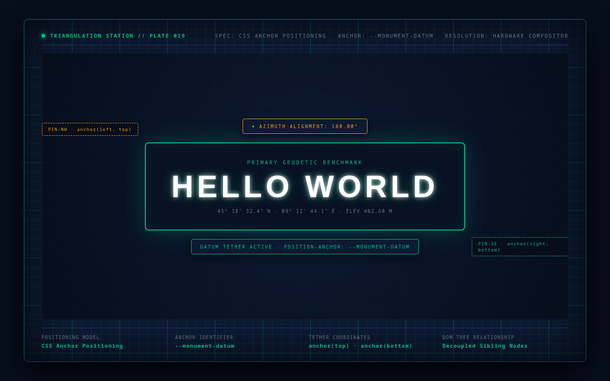](v2/agy-gemini-3.8/019/019.html) | [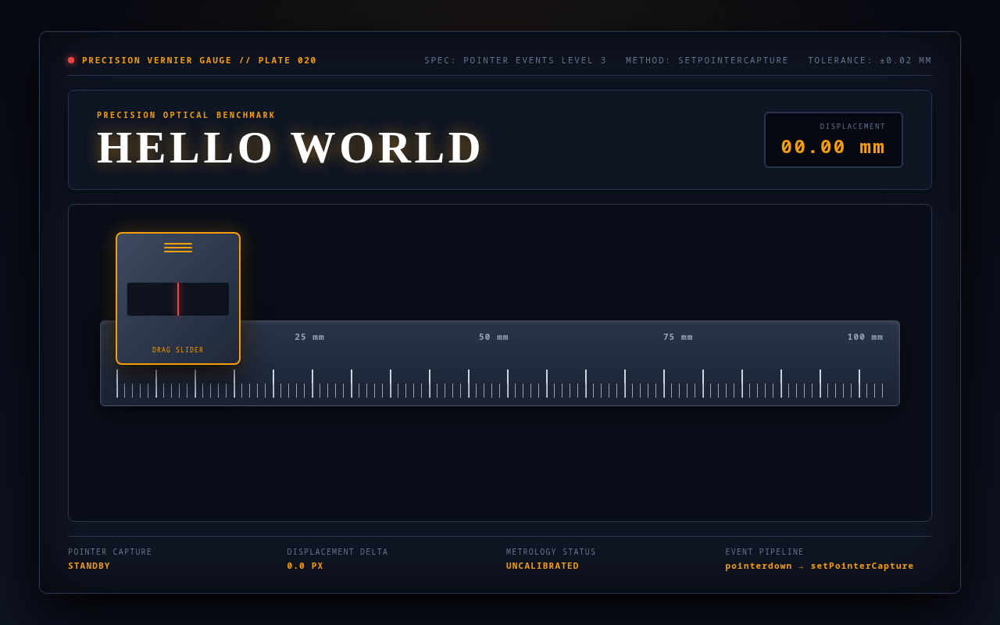](v2/agy-gemini-3.8/020/020.html) | [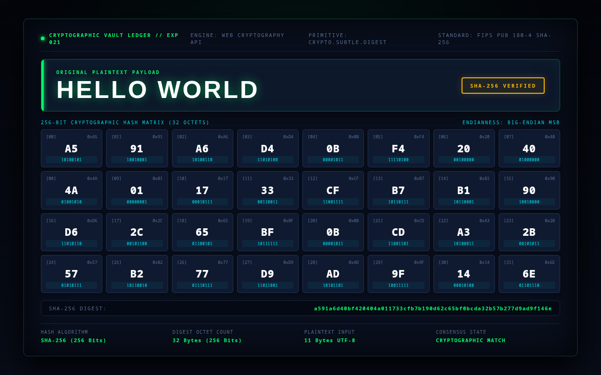](v2/agy-gemini-3.8/021/021.html) |
| :---: | :---: | :---: |
| **019 — CSS Anchor Positioning Survey Theodolite** [Demo](v2/agy-gemini-3.8/019/019.html) · [Report](v2/agy-gemini-3.8/019/report.md) · [Journal](v2/agy-gemini-3.8/019/journal.md) | **020 — Pointer Events Level 3 & Pointer Capture Caliper** [Demo](v2/agy-gemini-3.8/020/020.html) · [Report](v2/agy-gemini-3.8/020/report.md) · [Journal](v2/agy-gemini-3.8/020/journal.md) | **021 — Web Cryptography API SHA-256 Ledger** [Demo](v2/agy-gemini-3.8/021/021.html) · [Report](v2/agy-gemini-3.8/021/report.md) · [Journal](v2/agy-gemini-3.8/021/journal.md) |

| [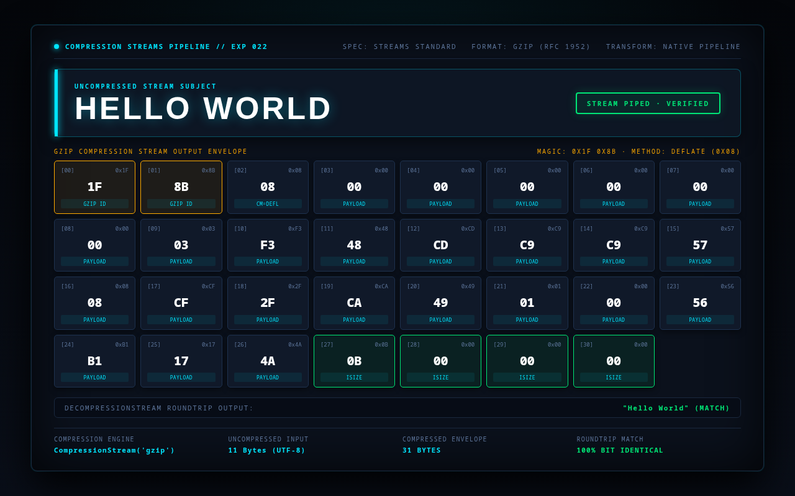](v2/agy-gemini-3.8/022/022.html) | [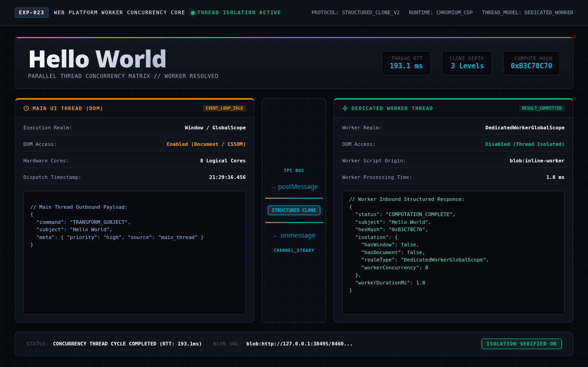](v2/agy-gemini-3.8/023/023.html) | [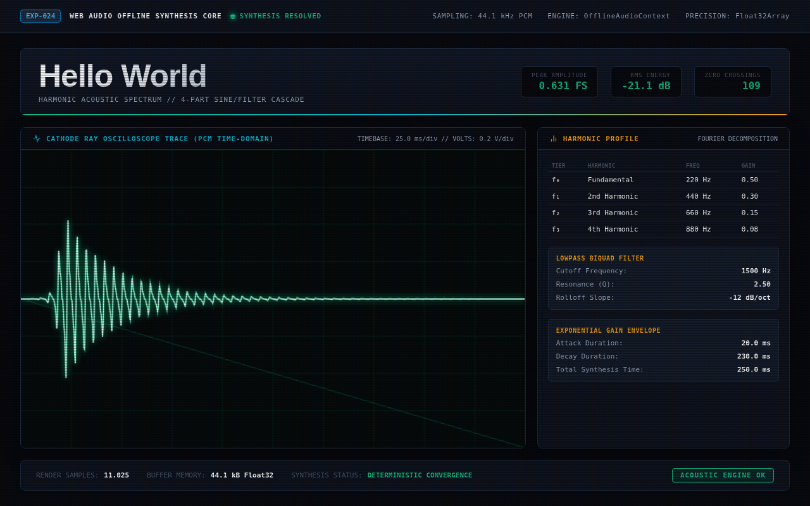](v2/agy-gemini-3.8/024/024.html) |
| :---: | :---: | :---: |
| **022 — Compression Streams API Pipeline** [Demo](v2/agy-gemini-3.8/022/022.html) · [Report](v2/agy-gemini-3.8/022/report.md) · [Journal](v2/agy-gemini-3.8/022/journal.md) | **023 — Inline Blob Web Worker & Thread Telemetry** [Demo](v2/agy-gemini-3.8/023/023.html) · [Report](v2/agy-gemini-3.8/023/report.md) · [Journal](v2/agy-gemini-3.8/023/journal.md) | **024 — Web Audio Offline Acoustic Synthesis & Spectral Scope** [Demo](v2/agy-gemini-3.8/024/024.html) · [Report](v2/agy-gemini-3.8/024/report.md) · [Journal](v2/agy-gemini-3.8/024/journal.md) |

| [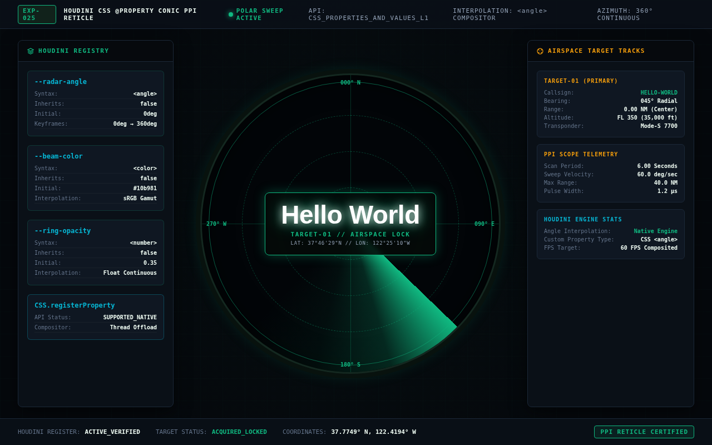](v2/agy-gemini-3.8/025/025.html) | [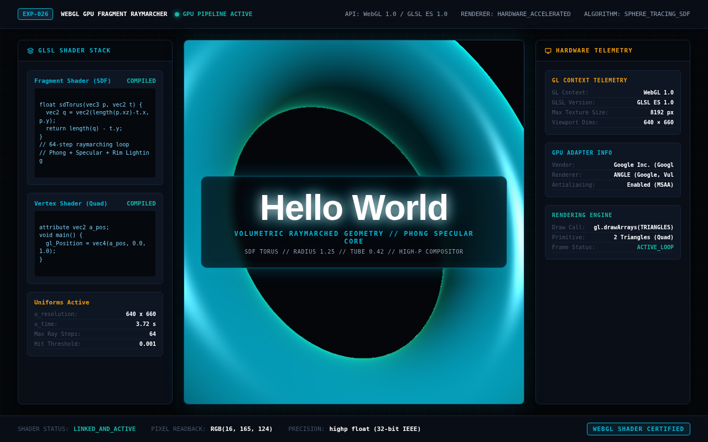](v2/agy-gemini-3.8/026/026.html) | [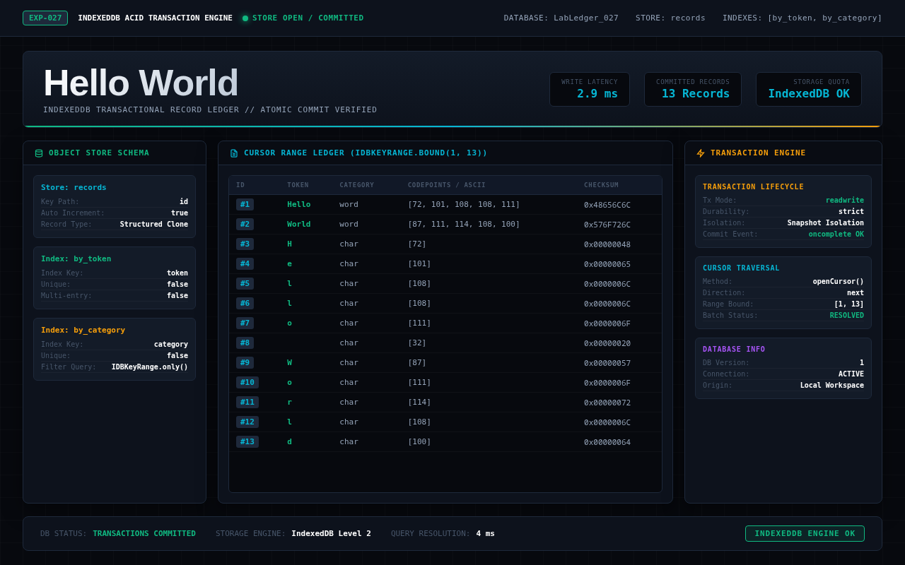](v2/agy-gemini-3.8/027/027.html) |
| :---: | :---: | :---: |
| **025 — CSS Houdini Typed Properties & Conic Radar Reticle** [Demo](v2/agy-gemini-3.8/025/025.html) · [Report](v2/agy-gemini-3.8/025/report.md) · [Journal](v2/agy-gemini-3.8/025/journal.md) | **026 — WebGL GPU Fragment Shader Raymarched SDF** [Demo](v2/agy-gemini-3.8/026/026.html) · [Report](v2/agy-gemini-3.8/026/report.md) · [Journal](v2/agy-gemini-3.8/026/journal.md) | **027 — IndexedDB Transactional Object Store & Ledger Inspector** [Demo](v2/agy-gemini-3.8/027/027.html) · [Report](v2/agy-gemini-3.8/027/report.md) · [Journal](v2/agy-gemini-3.8/027/journal.md) |

| [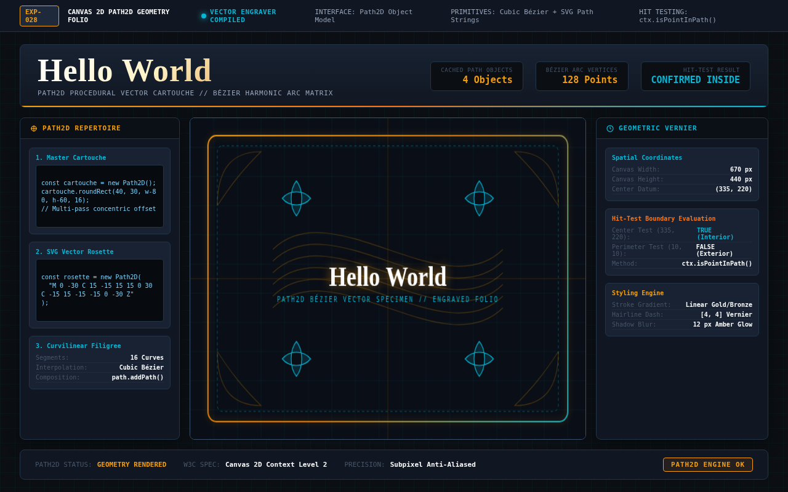](v2/agy-gemini-3.8/028/028.html) | [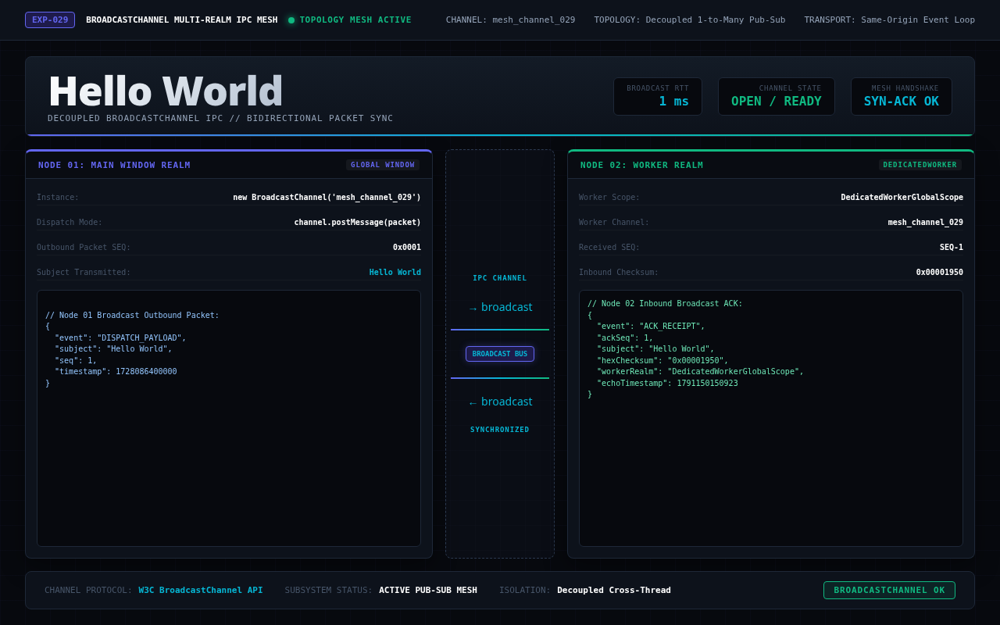](v2/agy-gemini-3.8/029/029.html) | [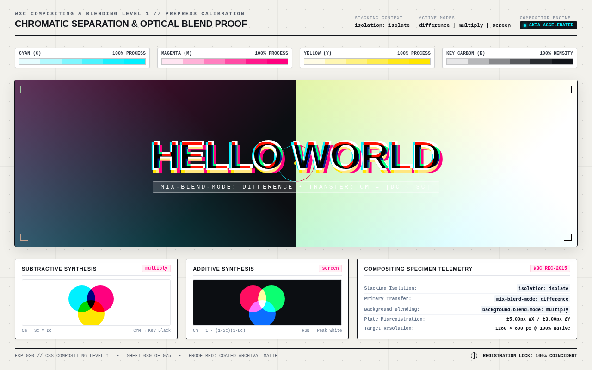](v2/agy-gemini-3.8/030/030.html) |
| :---: | :---: | :---: |
| **028 — Canvas 2D Path2D Vector Geometry & Bézier Drafting Folio** [Demo](v2/agy-gemini-3.8/028/028.html) · [Report](v2/agy-gemini-3.8/028/report.md) · [Journal](v2/agy-gemini-3.8/028/journal.md) | **029 — BroadcastChannel Multi-Realm Cross-Context IPC Mesh** [Demo](v2/agy-gemini-3.8/029/029.html) · [Report](v2/agy-gemini-3.8/029/report.md) · [Journal](v2/agy-gemini-3.8/029/journal.md) | **030 — CSS Compositing & Blending Level 1 Chromatic Proof** [Demo](v2/agy-gemini-3.8/030/030.html) · [Report](v2/agy-gemini-3.8/030/report.md) · [Journal](v2/agy-gemini-3.8/030/journal.md) |

| [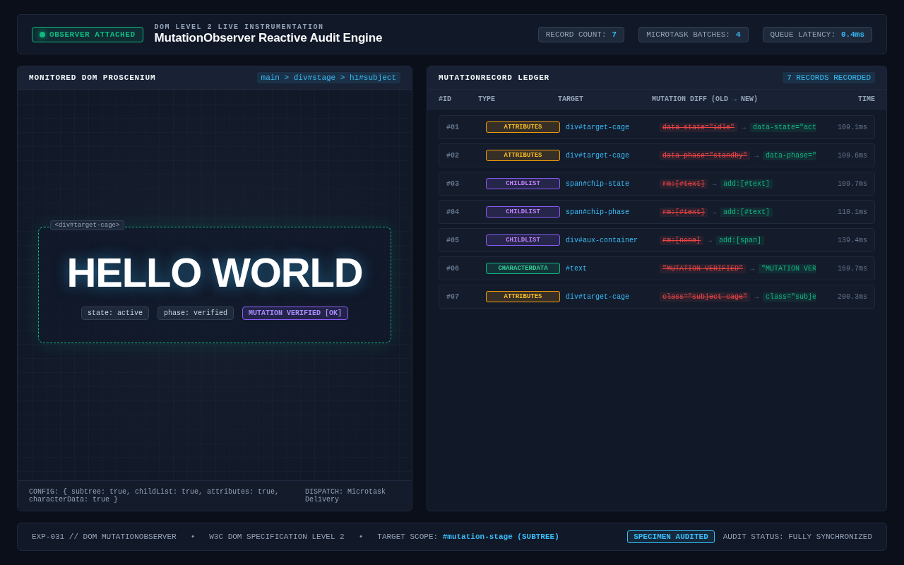](v2/agy-gemini-3.8/031/031.html) | [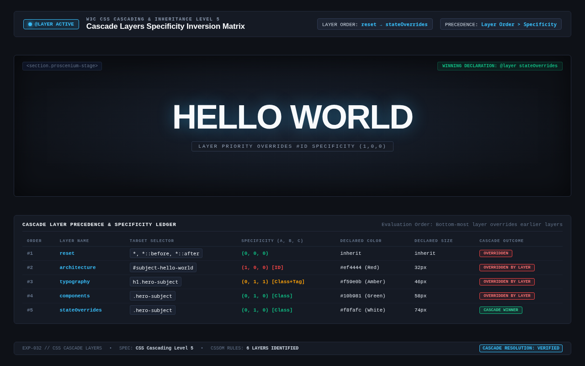](v2/agy-gemini-3.8/032/032.html) | [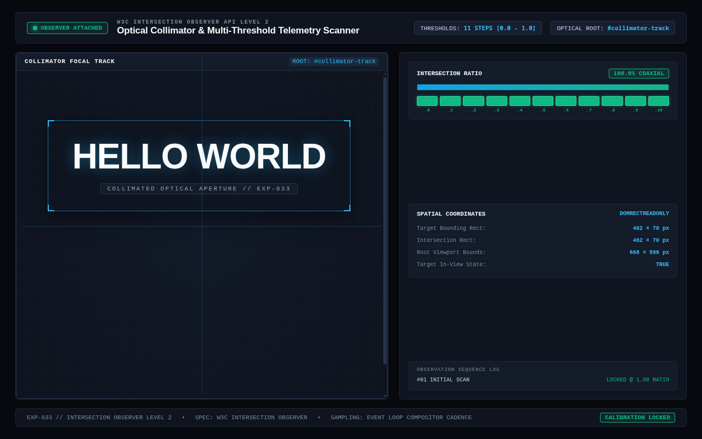](v2/agy-gemini-3.8/033/033.html) |
| :---: | :---: | :---: |
| **031 — DOM MutationObserver Level 2 Reactive Audit Engine** [Demo](v2/agy-gemini-3.8/031/031.html) · [Report](v2/agy-gemini-3.8/031/report.md) · [Journal](v2/agy-gemini-3.8/031/journal.md) | **032 — CSS Cascade Layers Level 1 Specificity Inversion** [Demo](v2/agy-gemini-3.8/032/032.html) · [Report](v2/agy-gemini-3.8/032/report.md) · [Journal](v2/agy-gemini-3.8/032/journal.md) | **033 — Intersection Observer Level 2 Focal Scanner** [Demo](v2/agy-gemini-3.8/033/033.html) · [Report](v2/agy-gemini-3.8/033/report.md) · [Journal](v2/agy-gemini-3.8/033/journal.md) |

| [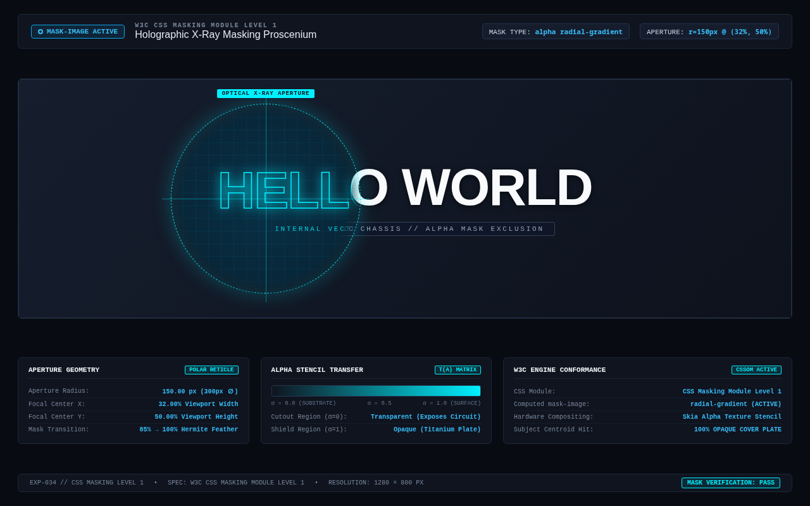](v2/agy-gemini-3.8/034/034.html) | [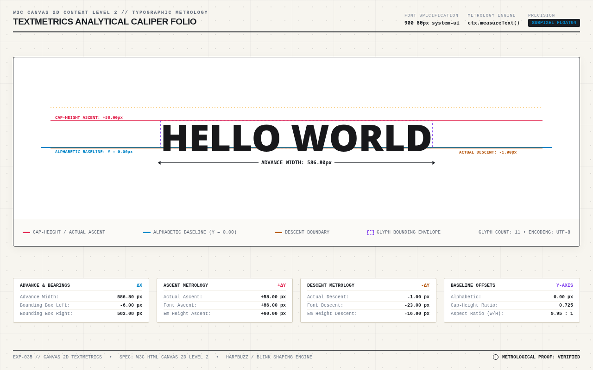](v2/agy-gemini-3.8/035/035.html) | [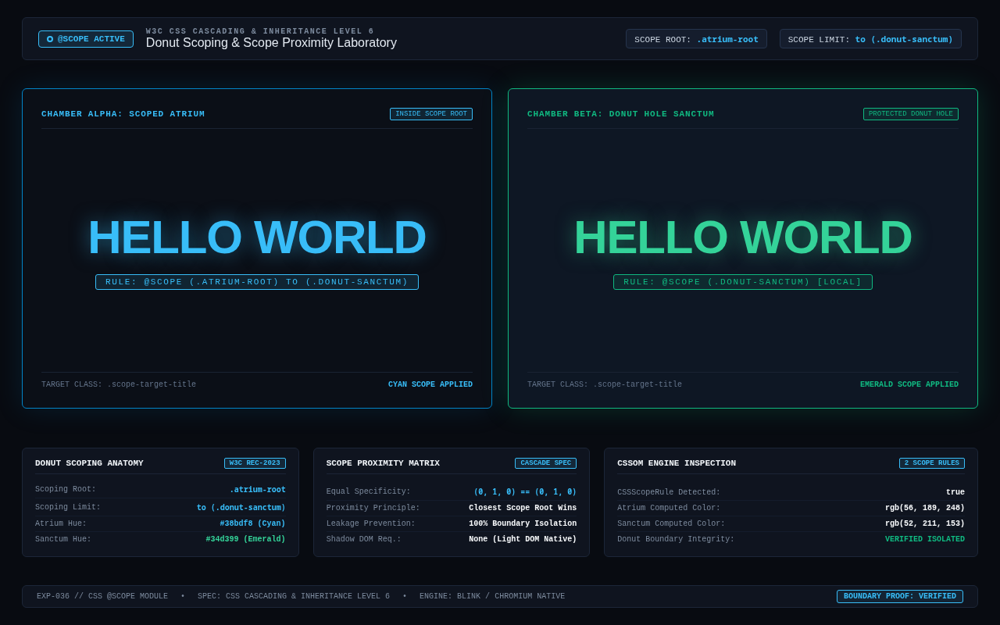](v2/agy-gemini-3.8/036/036.html) |
| :---: | :---: | :---: |
| **034 — CSS Masking Level 1 Holographic X-Ray Proscenium** [Demo](v2/agy-gemini-3.8/034/034.html) · [Report](v2/agy-gemini-3.8/034/report.md) · [Journal](v2/agy-gemini-3.8/034/journal.md) | **035 — Canvas 2D TextMetrics Typographic Metrology Folio** [Demo](v2/agy-gemini-3.8/035/035.html) · [Report](v2/agy-gemini-3.8/035/report.md) · [Journal](v2/agy-gemini-3.8/035/journal.md) | **036 — CSS @scope Donut Scoping & Scope Proximity Laboratory** [Demo](v2/agy-gemini-3.8/036/036.html) · [Report](v2/agy-gemini-3.8/036/report.md) · [Journal](v2/agy-gemini-3.8/036/journal.md) |

| [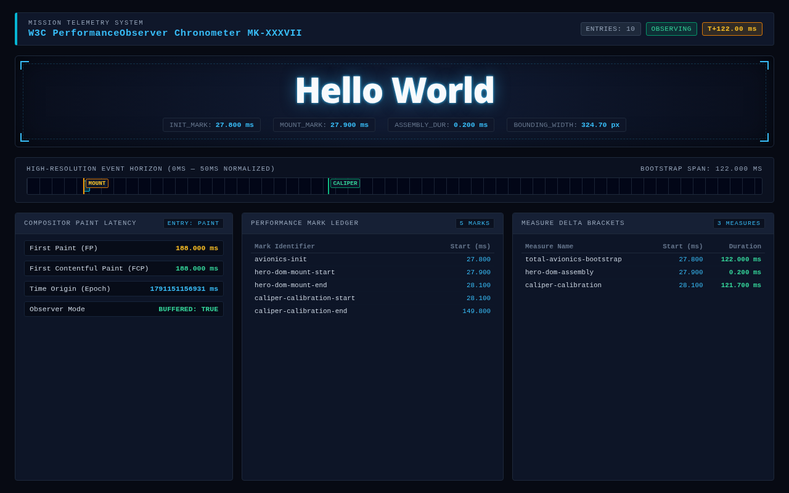](v2/agy-gemini-3.8/037/037.html) | [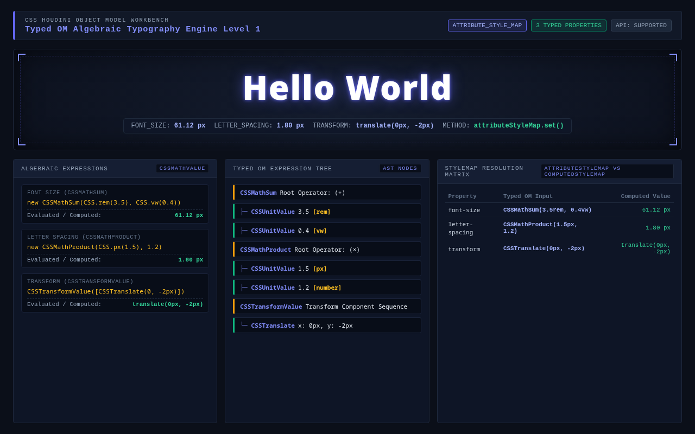](v2/agy-gemini-3.8/038/038.html) | [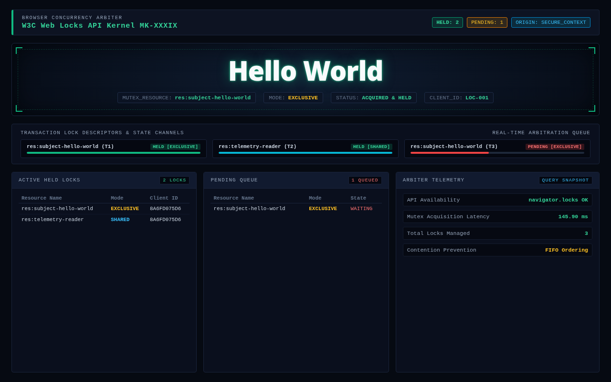](v2/agy-gemini-3.8/039/039.html) |
| :---: | :---: | :---: |
| **037 — PerformanceObserver & High-Resolution Telemetry Chronometer** [Demo](v2/agy-gemini-3.8/037/037.html) · [Report](v2/agy-gemini-3.8/037/report.md) · [Journal](v2/agy-gemini-3.8/037/journal.md) | **038 — CSS Typed Object Model API Level 1 Algebraic Typography** [Demo](v2/agy-gemini-3.8/038/038.html) · [Report](v2/agy-gemini-3.8/038/report.md) · [Journal](v2/agy-gemini-3.8/038/journal.md) | **039 — W3C Web Locks API Distributed Mutex Coordinator** [Demo](v2/agy-gemini-3.8/039/039.html) · [Report](v2/agy-gemini-3.8/039/report.md) · [Journal](v2/agy-gemini-3.8/039/journal.md) |

| [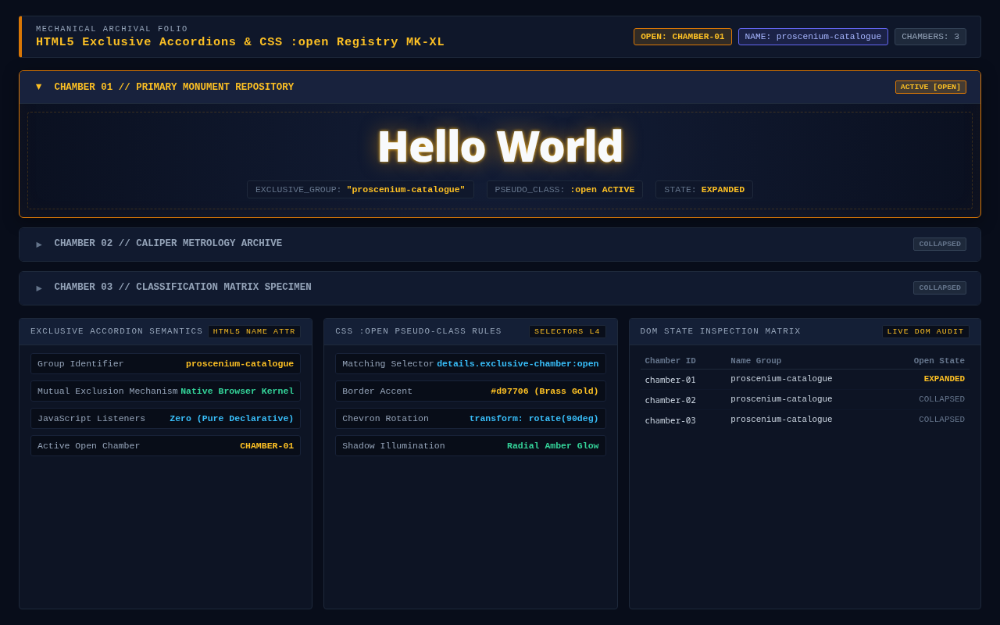](v2/agy-gemini-3.8/040/040.html) | [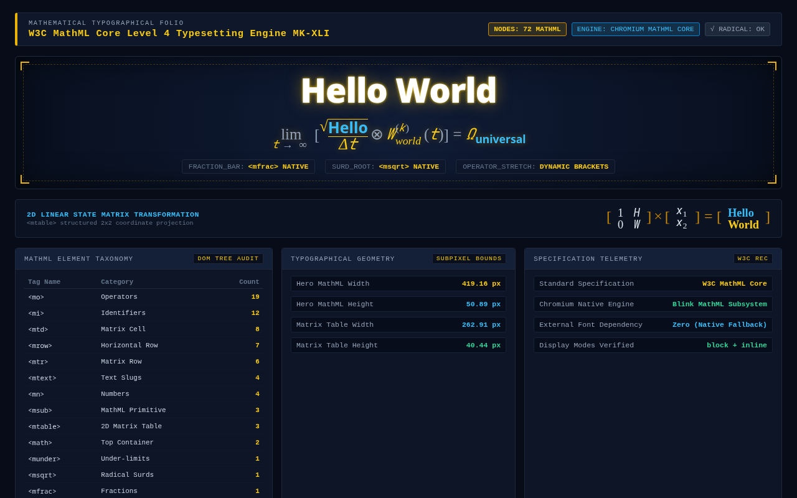](v2/agy-gemini-3.8/041/041.html) | [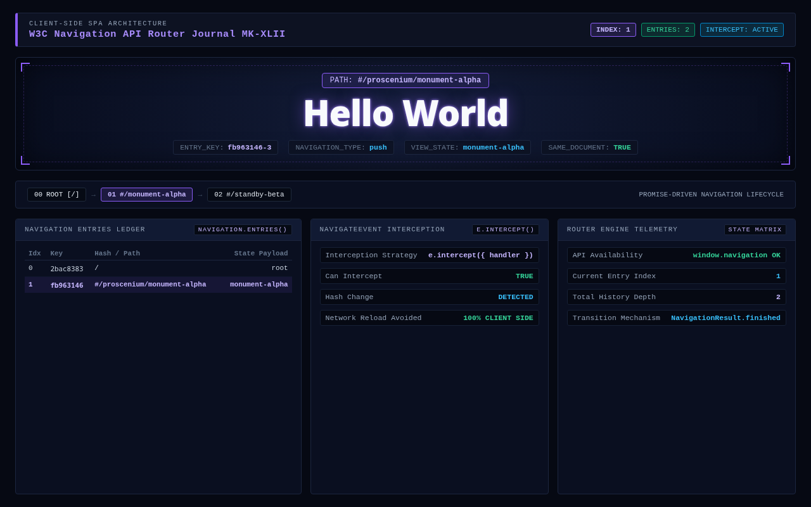](v2/agy-gemini-3.8/042/042.html) |
| :---: | :---: | :---: |
| **040 — HTML5 Exclusive Accordions & CSS :open Mechanical Index** [Demo](v2/agy-gemini-3.8/040/040.html) · [Report](v2/agy-gemini-3.8/040/report.md) · [Journal](v2/agy-gemini-3.8/040/journal.md) | **041 — MathML Core Level 4 Mathematical Typographical Folio** [Demo](v2/agy-gemini-3.8/041/041.html) · [Report](v2/agy-gemini-3.8/041/report.md) · [Journal](v2/agy-gemini-3.8/041/journal.md) | **042 — W3C Navigation API Client-Side SPA Router Journal** [Demo](v2/agy-gemini-3.8/042/042.html) · [Report](v2/agy-gemini-3.8/042/report.md) · [Journal](v2/agy-gemini-3.8/042/journal.md) |

| [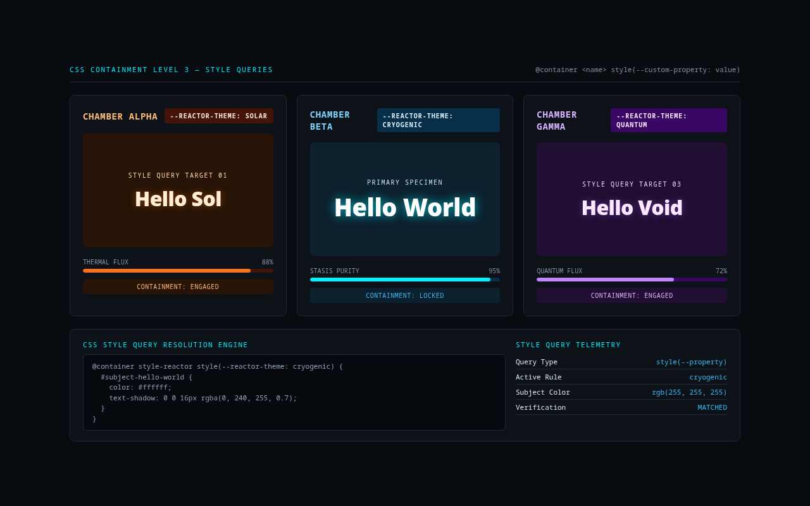](v2/agy-gemini-3.8/043/043.html) | [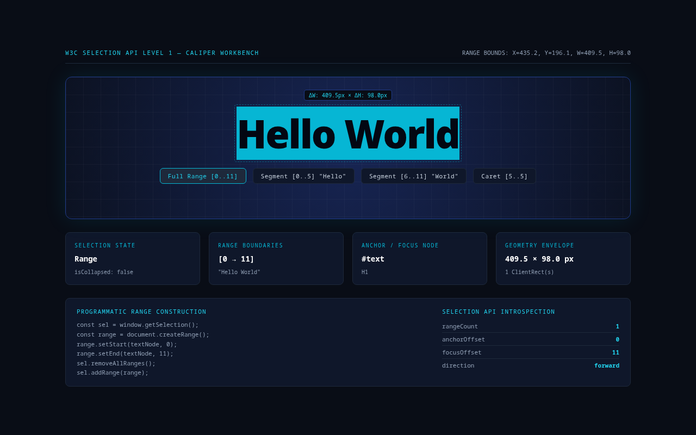](v2/agy-gemini-3.8/044/044.html) | [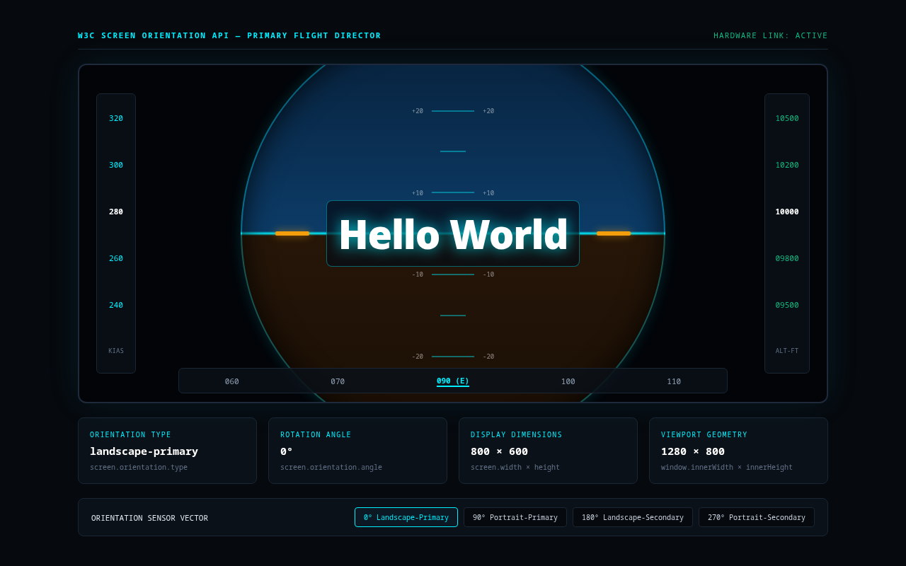](v2/agy-gemini-3.8/045/045.html) |
| :---: | :---: | :---: |
| **043 — CSS Container Style Queries Level 3** [Demo](v2/agy-gemini-3.8/043/043.html) · [Report](v2/agy-gemini-3.8/043/report.md) · [Journal](v2/agy-gemini-3.8/043/journal.md) | **044 — W3C Selection API Level 1 Typographic Caliper** [Demo](v2/agy-gemini-3.8/044/044.html) · [Report](v2/agy-gemini-3.8/044/report.md) · [Journal](v2/agy-gemini-3.8/044/journal.md) | **045 — W3C Screen Orientation API Avionics Horizon** [Demo](v2/agy-gemini-3.8/045/045.html) · [Report](v2/agy-gemini-3.8/045/report.md) · [Journal](v2/agy-gemini-3.8/045/journal.md) |

| [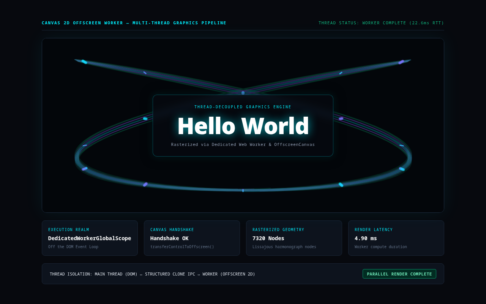](v2/agy-gemini-3.8/046/046.html) | [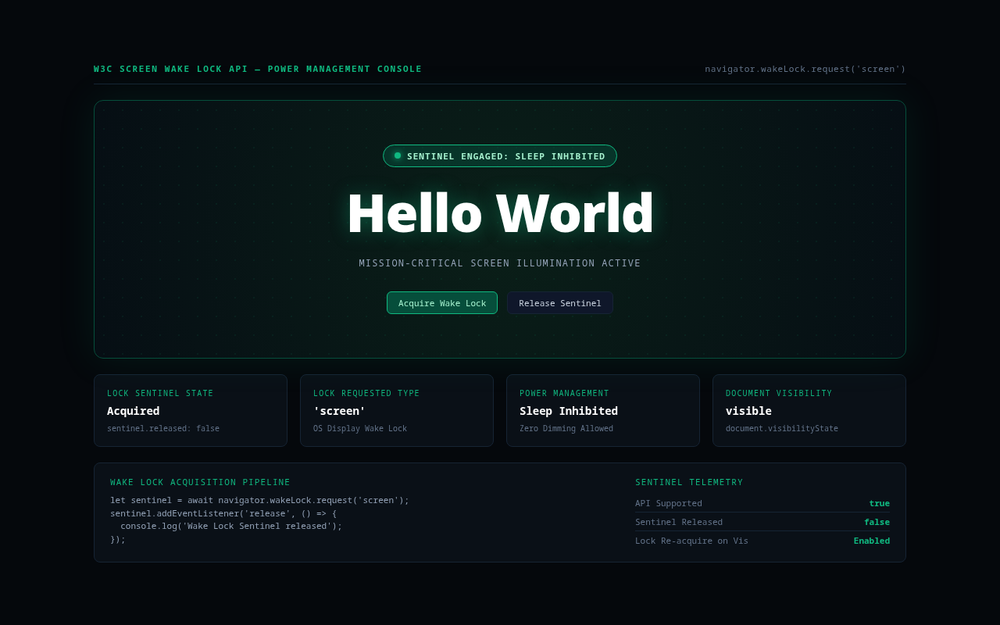](v2/agy-gemini-3.8/047/047.html) | [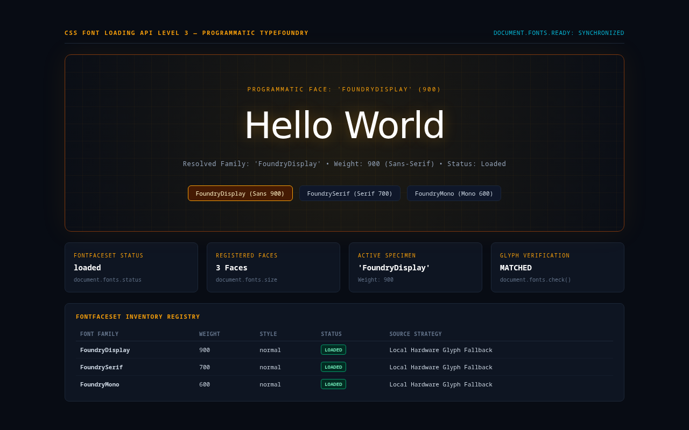](v2/agy-gemini-3.8/048/048.html) |
| :---: | :---: | :---: |
| **046 — Canvas 2D Offscreen Worker** [Demo](v2/agy-gemini-3.8/046/046.html) · [Report](v2/agy-gemini-3.8/046/report.md) · [Journal](v2/agy-gemini-3.8/046/journal.md) | **047 — W3C Screen Wake Lock API Console** [Demo](v2/agy-gemini-3.8/047/047.html) · [Report](v2/agy-gemini-3.8/047/report.md) · [Journal](v2/agy-gemini-3.8/047/journal.md) | **048 — CSS Font Loading API Level 3** [Demo](v2/agy-gemini-3.8/048/048.html) · [Report](v2/agy-gemini-3.8/048/report.md) · [Journal](v2/agy-gemini-3.8/048/journal.md) |

| [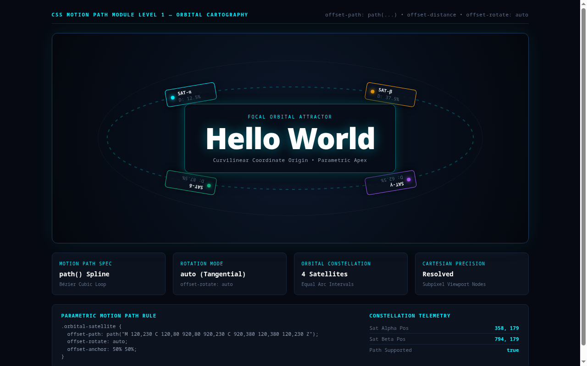](v2/agy-gemini-3.8/049/049.html) | [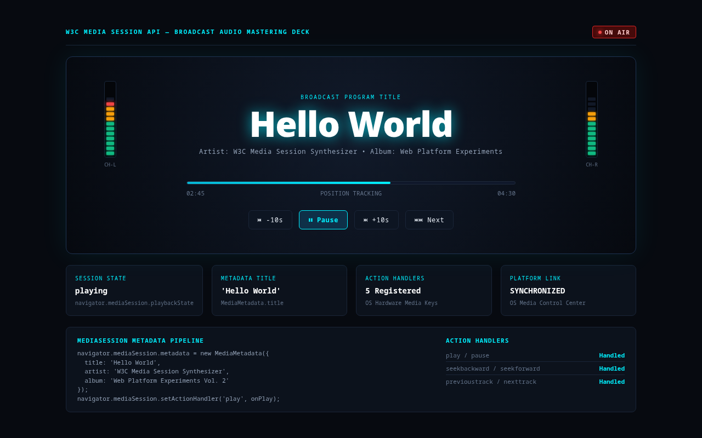](v2/agy-gemini-3.8/050/050.html) | [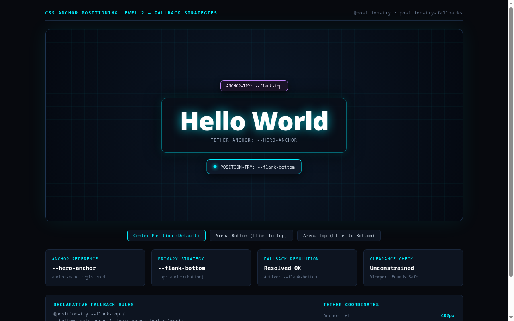](v2/agy-gemini-3.8/051/051.html) |
| :---: | :---: | :---: |
| **049 — CSS Motion Path Module Level 1** [Demo](v2/agy-gemini-3.8/049/049.html) · [Report](v2/agy-gemini-3.8/049/report.md) · [Journal](v2/agy-gemini-3.8/049/journal.md) | **050 — W3C Media Session API Broadcast Deck** [Demo](v2/agy-gemini-3.8/050/050.html) · [Report](v2/agy-gemini-3.8/050/report.md) · [Journal](v2/agy-gemini-3.8/050/journal.md) | **051 — CSS Anchor Positioning Fallback Strategies** [Demo](v2/agy-gemini-3.8/051/051.html) · [Report](v2/agy-gemini-3.8/051/report.md) · [Journal](v2/agy-gemini-3.8/051/journal.md) |

| [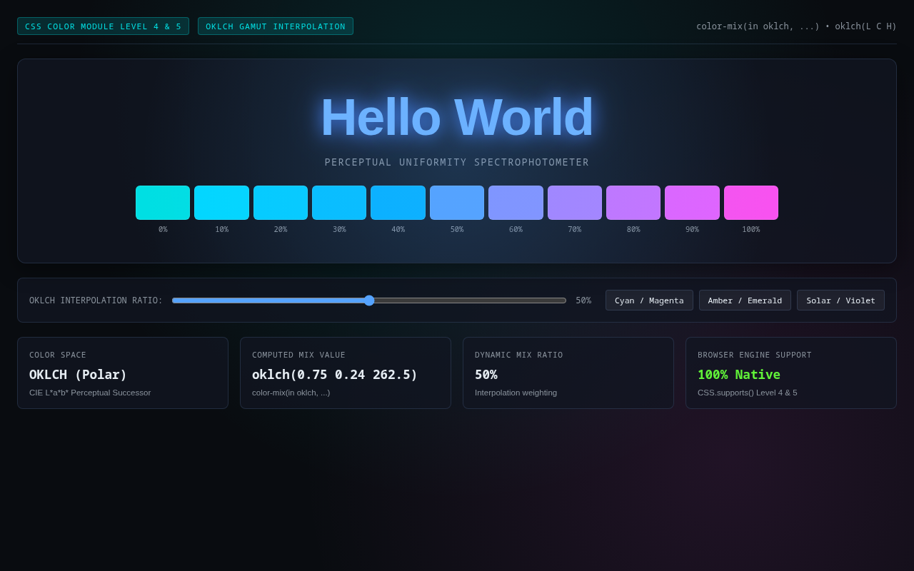](v2/agy-gemini-3.8/052/052.html) | [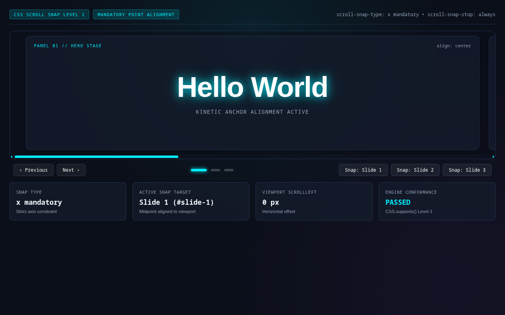](v2/agy-gemini-3.8/053/053.html) | [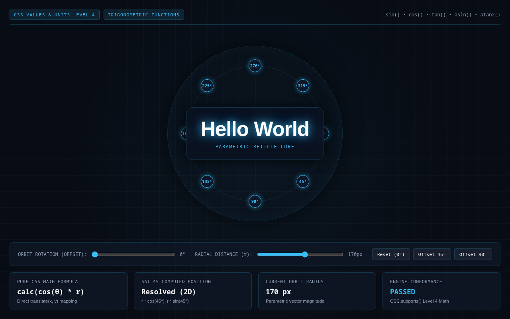](v2/agy-gemini-3.8/054/054.html) |
| :---: | :---: | :---: |
| **052 — CSS Color Module Level 4 & 5 OKLCH Spectral Mixer** [Demo](v2/agy-gemini-3.8/052/052.html) · [Report](v2/agy-gemini-3.8/052/report.md) · [Journal](v2/agy-gemini-3.8/052/journal.md) | **053 — CSS Scroll Snap Module Level 1 Tactile Viewport** [Demo](v2/agy-gemini-3.8/053/053.html) · [Report](v2/agy-gemini-3.8/053/report.md) · [Journal](v2/agy-gemini-3.8/053/journal.md) | **054 — CSS Trigonometric Functions Level 4 Parametric Reticle** [Demo](v2/agy-gemini-3.8/054/054.html) · [Report](v2/agy-gemini-3.8/054/report.md) · [Journal](v2/agy-gemini-3.8/054/journal.md) |

| [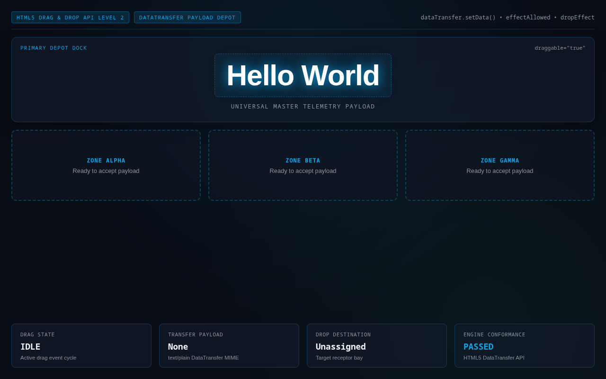](v2/agy-gemini-3.8/055/055.html) | [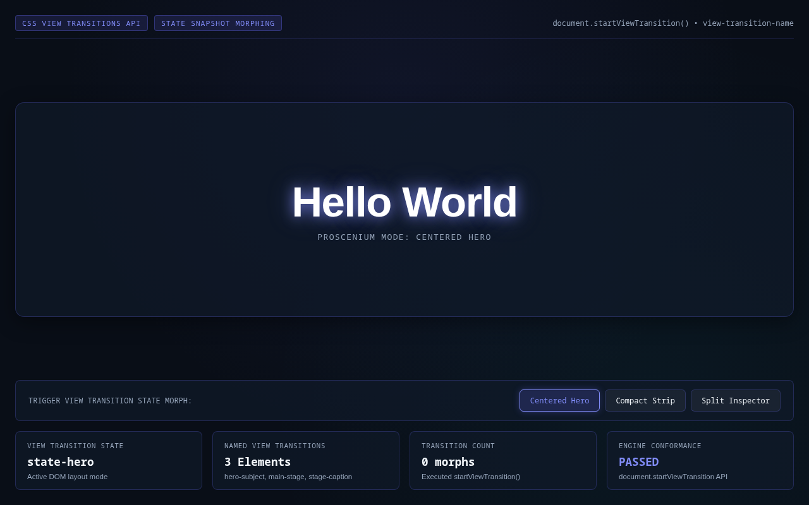](v2/agy-gemini-3.8/056/056.html) | [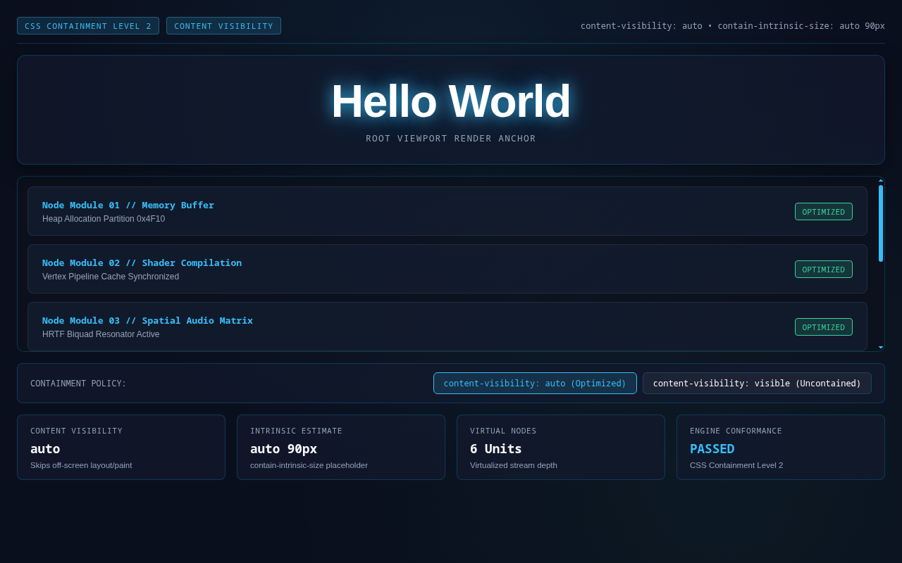](v2/agy-gemini-3.8/057/057.html) |
| :---: | :---: | :---: |
| **055 — HTML5 Drag and Drop API Level 2 Payload Staging Depot** [Demo](v2/agy-gemini-3.8/055/055.html) · [Report](v2/agy-gemini-3.8/055/report.md) · [Journal](v2/agy-gemini-3.8/055/journal.md) | **056 — CSS View Transitions API Level 1 State Morphing** [Demo](v2/agy-gemini-3.8/056/056.html) · [Report](v2/agy-gemini-3.8/056/report.md) · [Journal](v2/agy-gemini-3.8/056/journal.md) | **057 — CSS Content Visibility & Containment Level 2** [Demo](v2/agy-gemini-3.8/057/057.html) · [Report](v2/agy-gemini-3.8/057/report.md) · [Journal](v2/agy-gemini-3.8/057/journal.md) |

| [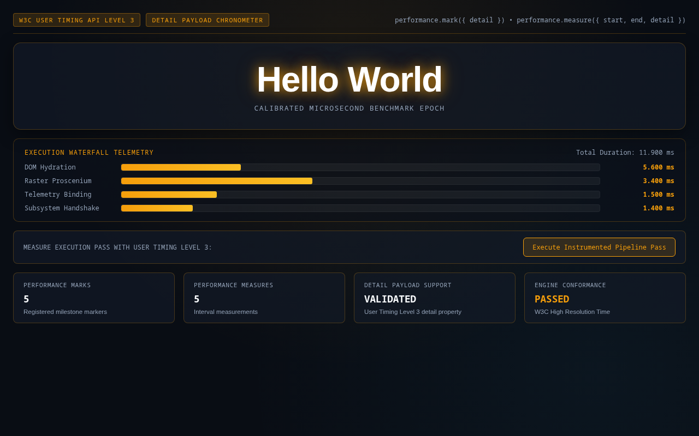](v2/agy-gemini-3.8/058/058.html) | [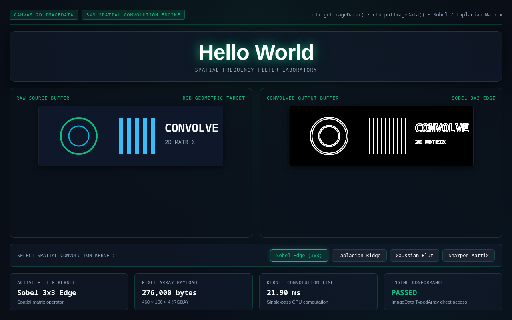](v2/agy-gemini-3.8/059/059.dev.html) | |
| :---: | :---: | :---: |
| **058 — W3C User Timing API Level 3 Execution Chronometer** [Demo](v2/agy-gemini-3.8/058/058.html) · [Report](v2/agy-gemini-3.8/058/report.md) · [Journal](v2/agy-gemini-3.8/058/journal.md) | **059 — Experiment 059** [Demo](v2/agy-gemini-3.8/059/059.dev.html) | |

## aistudio-gemini-3.8

An interactive showcase and experimental laboratory featuring 200 distinct visual, interactive, and algorithmic studies centered on the phrase Hello World. Built natively with React 19, Vite, and modern Web APIs, providing real-time exploration, category filtering, and direct DOM inspection... [Devamını oku](v2/aistudio-gemini-3.8/README.md)

[Demo](v2/aistudio-gemini-3.8/dist/index.html)

## luna-5.6

**174 experiments**

|  | [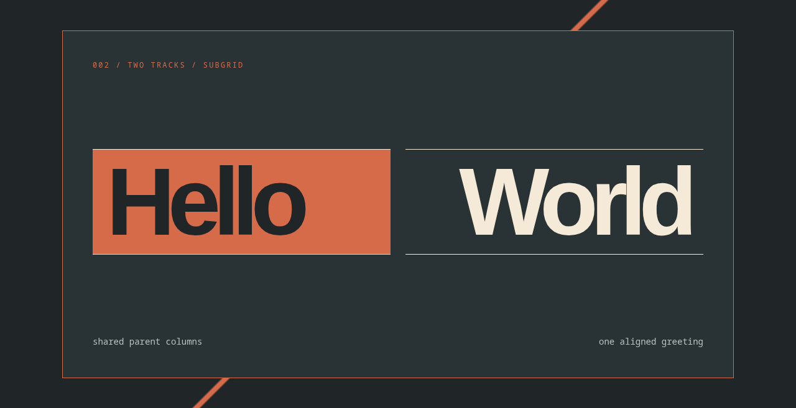](v2/luna-5.6/002/002.html) | [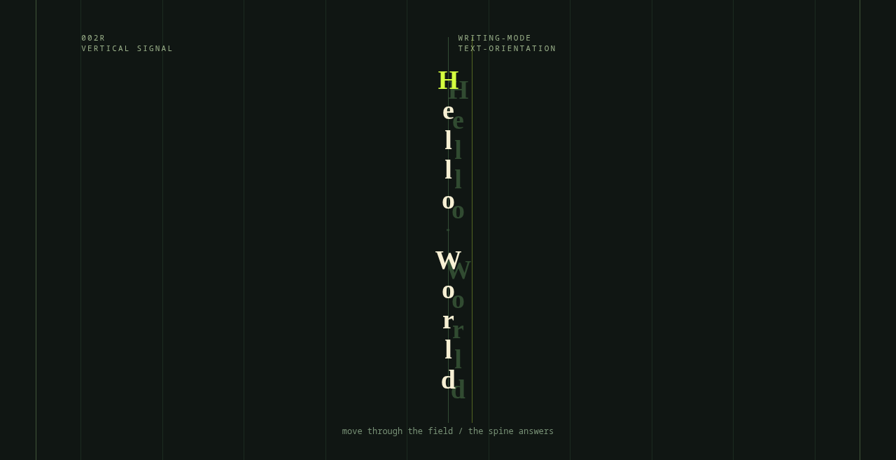](v2/luna-5.6/002R/002R.html) |
| :---: | :---: | :---: |
| **001 — Minimal Semantic HTML Baseline** [Demo](v2/luna-5.6/001/001.html) · [Report](v2/luna-5.6/001/report.md) · [Journal](v2/luna-5.6/001/journal.md) | **002 — Two Tracks** [Demo](v2/luna-5.6/002/002.html) · [Report](v2/luna-5.6/002/report.md) · [Journal](v2/luna-5.6/002/journal.md) | **002R — Experiment 002R — Vertical Signal** [Demo](v2/luna-5.6/002R/002R.html) · [Report](v2/luna-5.6/002R/report.md) · [Journal](v2/luna-5.6/002R/journal.md) |

| [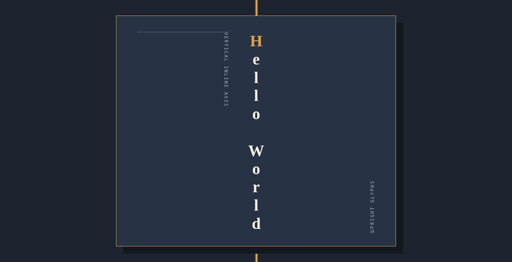](v2/luna-5.6/003/003.html) | [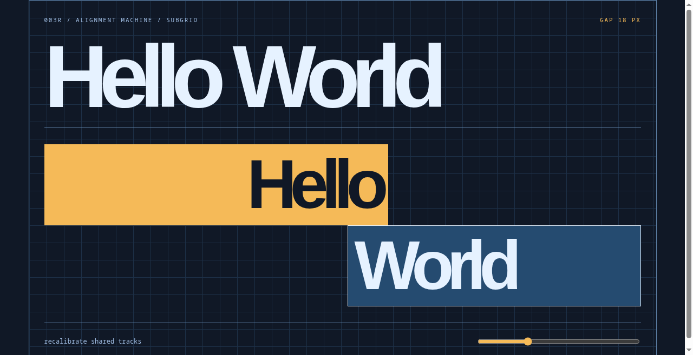](v2/luna-5.6/003R/003R.html) | [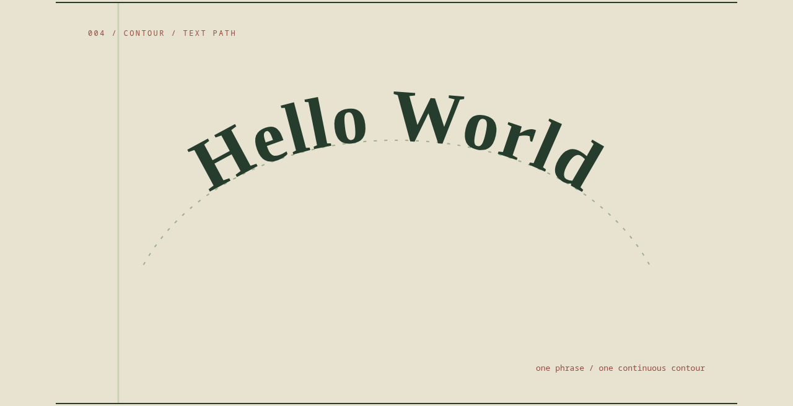](v2/luna-5.6/004/004.html) |
| :---: | :---: | :---: |
| **003 — Spine** [Demo](v2/luna-5.6/003/003.html) · [Report](v2/luna-5.6/003/report.md) · [Journal](v2/luna-5.6/003/journal.md) | **003R — Experiment 003R — Alignment Machine** [Demo](v2/luna-5.6/003R/003R.html) · [Report](v2/luna-5.6/003R/report.md) · [Journal](v2/luna-5.6/003R/journal.md) | **004 — Contour** [Demo](v2/luna-5.6/004/004.html) · [Report](v2/luna-5.6/004/report.md) · [Journal](v2/luna-5.6/004/journal.md) |

| [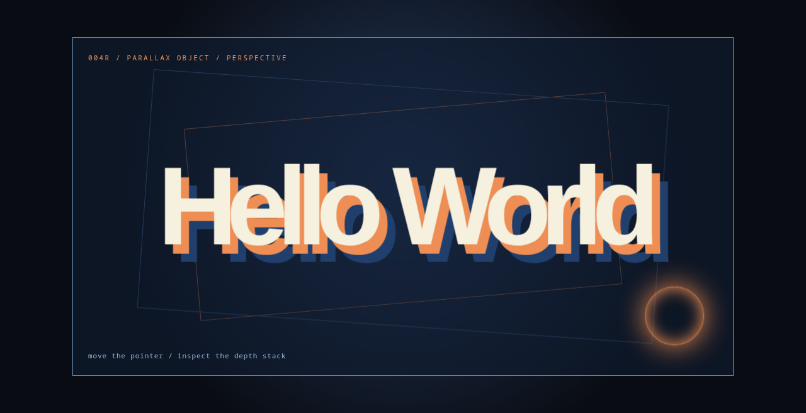](v2/luna-5.6/004R/004R.html) | [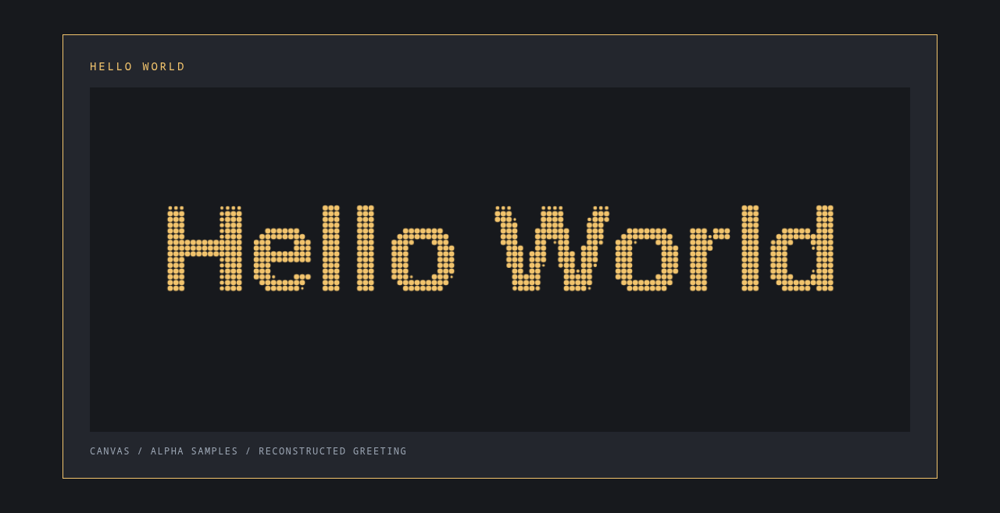](v2/luna-5.6/005/005.html) | [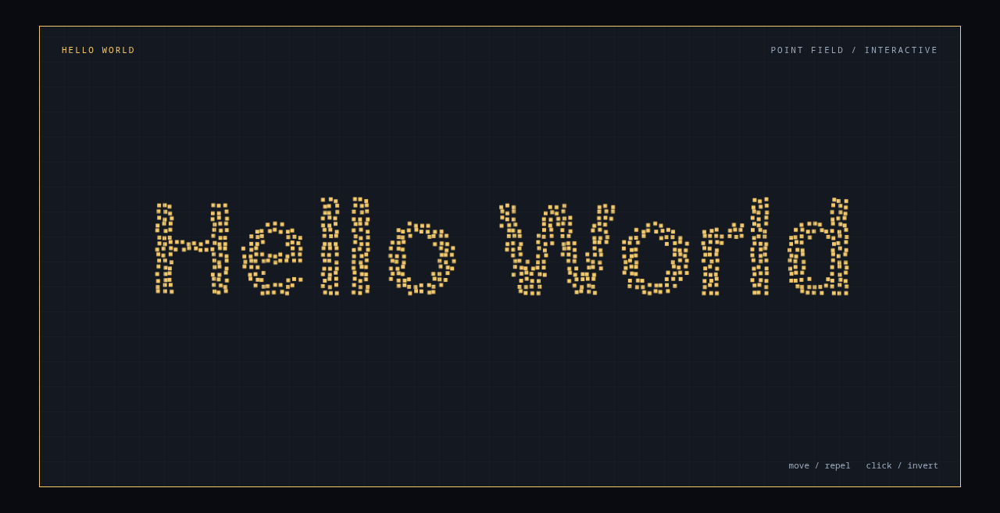](v2/luna-5.6/005R/005R.html) |
| :---: | :---: | :---: |
| **004R — Experiment 004R — Parallax Object** [Demo](v2/luna-5.6/004R/004R.html) · [Report](v2/luna-5.6/004R/report.md) · [Journal](v2/luna-5.6/004R/journal.md) | **005 — Point Field** [Demo](v2/luna-5.6/005/005.html) · [Report](v2/luna-5.6/005/report.md) · [Journal](v2/luna-5.6/005/journal.md) | **005R — Experiment 005R — Living Particles** [Demo](v2/luna-5.6/005R/005R.html) · [Report](v2/luna-5.6/005R/report.md) · [Journal](v2/luna-5.6/005R/journal.md) |

|  | [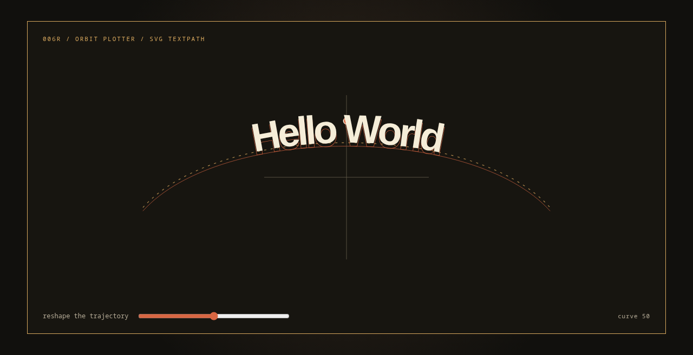](v2/luna-5.6/006R/006R.html) |  |
| :---: | :---: | :---: |
| **006 — Tilt** [Demo](v2/luna-5.6/006/006.html) · [Report](v2/luna-5.6/006/report.md) · [Journal](v2/luna-5.6/006/journal.md) | **006R — Experiment 006R — Orbit Plotter** [Demo](v2/luna-5.6/006R/006R.html) · [Report](v2/luna-5.6/006R/report.md) · [Journal](v2/luna-5.6/006R/journal.md) | **007 — Countermotion** [Demo](v2/luna-5.6/007/007.html) · [Report](v2/luna-5.6/007/report.md) · [Journal](v2/luna-5.6/007/journal.md) |

| [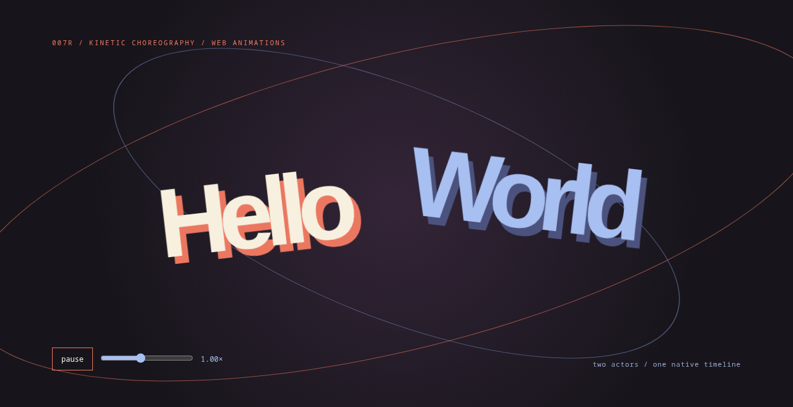](v2/luna-5.6/007R/007R.html) | [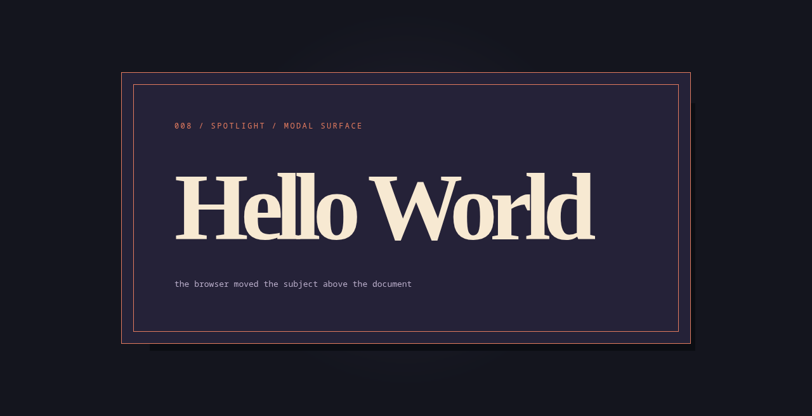](v2/luna-5.6/008/008.html) | [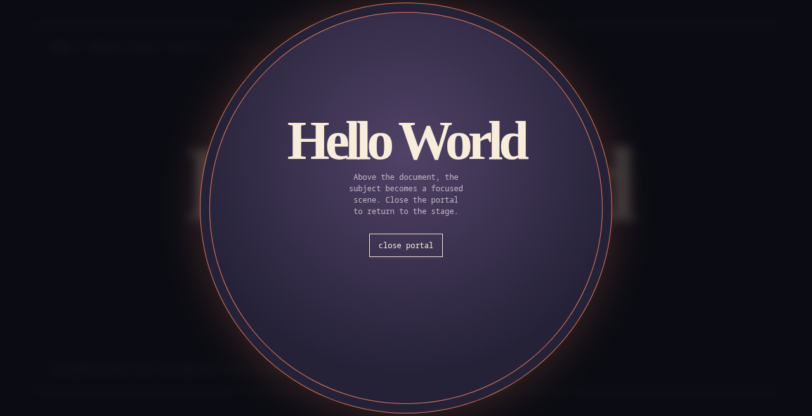](v2/luna-5.6/008R/008R.html) |
| :---: | :---: | :---: |
| **007R — Experiment 007R — Kinetic Choreography** [Demo](v2/luna-5.6/007R/007R.html) · [Report](v2/luna-5.6/007R/report.md) · [Journal](v2/luna-5.6/007R/journal.md) | **008 — Spotlight** [Demo](v2/luna-5.6/008/008.html) · [Report](v2/luna-5.6/008/report.md) · [Journal](v2/luna-5.6/008/journal.md) | **008R — Experiment 008R — Portal Stage** [Demo](v2/luna-5.6/008R/008R.html) · [Report](v2/luna-5.6/008R/report.md) · [Journal](v2/luna-5.6/008R/journal.md) |

|  | [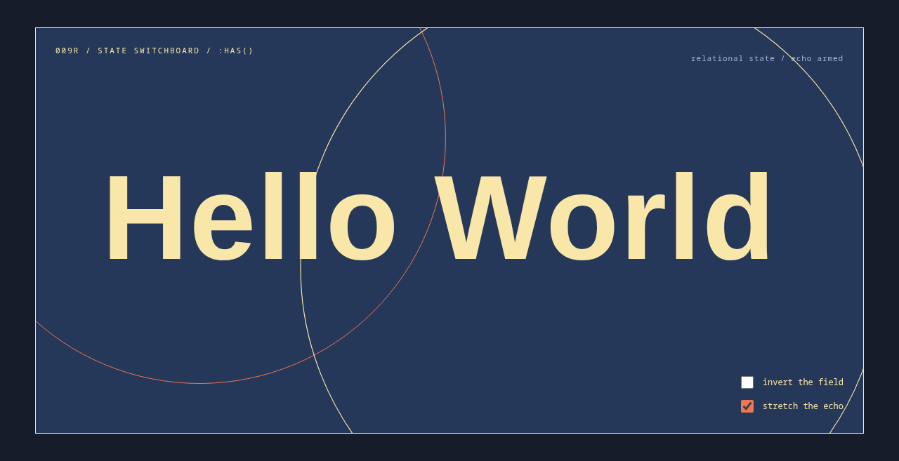](v2/luna-5.6/009R/009R.html) | [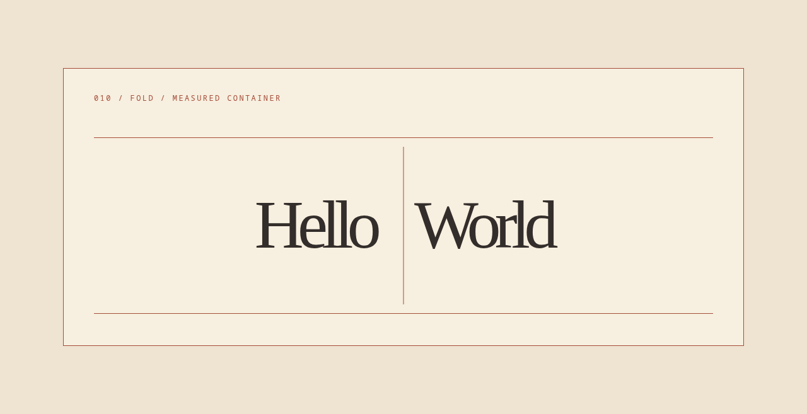](v2/luna-5.6/010/010.html) |
| :---: | :---: | :---: |
| **009 — Impression** [Demo](v2/luna-5.6/009/009.html) · [Report](v2/luna-5.6/009/report.md) · [Journal](v2/luna-5.6/009/journal.md) | **009R — Experiment 009R — State Switchboard** [Demo](v2/luna-5.6/009R/009R.html) · [Report](v2/luna-5.6/009R/report.md) · [Journal](v2/luna-5.6/009R/journal.md) | **010 — Fold** [Demo](v2/luna-5.6/010/010.html) · [Report](v2/luna-5.6/010/report.md) · [Journal](v2/luna-5.6/010/journal.md) |

| [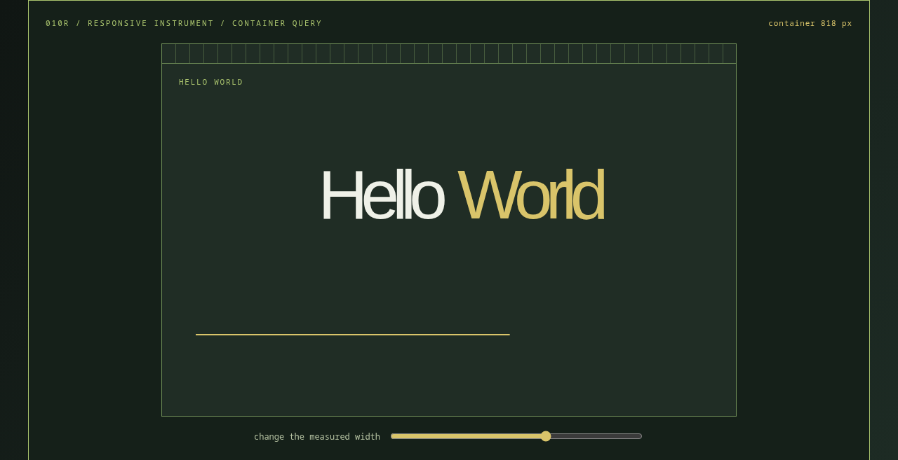](v2/luna-5.6/010R/010R.html) |  | [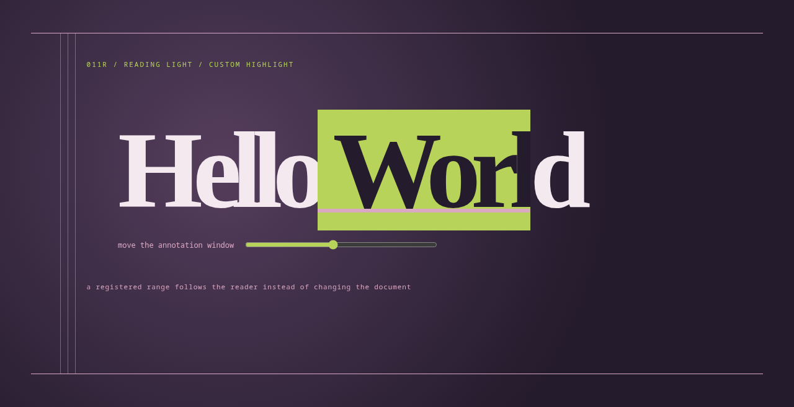](v2/luna-5.6/011R/011R.html) |
| :---: | :---: | :---: |
| **010R — Experiment 010R — Responsive Instrument** [Demo](v2/luna-5.6/010R/010R.html) · [Report](v2/luna-5.6/010R/report.md) · [Journal](v2/luna-5.6/010R/journal.md) | **011 — Annotation** [Demo](v2/luna-5.6/011/011.html) · [Report](v2/luna-5.6/011/report.md) · [Journal](v2/luna-5.6/011/journal.md) | **011R — Experiment 011R — Reading Light** [Demo](v2/luna-5.6/011R/011R.html) · [Report](v2/luna-5.6/011R/report.md) · [Journal](v2/luna-5.6/011R/journal.md) |

|  | [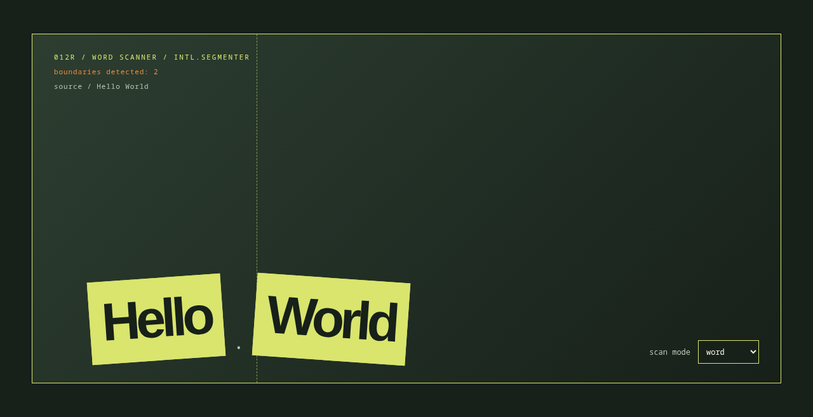](v2/luna-5.6/012R/012R.html) |  |
| :---: | :---: | :---: |
| **012 — Units** [Demo](v2/luna-5.6/012/012.html) · [Report](v2/luna-5.6/012/report.md) · [Journal](v2/luna-5.6/012/journal.md) | **012R — Experiment 012R — Word Scanner** [Demo](v2/luna-5.6/012R/012R.html) · [Report](v2/luna-5.6/012R/report.md) · [Journal](v2/luna-5.6/012R/journal.md) | **013 — Shared Plate** [Demo](v2/luna-5.6/013/013.html) · [Report](v2/luna-5.6/013/report.md) · [Journal](v2/luna-5.6/013/journal.md) |

| [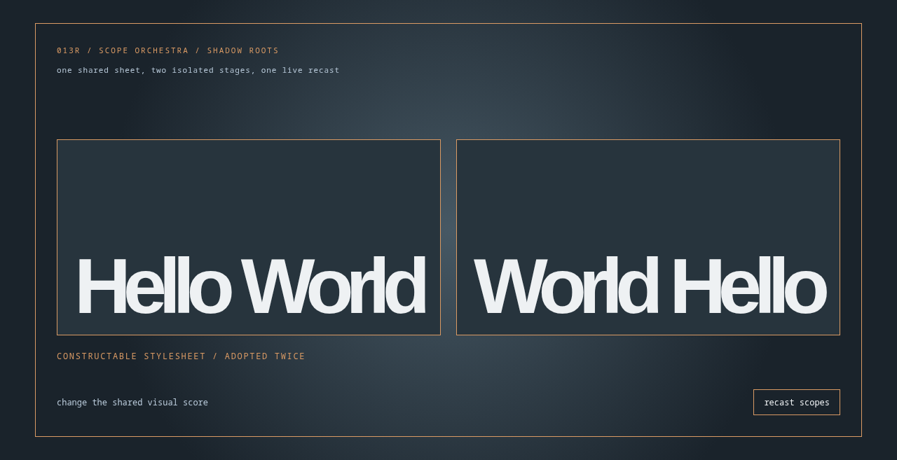](v2/luna-5.6/013R/013R.html) | [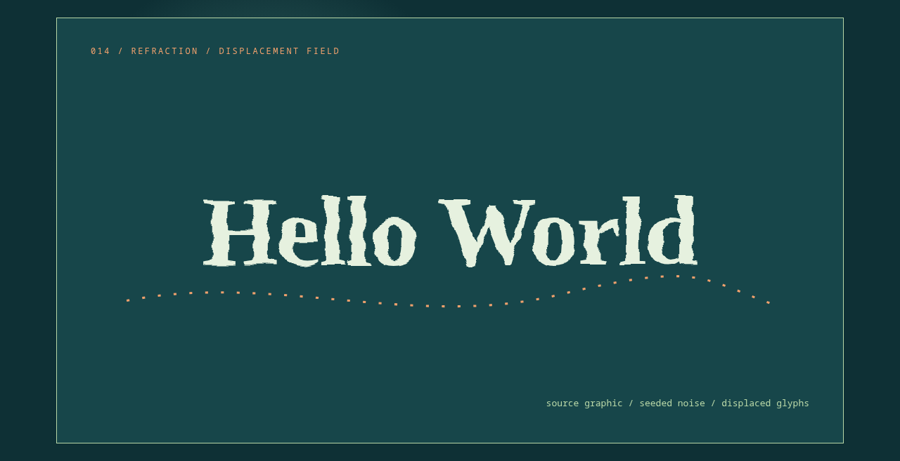](v2/luna-5.6/014/014.html) | [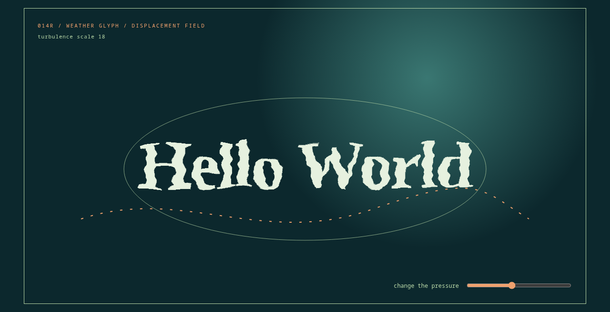](v2/luna-5.6/014R/014R.html) |
| :---: | :---: | :---: |
| **013R — Experiment 013R — Scope Orchestra** [Demo](v2/luna-5.6/013R/013R.html) · [Report](v2/luna-5.6/013R/report.md) · [Journal](v2/luna-5.6/013R/journal.md) | **014 — Refraction** [Demo](v2/luna-5.6/014/014.html) · [Report](v2/luna-5.6/014/report.md) · [Journal](v2/luna-5.6/014/journal.md) | **014R — Experiment 014R — Weather Glyph** [Demo](v2/luna-5.6/014R/014R.html) · [Report](v2/luna-5.6/014R/report.md) · [Journal](v2/luna-5.6/014R/journal.md) |

| [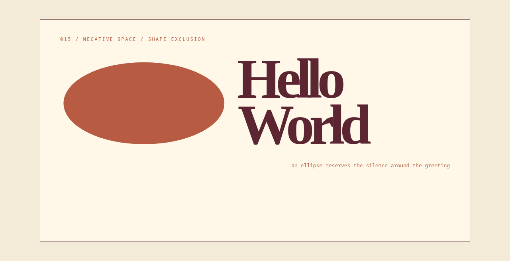](v2/luna-5.6/015/015.html) | [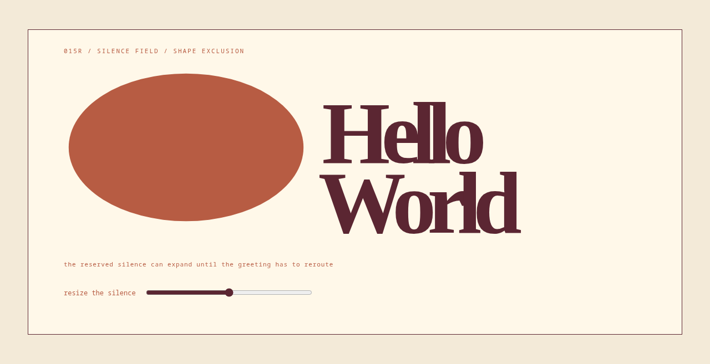](v2/luna-5.6/015R/015R.html) | [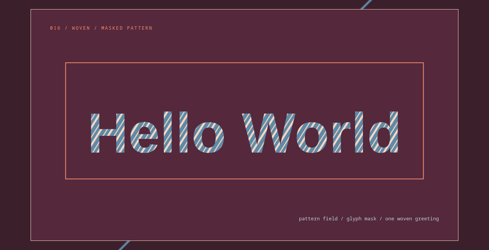](v2/luna-5.6/016/016.html) |
| :---: | :---: | :---: |
| **015 — Negative Space** [Demo](v2/luna-5.6/015/015.html) · [Report](v2/luna-5.6/015/report.md) · [Journal](v2/luna-5.6/015/journal.md) | **015R — Experiment 015R — Silence Field** [Demo](v2/luna-5.6/015R/015R.html) · [Report](v2/luna-5.6/015R/report.md) · [Journal](v2/luna-5.6/015R/journal.md) | **016 — Woven** [Demo](v2/luna-5.6/016/016.html) · [Report](v2/luna-5.6/016/report.md) · [Journal](v2/luna-5.6/016/journal.md) |

| [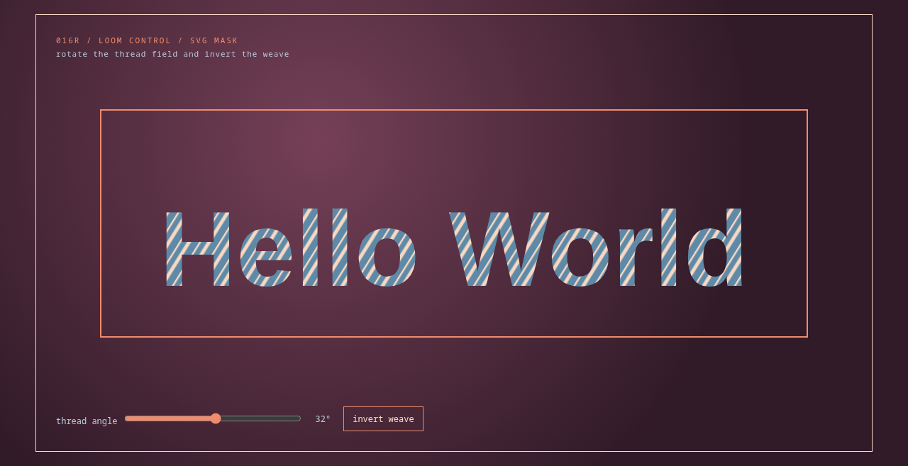](v2/luna-5.6/016R/016R.html) | [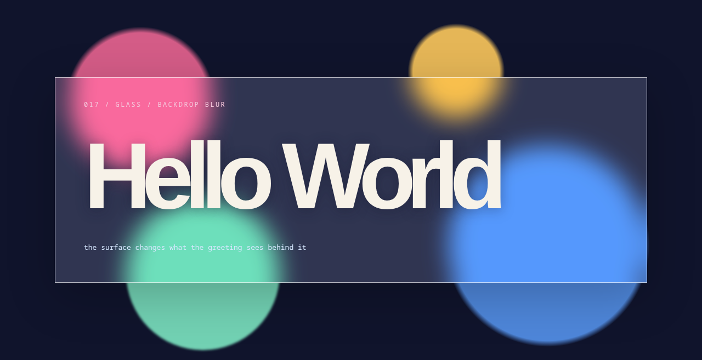](v2/luna-5.6/017/017.html) | [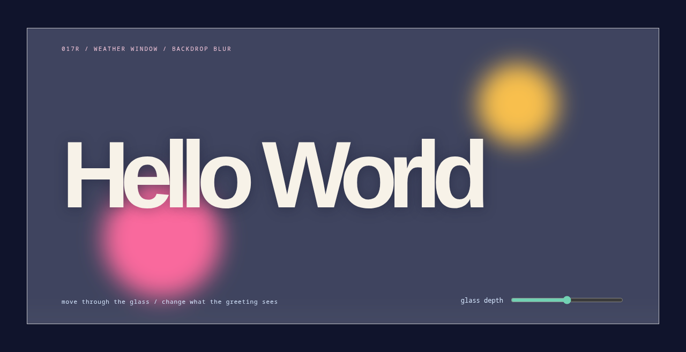](v2/luna-5.6/017R/017R.html) |
| :---: | :---: | :---: |
| **016R — Experiment 016R — Loom Control** [Demo](v2/luna-5.6/016R/016R.html) · [Report](v2/luna-5.6/016R/report.md) · [Journal](v2/luna-5.6/016R/journal.md) | **017 — Glass** [Demo](v2/luna-5.6/017/017.html) · [Report](v2/luna-5.6/017/report.md) · [Journal](v2/luna-5.6/017/journal.md) | **017R — Experiment 017R — Weather Window** [Demo](v2/luna-5.6/017R/017R.html) · [Report](v2/luna-5.6/017R/report.md) · [Journal](v2/luna-5.6/017R/journal.md) |

| [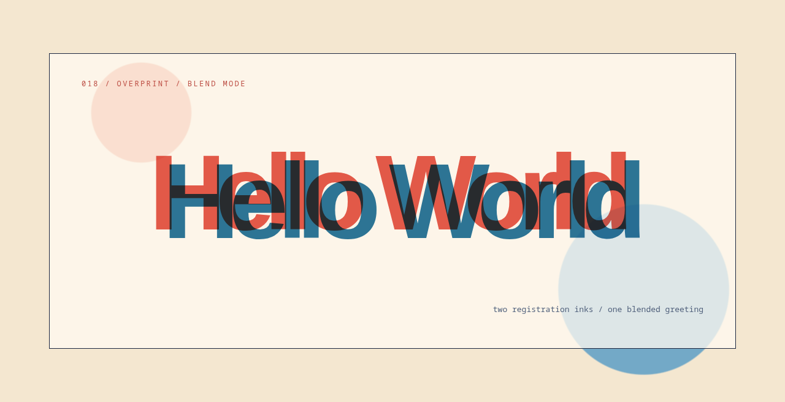](v2/luna-5.6/018/018.html) | [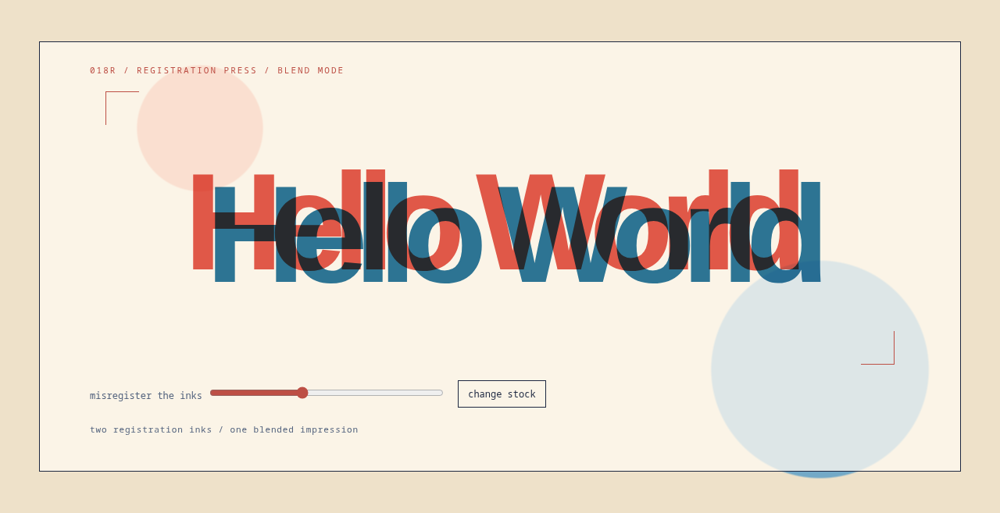](v2/luna-5.6/018R/018R.html) | [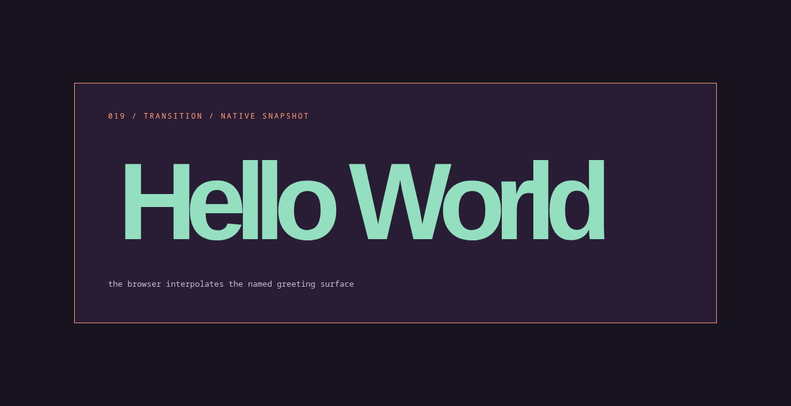](v2/luna-5.6/019/019.html) |
| :---: | :---: | :---: |
| **018 — Overprint** [Demo](v2/luna-5.6/018/018.html) · [Report](v2/luna-5.6/018/report.md) · [Journal](v2/luna-5.6/018/journal.md) | **018R — Experiment 018R — Registration Press** [Demo](v2/luna-5.6/018R/018R.html) · [Report](v2/luna-5.6/018R/report.md) · [Journal](v2/luna-5.6/018R/journal.md) | **019 — Transition** [Demo](v2/luna-5.6/019/019.html) · [Report](v2/luna-5.6/019/report.md) · [Journal](v2/luna-5.6/019/journal.md) |

| [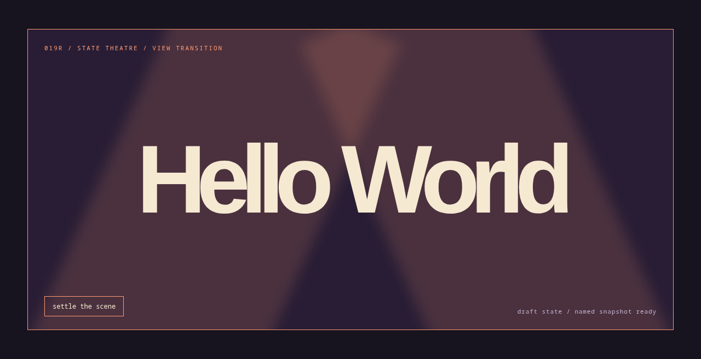](v2/luna-5.6/019R/019R.html) | [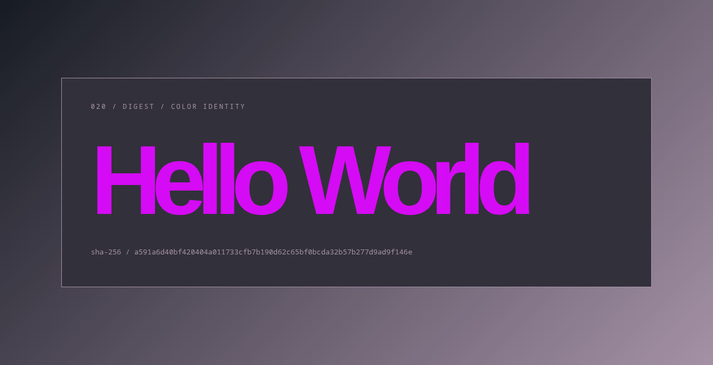](v2/luna-5.6/020/020.html) | [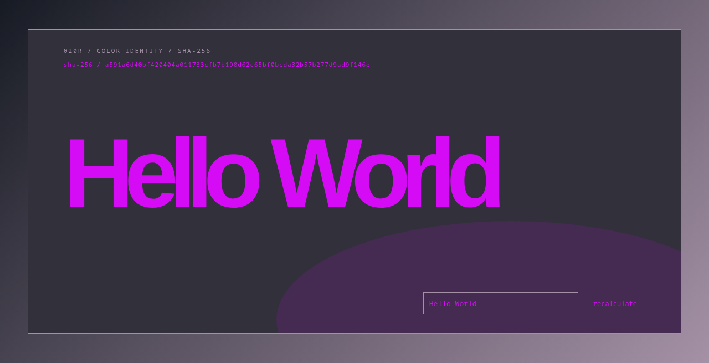](v2/luna-5.6/020R/020R.html) |
| :---: | :---: | :---: |
| **019R — Experiment 019R — State Theatre** [Demo](v2/luna-5.6/019R/019R.html) · [Report](v2/luna-5.6/019R/report.md) · [Journal](v2/luna-5.6/019R/journal.md) | **020 — Digest** [Demo](v2/luna-5.6/020/020.html) · [Report](v2/luna-5.6/020/report.md) · [Journal](v2/luna-5.6/020/journal.md) | **020R — Experiment 020R — Color Identity** [Demo](v2/luna-5.6/020R/020R.html) · [Report](v2/luna-5.6/020R/report.md) · [Journal](v2/luna-5.6/020R/journal.md) |

|  |  |  |
| :---: | :---: | :---: |
| **021 — Scroll Timeline** [Demo](v2/luna-5.6/021/021.html) · [Report](v2/luna-5.6/021/report.md) · [Journal](v2/luna-5.6/021/journal.md) | **021R — Experiment 021R — Scroll Elevator** [Demo](v2/luna-5.6/021R/021R.html) · [Report](v2/luna-5.6/021R/report.md) · [Journal](v2/luna-5.6/021R/journal.md) | **022 — Stream** [Demo](v2/luna-5.6/022/022.html) · [Report](v2/luna-5.6/022/report.md) · [Journal](v2/luna-5.6/022/journal.md) |

| [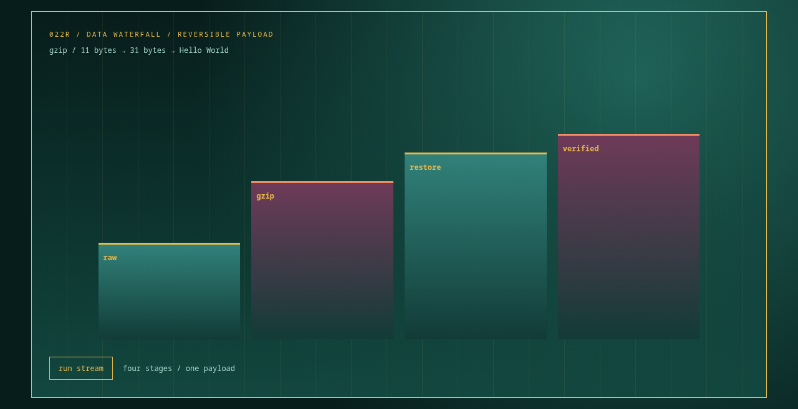](v2/luna-5.6/022R/022R.html) |  | [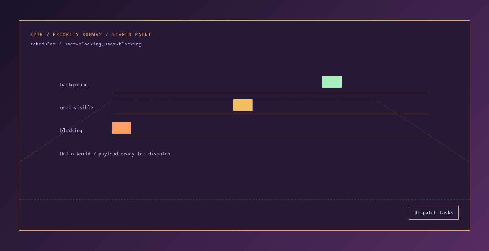](v2/luna-5.6/023R/023R.html) |
| :---: | :---: | :---: |
| **022R — Experiment 022R — Data Waterfall** [Demo](v2/luna-5.6/022R/022R.html) · [Report](v2/luna-5.6/022R/report.md) · [Journal](v2/luna-5.6/022R/journal.md) | **023 — Priority** [Demo](v2/luna-5.6/023/023.html) · [Report](v2/luna-5.6/023/report.md) · [Journal](v2/luna-5.6/023/journal.md) | **023R — Experiment 023R — Priority Runway** [Demo](v2/luna-5.6/023R/023R.html) · [Report](v2/luna-5.6/023R/report.md) · [Journal](v2/luna-5.6/023R/journal.md) |

| [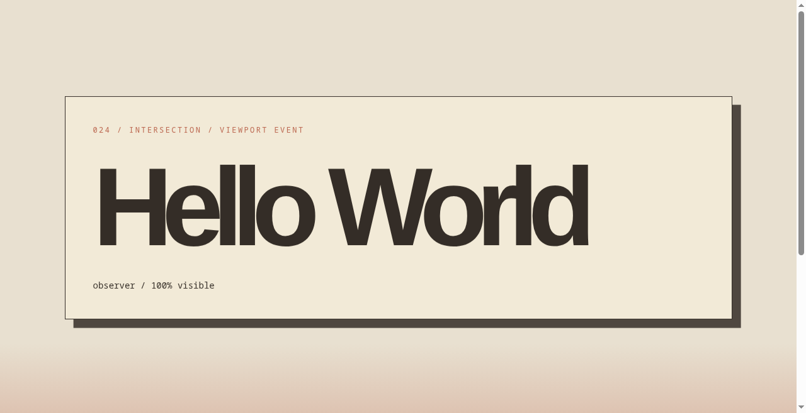](v2/luna-5.6/024/024.html) | [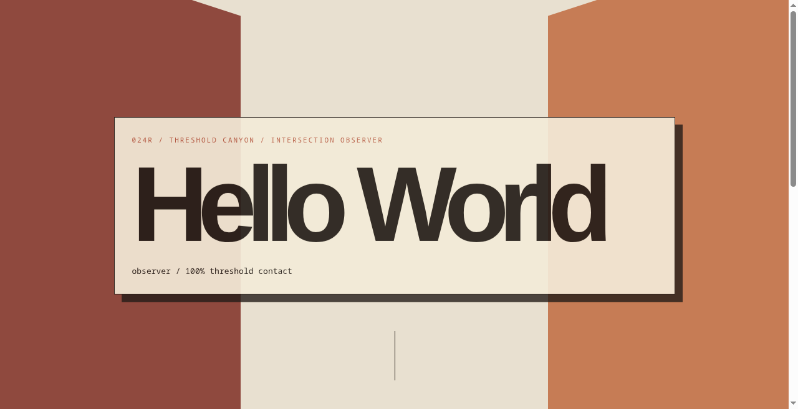](v2/luna-5.6/024R/024R.html) | [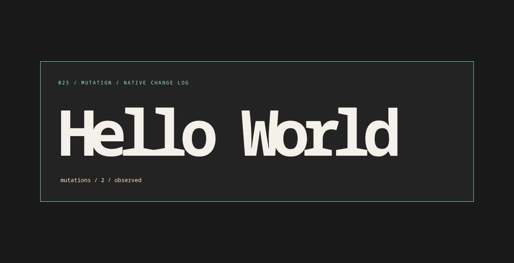](v2/luna-5.6/025/025.html) |
| :---: | :---: | :---: |
| **024 — Intersection** [Demo](v2/luna-5.6/024/024.html) · [Report](v2/luna-5.6/024/report.md) · [Journal](v2/luna-5.6/024/journal.md) | **024R — Experiment 024R — Threshold Canyon** [Demo](v2/luna-5.6/024R/024R.html) · [Report](v2/luna-5.6/024R/report.md) · [Journal](v2/luna-5.6/024R/journal.md) | **025 — Mutation** [Demo](v2/luna-5.6/025/025.html) · [Report](v2/luna-5.6/025/report.md) · [Journal](v2/luna-5.6/025/journal.md) |

| [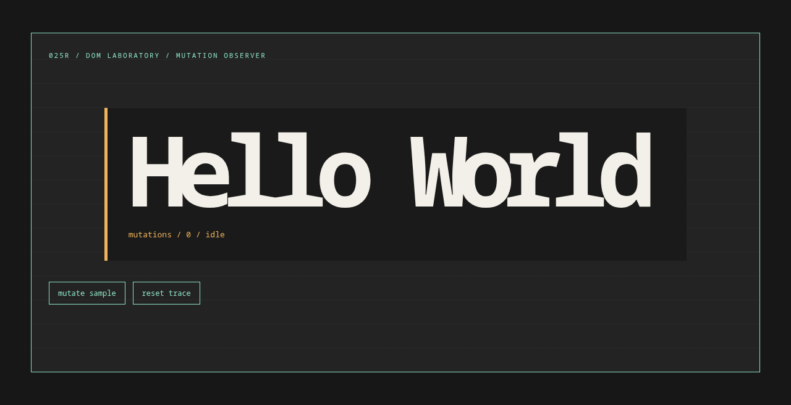](v2/luna-5.6/025R/025R.html) |  | [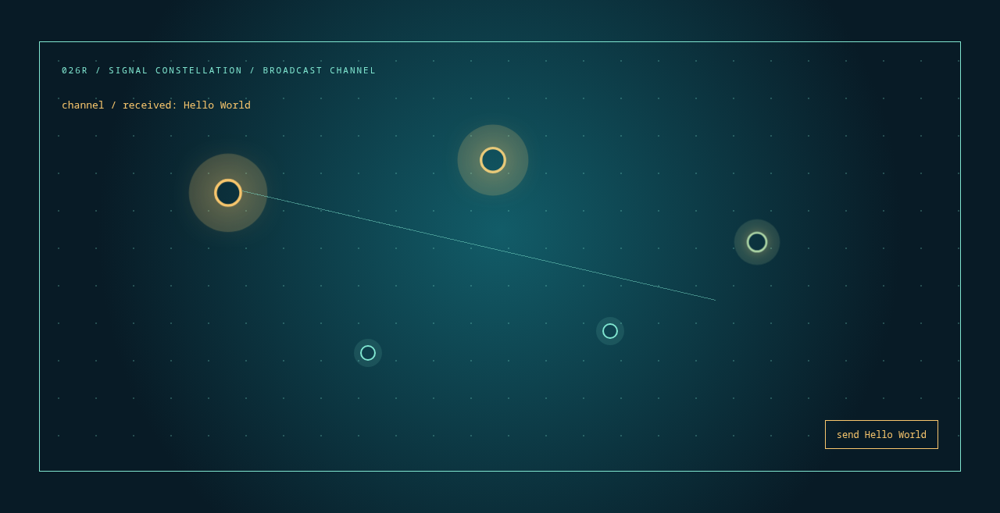](v2/luna-5.6/026R/026R.html) |
| :---: | :---: | :---: |
| **025R — Experiment 025R — DOM Laboratory** [Demo](v2/luna-5.6/025R/025R.html) · [Report](v2/luna-5.6/025R/report.md) · [Journal](v2/luna-5.6/025R/journal.md) | **026 — Channel** [Demo](v2/luna-5.6/026/026.html) · [Report](v2/luna-5.6/026/report.md) · [Journal](v2/luna-5.6/026/journal.md) | **026R — Experiment 026R — Signal Constellation** [Demo](v2/luna-5.6/026R/026R.html) · [Report](v2/luna-5.6/026R/report.md) · [Journal](v2/luna-5.6/026R/journal.md) |

|  | [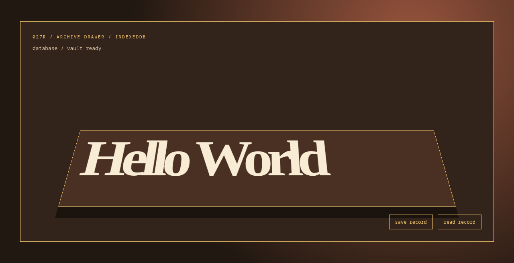](v2/luna-5.6/027R/027R.html) |  |
| :---: | :---: | :---: |
| **027 — IndexedDB** [Demo](v2/luna-5.6/027/027.html) · [Report](v2/luna-5.6/027/report.md) · [Journal](v2/luna-5.6/027/journal.md) | **027R — Experiment 027R — Archive Drawer** [Demo](v2/luna-5.6/027R/027R.html) · [Report](v2/luna-5.6/027R/report.md) · [Journal](v2/luna-5.6/027R/journal.md) | **028 — Pattern** [Demo](v2/luna-5.6/028/028.html) · [Report](v2/luna-5.6/028/report.md) · [Journal](v2/luna-5.6/028/journal.md) |

| [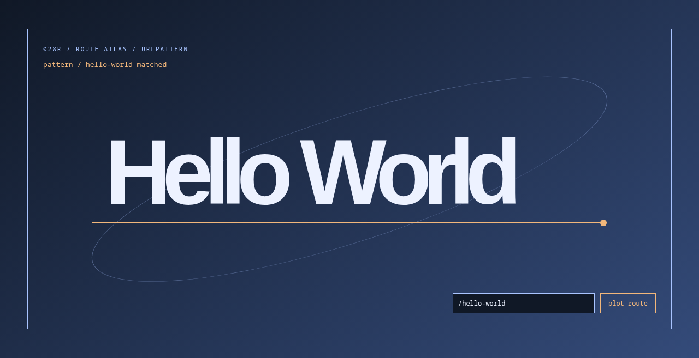](v2/luna-5.6/028R/028R.html) |  | [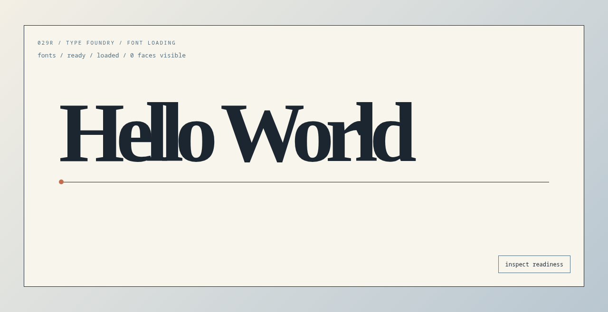](v2/luna-5.6/029R/029R.html) |
| :---: | :---: | :---: |
| **028R — Experiment 028R — Route Atlas** [Demo](v2/luna-5.6/028R/028R.html) · [Report](v2/luna-5.6/028R/report.md) · [Journal](v2/luna-5.6/028R/journal.md) | **029 — Fonts** [Demo](v2/luna-5.6/029/029.html) · [Report](v2/luna-5.6/029/report.md) · [Journal](v2/luna-5.6/029/journal.md) | **029R — Experiment 029R — Type Foundry** [Demo](v2/luna-5.6/029R/029R.html) · [Report](v2/luna-5.6/029R/report.md) · [Journal](v2/luna-5.6/029R/journal.md) |

|  | [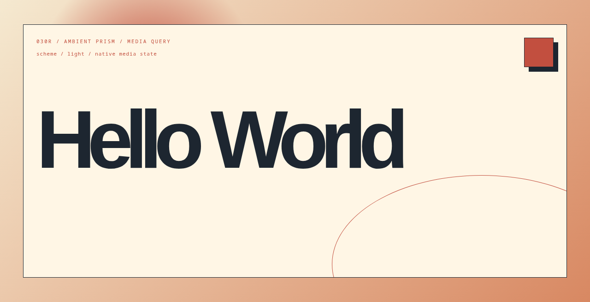](v2/luna-5.6/030R/030R.html) |  |
| :---: | :---: | :---: |
| **030 — Media Query** [Demo](v2/luna-5.6/030/030.html) · [Report](v2/luna-5.6/030/report.md) · [Journal](v2/luna-5.6/030/journal.md) | **030R — Experiment 030R — Ambient Prism** [Demo](v2/luna-5.6/030R/030R.html) · [Report](v2/luna-5.6/030R/report.md) · [Journal](v2/luna-5.6/030R/journal.md) | **031 — Audio** [Demo](v2/luna-5.6/031/031.html) · [Report](v2/luna-5.6/031/report.md) · [Journal](v2/luna-5.6/031/journal.md) |

| [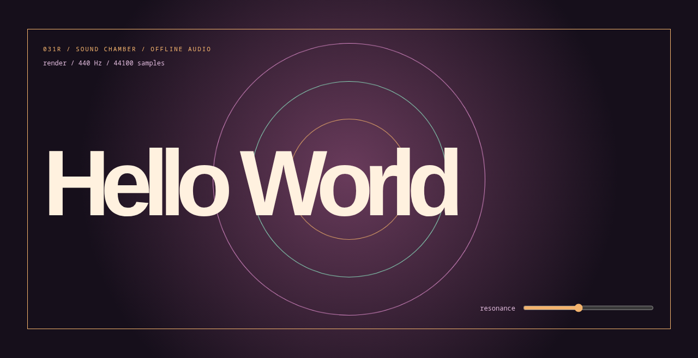](v2/luna-5.6/031R/031R.html) | [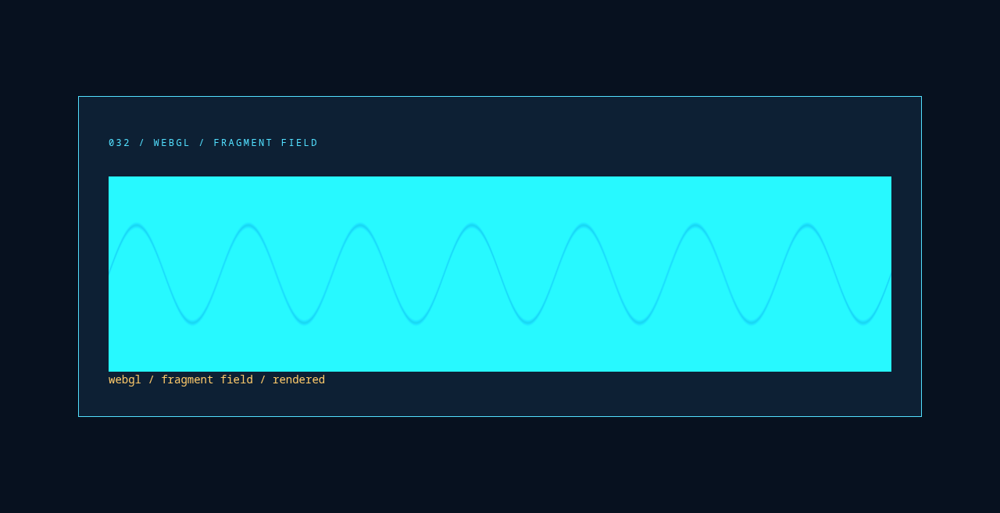](v2/luna-5.6/032/032.html) | [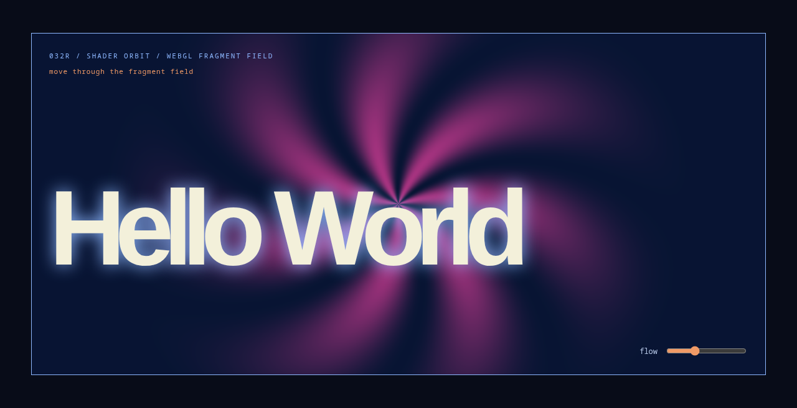](v2/luna-5.6/032R/032R.html) |
| :---: | :---: | :---: |
| **031R — Experiment 031R — Sound Chamber** [Demo](v2/luna-5.6/031R/031R.html) · [Report](v2/luna-5.6/031R/report.md) · [Journal](v2/luna-5.6/031R/journal.md) | **032 — WebGL** [Demo](v2/luna-5.6/032/032.html) · [Report](v2/luna-5.6/032/report.md) · [Journal](v2/luna-5.6/032/journal.md) | **032R — Experiment 032R — Shader Orbit** [Demo](v2/luna-5.6/032R/032R.html) · [Report](v2/luna-5.6/032R/report.md) · [Journal](v2/luna-5.6/032R/journal.md) |

|  | [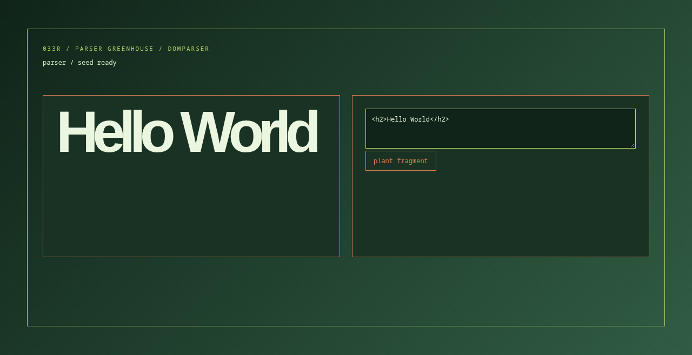](v2/luna-5.6/033R/033R.html) | [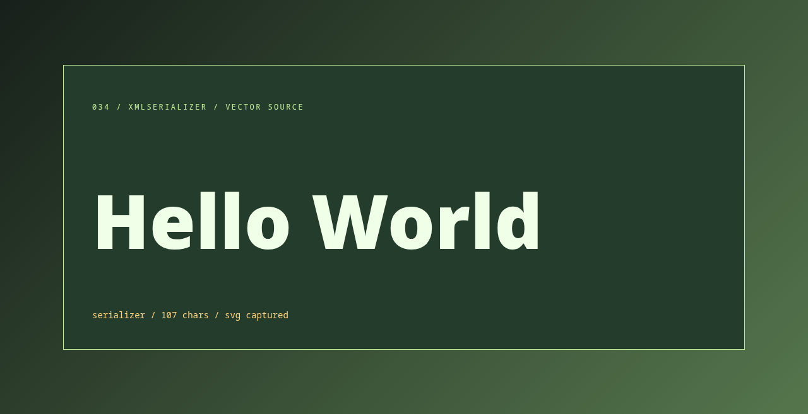](v2/luna-5.6/034/034.html) |
| :---: | :---: | :---: |
| **033 — Parser** [Demo](v2/luna-5.6/033/033.html) · [Report](v2/luna-5.6/033/report.md) · [Journal](v2/luna-5.6/033/journal.md) | **033R — Experiment 033R — Parser Greenhouse** [Demo](v2/luna-5.6/033R/033R.html) · [Report](v2/luna-5.6/033R/report.md) · [Journal](v2/luna-5.6/033R/journal.md) | **034 — Serialize** [Demo](v2/luna-5.6/034/034.html) · [Report](v2/luna-5.6/034/report.md) · [Journal](v2/luna-5.6/034/journal.md) |

| [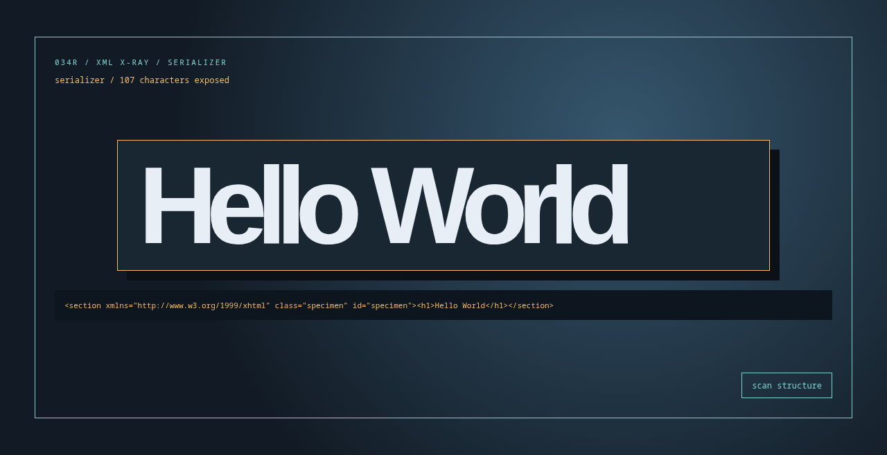](v2/luna-5.6/034R/034R.html) |  |  |
| :---: | :---: | :---: |
| **034R — Experiment 034R — XML X-Ray** [Demo](v2/luna-5.6/034R/034R.html) · [Report](v2/luna-5.6/034R/report.md) · [Journal](v2/luna-5.6/034R/journal.md) | **035 — FormData** [Demo](v2/luna-5.6/035/035.html) · [Report](v2/luna-5.6/035/report.md) · [Journal](v2/luna-5.6/035/journal.md) | **035R — Experiment 035R — Parcel Desk** [Demo](v2/luna-5.6/035R/035R.html) · [Report](v2/luna-5.6/035R/report.md) · [Journal](v2/luna-5.6/035R/journal.md) |

| [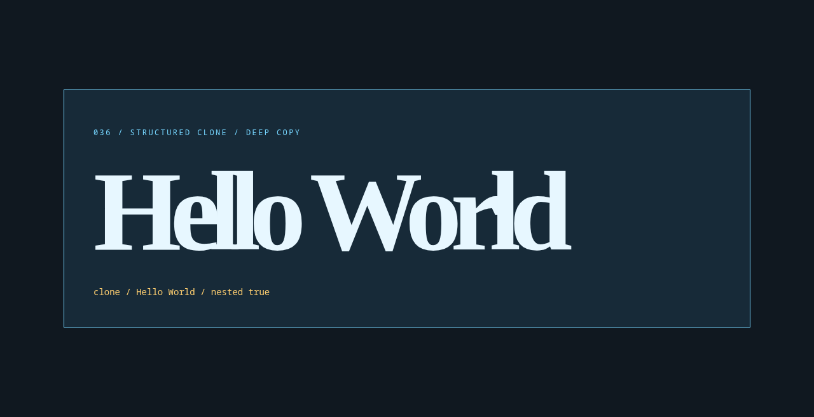](v2/luna-5.6/036/036.html) | [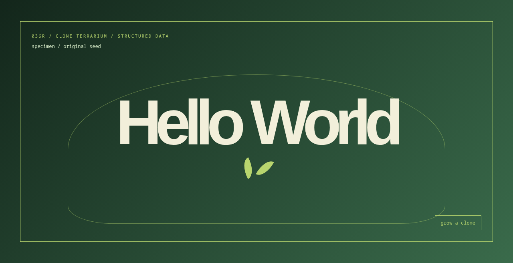](v2/luna-5.6/036R/036R.html) | [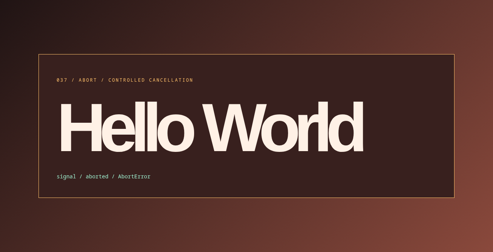](v2/luna-5.6/037/037.html) |
| :---: | :---: | :---: |
| **036 — Clone** [Demo](v2/luna-5.6/036/036.html) · [Report](v2/luna-5.6/036/report.md) · [Journal](v2/luna-5.6/036/journal.md) | **036R — Experiment 036R — Clone Terrarium** [Demo](v2/luna-5.6/036R/036R.html) · [Report](v2/luna-5.6/036R/report.md) · [Journal](v2/luna-5.6/036R/journal.md) | **037 — Abort** [Demo](v2/luna-5.6/037/037.html) · [Report](v2/luna-5.6/037/report.md) · [Journal](v2/luna-5.6/037/journal.md) |

| [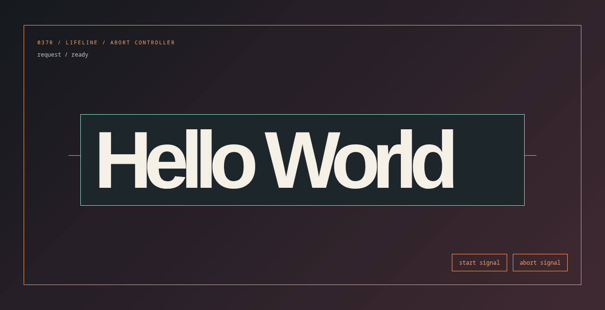](v2/luna-5.6/037R/037R.html) |  | [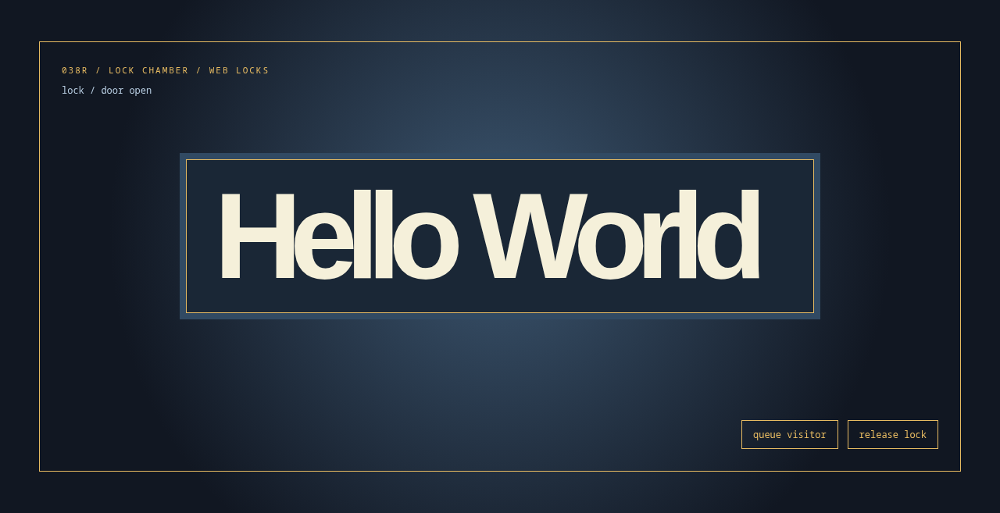](v2/luna-5.6/038R/038R.html) |
| :---: | :---: | :---: |
| **037R — Experiment 037R — Lifeline** [Demo](v2/luna-5.6/037R/037R.html) · [Report](v2/luna-5.6/037R/report.md) · [Journal](v2/luna-5.6/037R/journal.md) | **038 — Locks** [Demo](v2/luna-5.6/038/038.html) · [Report](v2/luna-5.6/038/report.md) · [Journal](v2/luna-5.6/038/journal.md) | **038R — Experiment 038R — Lock Chamber** [Demo](v2/luna-5.6/038R/038R.html) · [Report](v2/luna-5.6/038R/report.md) · [Journal](v2/luna-5.6/038R/journal.md) |

| [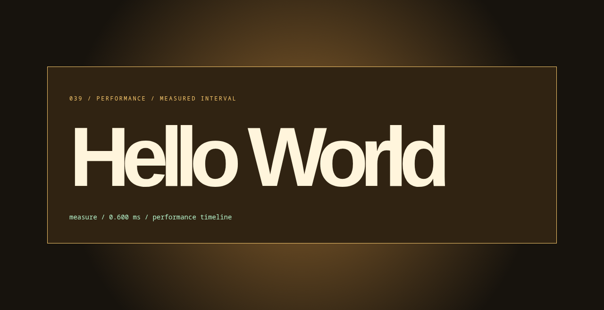](v2/luna-5.6/039/039.html) | [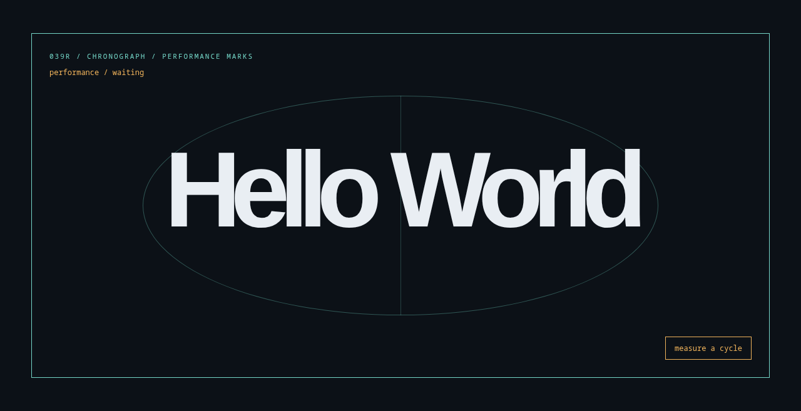](v2/luna-5.6/039R/039R.html) |  |
| :---: | :---: | :---: |
| **039 — Performance** [Demo](v2/luna-5.6/039/039.html) · [Report](v2/luna-5.6/039/report.md) · [Journal](v2/luna-5.6/039/journal.md) | **039R — Experiment 039R — Chronograph** [Demo](v2/luna-5.6/039R/039R.html) · [Report](v2/luna-5.6/039R/report.md) · [Journal](v2/luna-5.6/039R/journal.md) | **040 — Popover** [Demo](v2/luna-5.6/040/040.html) · [Report](v2/luna-5.6/040/report.md) · [Journal](v2/luna-5.6/040/journal.md) |

| [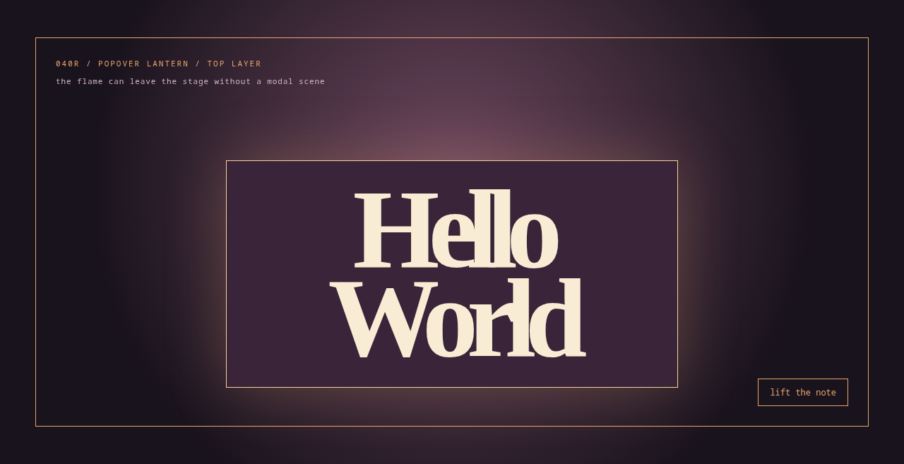](v2/luna-5.6/040R/040R.html) |  | [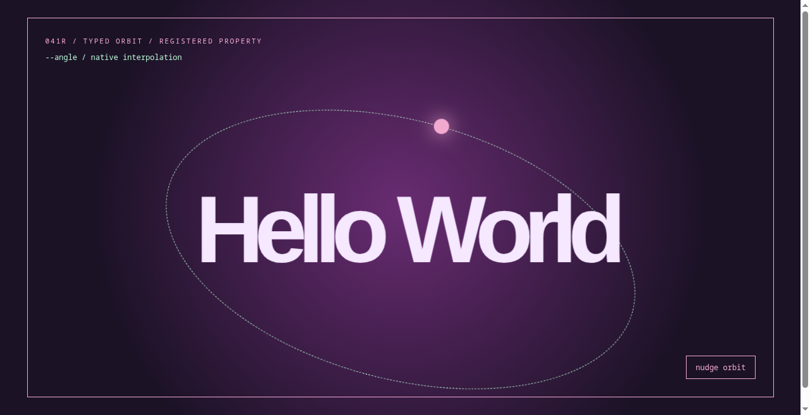](v2/luna-5.6/041R/041R.html) |
| :---: | :---: | :---: |
| **040R — Experiment 040R — Popover Lantern** [Demo](v2/luna-5.6/040R/040R.html) · [Report](v2/luna-5.6/040R/report.md) · [Journal](v2/luna-5.6/040R/journal.md) | **041 — Property** [Demo](v2/luna-5.6/041/041.html) · [Report](v2/luna-5.6/041/report.md) · [Journal](v2/luna-5.6/041/journal.md) | **041R — Experiment 041R — Typed Orbit** [Demo](v2/luna-5.6/041R/041R.html) · [Report](v2/luna-5.6/041R/report.md) · [Journal](v2/luna-5.6/041R/journal.md) |

|  | [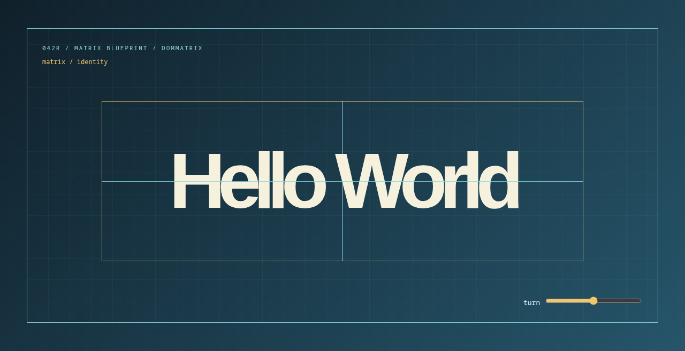](v2/luna-5.6/042R/042R.html) |  |
| :---: | :---: | :---: |
| **042 — Matrix** [Demo](v2/luna-5.6/042/042.html) · [Report](v2/luna-5.6/042/report.md) · [Journal](v2/luna-5.6/042/journal.md) | **042R — Experiment 042R — Matrix Blueprint** [Demo](v2/luna-5.6/042R/042R.html) · [Report](v2/luna-5.6/042R/report.md) · [Journal](v2/luna-5.6/042R/journal.md) | **043 — Event** [Demo](v2/luna-5.6/043/043.html) · [Report](v2/luna-5.6/043/report.md) · [Journal](v2/luna-5.6/043/journal.md) |

| [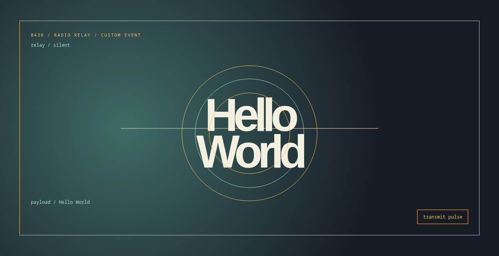](v2/luna-5.6/043R/043R.html) |  | [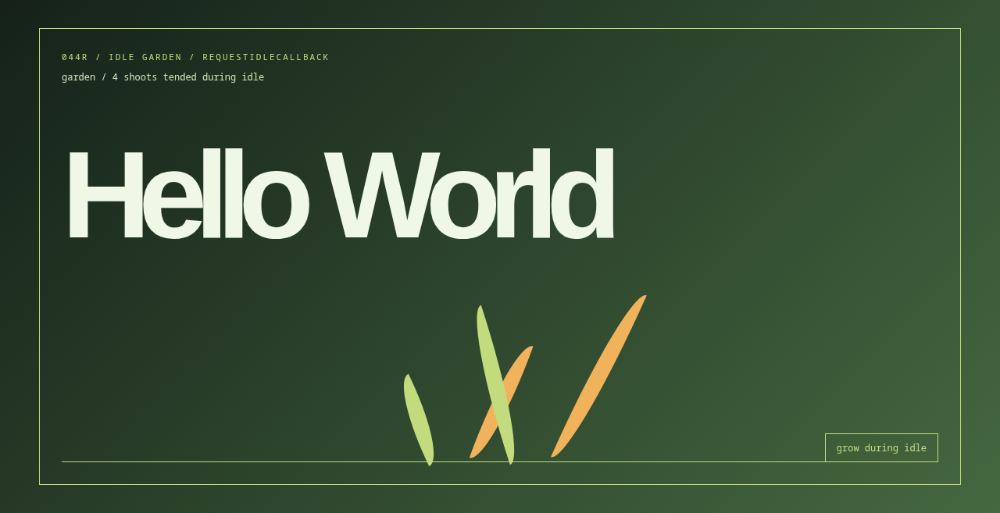](v2/luna-5.6/044R/044R.html) |
| :---: | :---: | :---: |
| **043R — Experiment 043R — Radio Relay** [Demo](v2/luna-5.6/043R/043R.html) · [Report](v2/luna-5.6/043R/report.md) · [Journal](v2/luna-5.6/043R/journal.md) | **044 — Idle** [Demo](v2/luna-5.6/044/044.html) · [Report](v2/luna-5.6/044/report.md) · [Journal](v2/luna-5.6/044/journal.md) | **044R — Experiment 044R — Idle Garden** [Demo](v2/luna-5.6/044R/044R.html) · [Report](v2/luna-5.6/044R/report.md) · [Journal](v2/luna-5.6/044R/journal.md) |

|  | [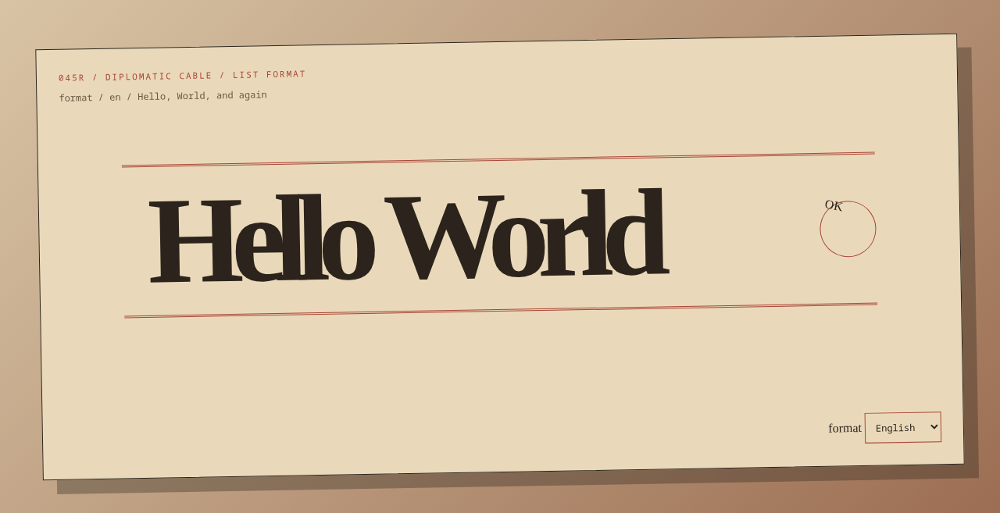](v2/luna-5.6/045R/045R.html) | [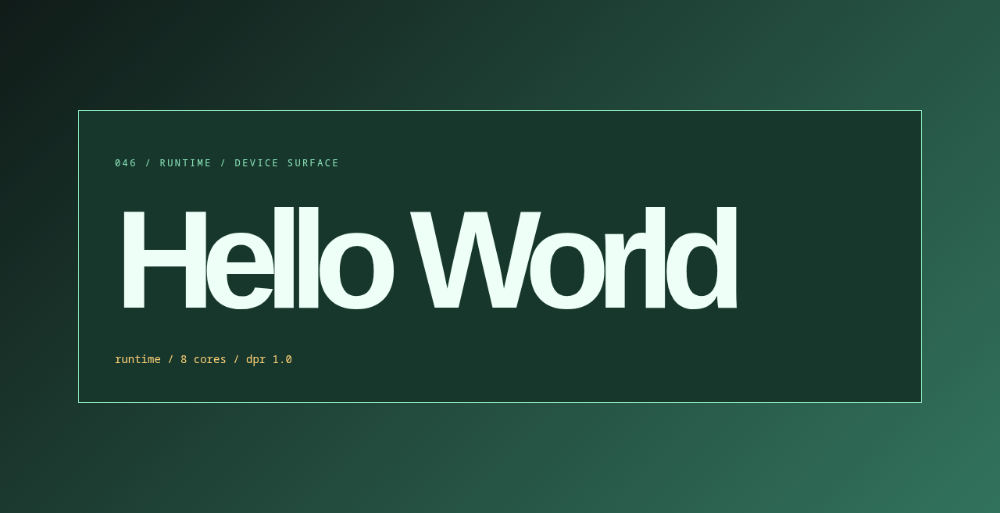](v2/luna-5.6/046/046.html) |
| :---: | :---: | :---: |
| **045 — List** [Demo](v2/luna-5.6/045/045.html) · [Report](v2/luna-5.6/045/report.md) · [Journal](v2/luna-5.6/045/journal.md) | **045R — Experiment 045R — Diplomatic Cable** [Demo](v2/luna-5.6/045R/045R.html) · [Report](v2/luna-5.6/045R/report.md) · [Journal](v2/luna-5.6/045R/journal.md) | **046 — Runtime** [Demo](v2/luna-5.6/046/046.html) · [Report](v2/luna-5.6/046/report.md) · [Journal](v2/luna-5.6/046/journal.md) |

| [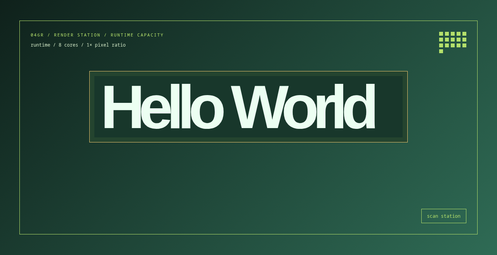](v2/luna-5.6/046R/046R.html) |  | [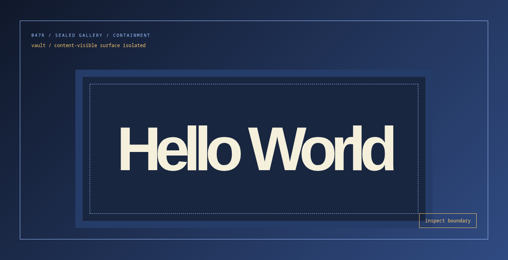](v2/luna-5.6/047R/047R.html) |
| :---: | :---: | :---: |
| **046R — Experiment 046R — Render Station** [Demo](v2/luna-5.6/046R/046R.html) · [Report](v2/luna-5.6/046R/report.md) · [Journal](v2/luna-5.6/046R/journal.md) | **047 — Containment** [Demo](v2/luna-5.6/047/047.html) · [Report](v2/luna-5.6/047/report.md) · [Journal](v2/luna-5.6/047/journal.md) | **047R — Experiment 047R — Sealed Gallery** [Demo](v2/luna-5.6/047R/047R.html) · [Report](v2/luna-5.6/047R/report.md) · [Journal](v2/luna-5.6/047R/journal.md) |

|  | [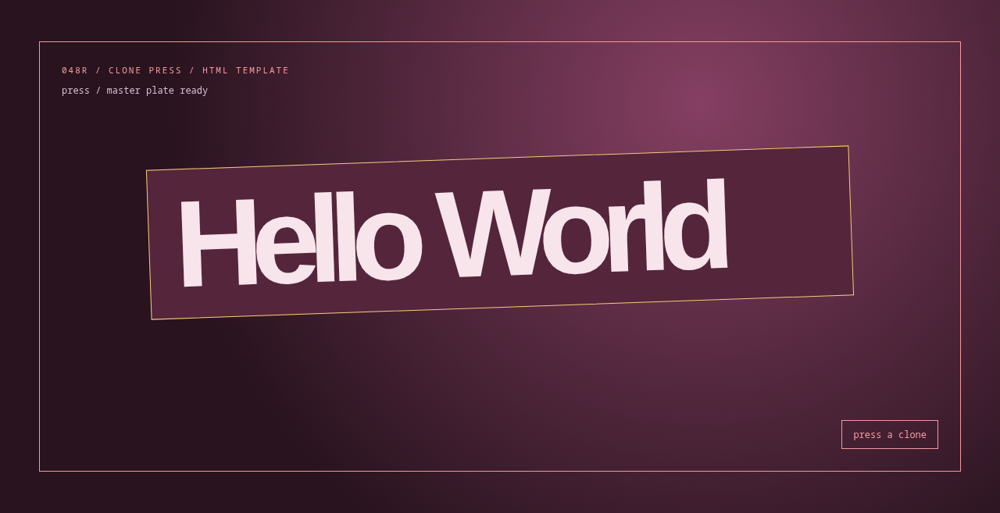](v2/luna-5.6/048R/048R.html) |  |
| :---: | :---: | :---: |
| **048 — Template** [Demo](v2/luna-5.6/048/048.html) · [Report](v2/luna-5.6/048/report.md) · [Journal](v2/luna-5.6/048/journal.md) | **048R — Experiment 048R — Clone Press** [Demo](v2/luna-5.6/048R/048R.html) · [Report](v2/luna-5.6/048R/report.md) · [Journal](v2/luna-5.6/048R/journal.md) | **049 — Meter** [Demo](v2/luna-5.6/049/049.html) · [Report](v2/luna-5.6/049/report.md) · [Journal](v2/luna-5.6/049/journal.md) |

| [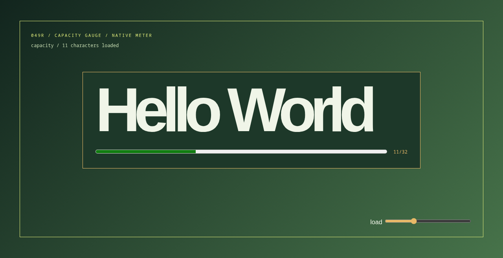](v2/luna-5.6/049R/049R.html) | [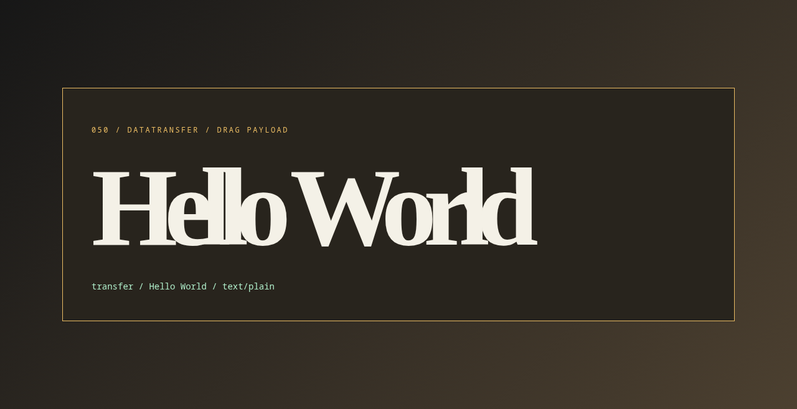](v2/luna-5.6/050/050.html) | [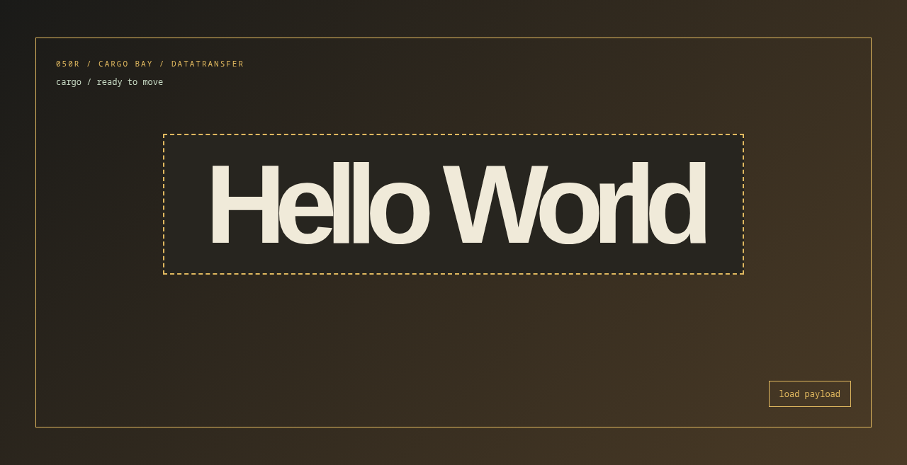](v2/luna-5.6/050R/050R.html) |
| :---: | :---: | :---: |
| **049R — Experiment 049R — Capacity Gauge** [Demo](v2/luna-5.6/049R/049R.html) · [Report](v2/luna-5.6/049R/report.md) · [Journal](v2/luna-5.6/049R/journal.md) | **050 — Transfer** [Demo](v2/luna-5.6/050/050.html) · [Report](v2/luna-5.6/050/report.md) · [Journal](v2/luna-5.6/050/journal.md) | **050R — Experiment 050R — Cargo Bay** [Demo](v2/luna-5.6/050R/050R.html) · [Report](v2/luna-5.6/050R/report.md) · [Journal](v2/luna-5.6/050R/journal.md) |

|  | [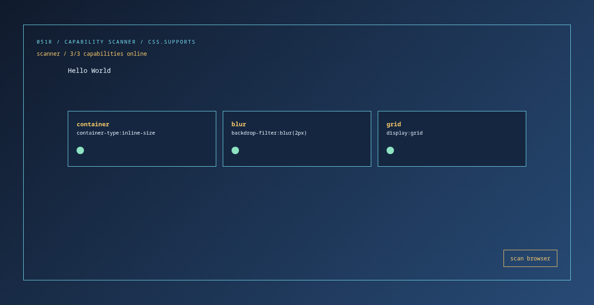](v2/luna-5.6/051R/051R.html) |  |
| :---: | :---: | :---: |
| **051 — Supports** [Demo](v2/luna-5.6/051/051.html) · [Report](v2/luna-5.6/051/report.md) · [Journal](v2/luna-5.6/051/journal.md) | **051R — Experiment 051R — Capability Scanner** [Demo](v2/luna-5.6/051R/051R.html) · [Report](v2/luna-5.6/051R/report.md) · [Journal](v2/luna-5.6/051R/journal.md) | **052 — Point** [Demo](v2/luna-5.6/052/052.html) · [Report](v2/luna-5.6/052/report.md) · [Journal](v2/luna-5.6/052/journal.md) |

| [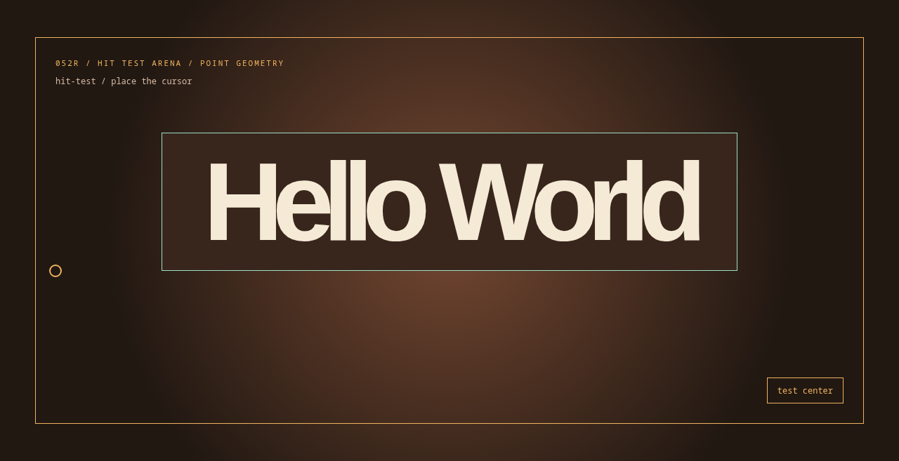](v2/luna-5.6/052R/052R.html) |  | [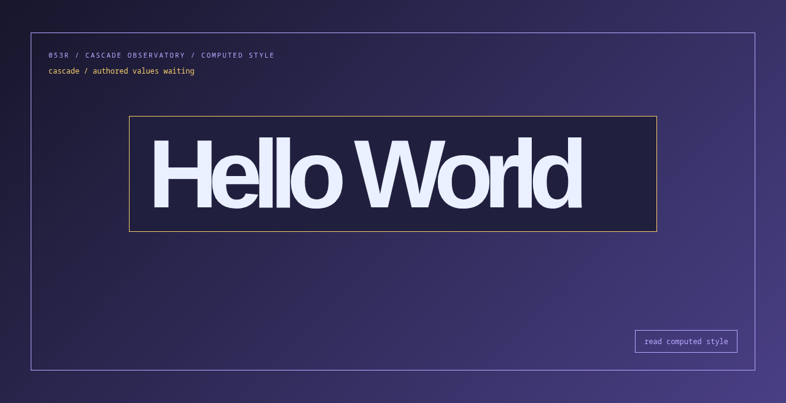](v2/luna-5.6/053R/053R.html) |
| :---: | :---: | :---: |
| **052R — Experiment 052R — Hit Test Arena** [Demo](v2/luna-5.6/052R/052R.html) · [Report](v2/luna-5.6/052R/report.md) · [Journal](v2/luna-5.6/052R/journal.md) | **053 — Computed** [Demo](v2/luna-5.6/053/053.html) · [Report](v2/luna-5.6/053/report.md) · [Journal](v2/luna-5.6/053/journal.md) | **053R — Experiment 053R — Cascade Observatory** [Demo](v2/luna-5.6/053R/053R.html) · [Report](v2/luna-5.6/053R/report.md) · [Journal](v2/luna-5.6/053R/journal.md) |

|  | [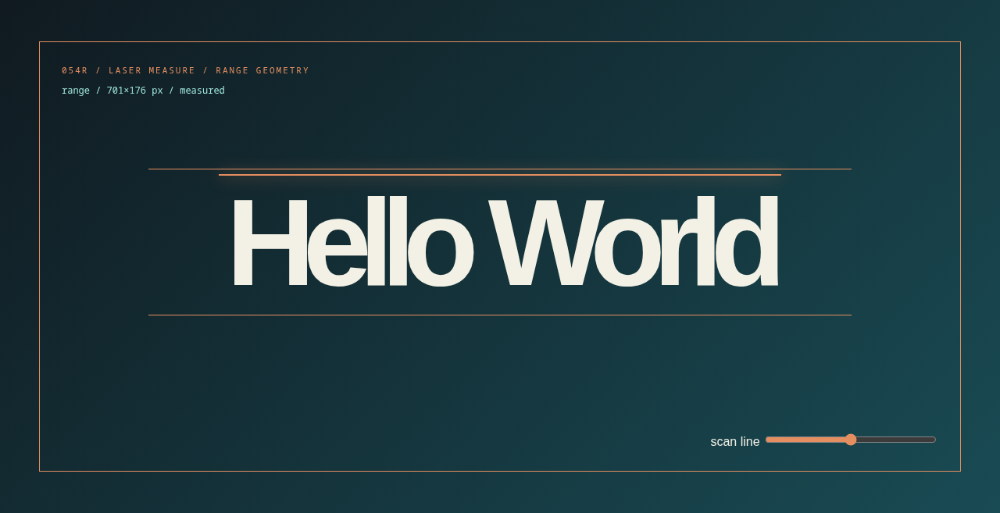](v2/luna-5.6/054R/054R.html) |  |
| :---: | :---: | :---: |
| **054 — Range** [Demo](v2/luna-5.6/054/054.html) · [Report](v2/luna-5.6/054/report.md) · [Journal](v2/luna-5.6/054/journal.md) | **054R — Experiment 054R — Laser Measure** [Demo](v2/luna-5.6/054R/054R.html) · [Report](v2/luna-5.6/054R/report.md) · [Journal](v2/luna-5.6/054R/journal.md) | **055 — Selection** [Demo](v2/luna-5.6/055/055.html) · [Report](v2/luna-5.6/055/report.md) · [Journal](v2/luna-5.6/055/journal.md) |

| [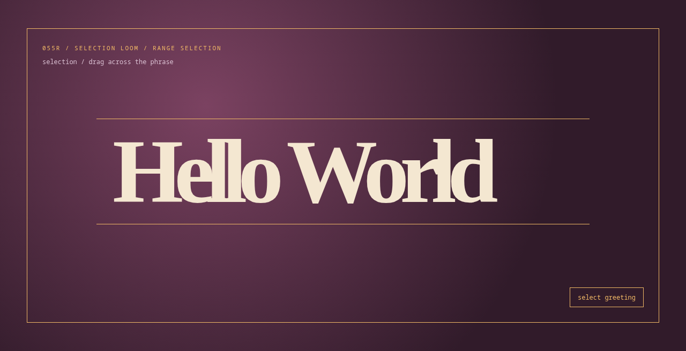](v2/luna-5.6/055R/055R.html) |  | [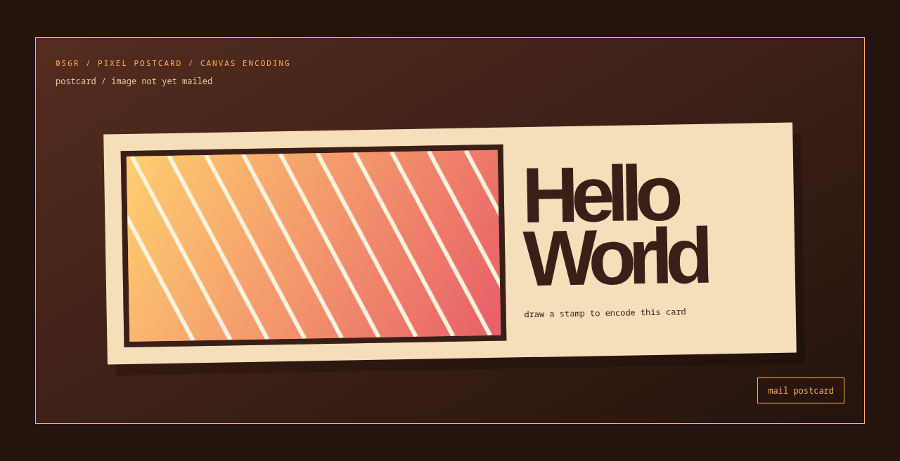](v2/luna-5.6/056R/056R.html) |
| :---: | :---: | :---: |
| **055R — Experiment 055R — Selection Loom** [Demo](v2/luna-5.6/055R/055R.html) · [Report](v2/luna-5.6/055R/report.md) · [Journal](v2/luna-5.6/055R/journal.md) | **056 — Data URL** [Demo](v2/luna-5.6/056/056.html) · [Report](v2/luna-5.6/056/report.md) · [Journal](v2/luna-5.6/056/journal.md) | **056R — Experiment 056R — Pixel Postcard** [Demo](v2/luna-5.6/056R/056R.html) · [Report](v2/luna-5.6/056R/report.md) · [Journal](v2/luna-5.6/056R/journal.md) |

| [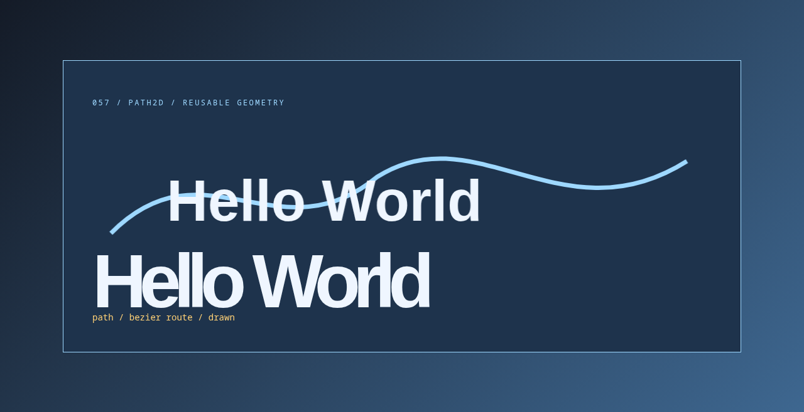](v2/luna-5.6/057/057.html) | [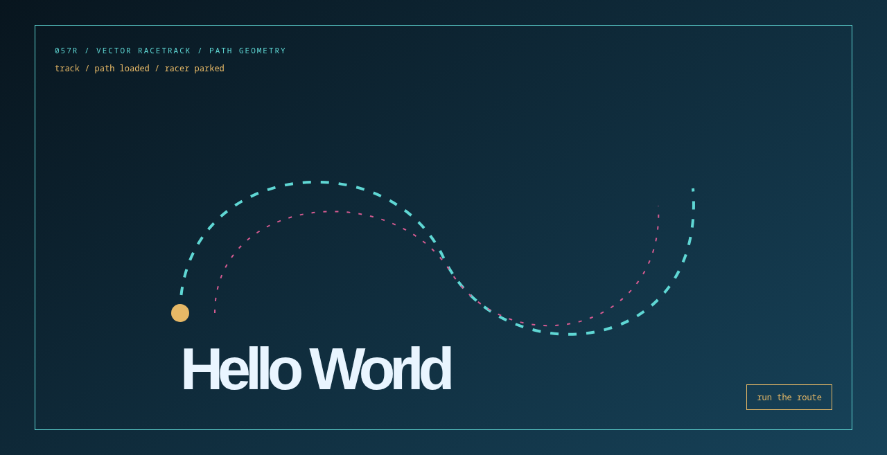](v2/luna-5.6/057R/057R.html) |  |
| :---: | :---: | :---: |
| **057 — Path** [Demo](v2/luna-5.6/057/057.html) · [Report](v2/luna-5.6/057/report.md) · [Journal](v2/luna-5.6/057/journal.md) | **057R — Experiment 057R — Vector Racetrack** [Demo](v2/luna-5.6/057R/057R.html) · [Report](v2/luna-5.6/057R/report.md) · [Journal](v2/luna-5.6/057R/journal.md) | **058 — Offscreen** [Demo](v2/luna-5.6/058/058.html) · [Report](v2/luna-5.6/058/report.md) · [Journal](v2/luna-5.6/058/journal.md) |

| [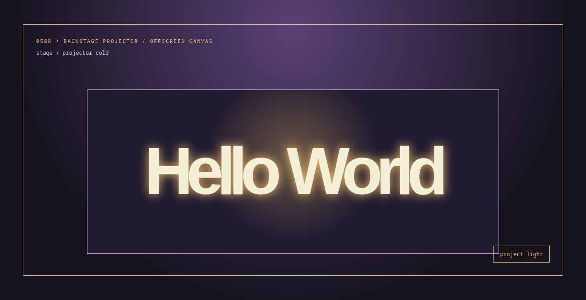](v2/luna-5.6/058R/058R.html) |  | [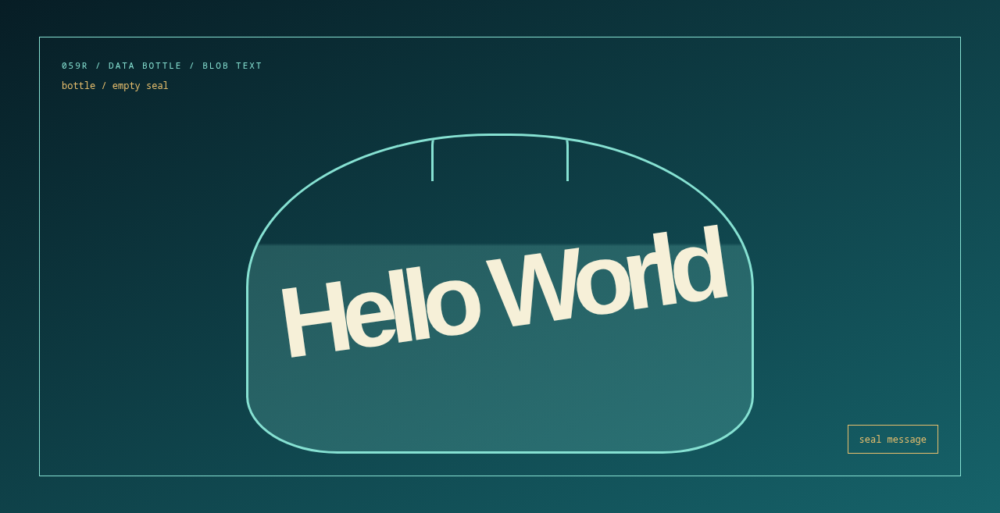](v2/luna-5.6/059R/059R.html) |
| :---: | :---: | :---: |
| **058R — Experiment 058R — Backstage Projector** [Demo](v2/luna-5.6/058R/058R.html) · [Report](v2/luna-5.6/058R/report.md) · [Journal](v2/luna-5.6/058R/journal.md) | **059 — Blob URL** [Demo](v2/luna-5.6/059/059.html) · [Report](v2/luna-5.6/059/report.md) · [Journal](v2/luna-5.6/059/journal.md) | **059R — Experiment 059R — Data Bottle** [Demo](v2/luna-5.6/059R/059R.html) · [Report](v2/luna-5.6/059R/report.md) · [Journal](v2/luna-5.6/059R/journal.md) |

|  | [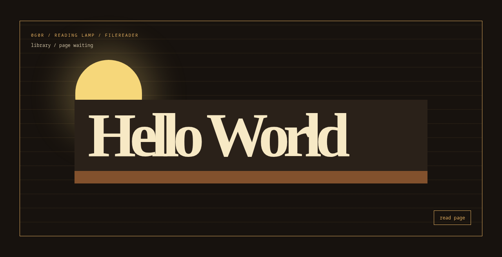](v2/luna-5.6/060R/060R.html) |  |
| :---: | :---: | :---: |
| **060 — FileReader** [Demo](v2/luna-5.6/060/060.html) · [Report](v2/luna-5.6/060/report.md) · [Journal](v2/luna-5.6/060/journal.md) | **060R — Experiment 060R — Reading Lamp** [Demo](v2/luna-5.6/060R/060R.html) · [Report](v2/luna-5.6/060R/report.md) · [Journal](v2/luna-5.6/060R/journal.md) | **061 — Relative** [Demo](v2/luna-5.6/061/061.html) · [Report](v2/luna-5.6/061/report.md) · [Journal](v2/luna-5.6/061/journal.md) |

| [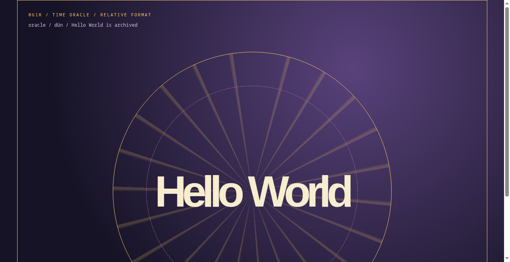](v2/luna-5.6/061R/061R.html) | [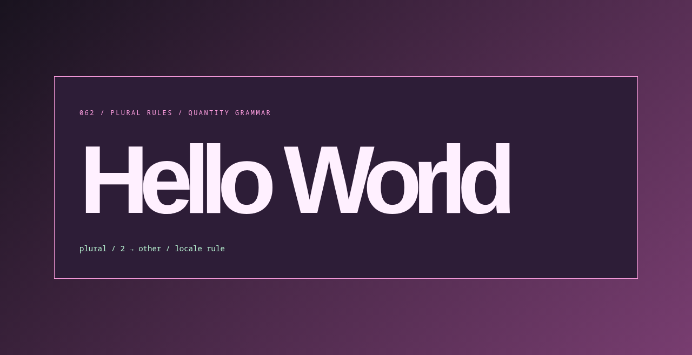](v2/luna-5.6/062/062.html) | [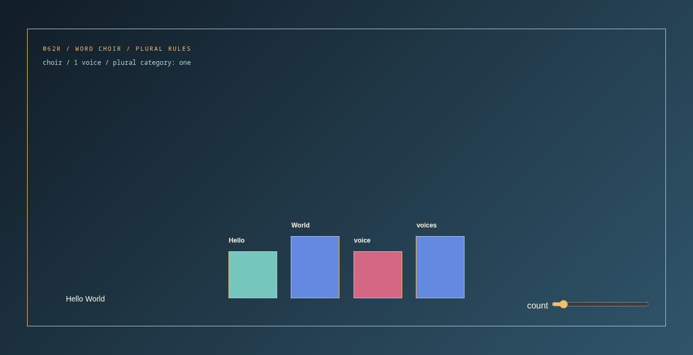](v2/luna-5.6/062R/062R.html) |
| :---: | :---: | :---: |
| **061R — Experiment 061R — Time Oracle** [Demo](v2/luna-5.6/061R/061R.html) · [Report](v2/luna-5.6/061R/report.md) · [Journal](v2/luna-5.6/061R/journal.md) | **062 — Plural** [Demo](v2/luna-5.6/062/062.html) · [Report](v2/luna-5.6/062/report.md) · [Journal](v2/luna-5.6/062/journal.md) | **062R — Experiment 062R — Word Choir** [Demo](v2/luna-5.6/062R/062R.html) · [Report](v2/luna-5.6/062R/report.md) · [Journal](v2/luna-5.6/062R/journal.md) |

|  | [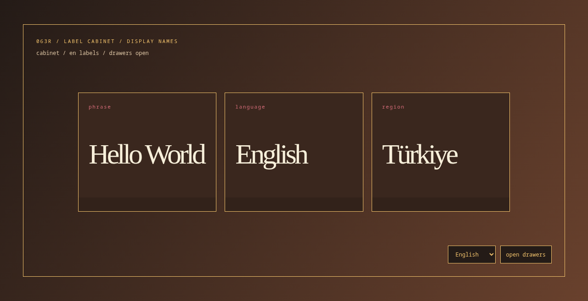](v2/luna-5.6/063R/063R.html) |  |
| :---: | :---: | :---: |
| **063 — Names** [Demo](v2/luna-5.6/063/063.html) · [Report](v2/luna-5.6/063/report.md) · [Journal](v2/luna-5.6/063/journal.md) | **063R — Experiment 063R — Label Cabinet** [Demo](v2/luna-5.6/063R/063R.html) · [Report](v2/luna-5.6/063R/report.md) · [Journal](v2/luna-5.6/063R/journal.md) | **064 — UUID** [Demo](v2/luna-5.6/064/064.html) · [Report](v2/luna-5.6/064/report.md) · [Journal](v2/luna-5.6/064/journal.md) |

| [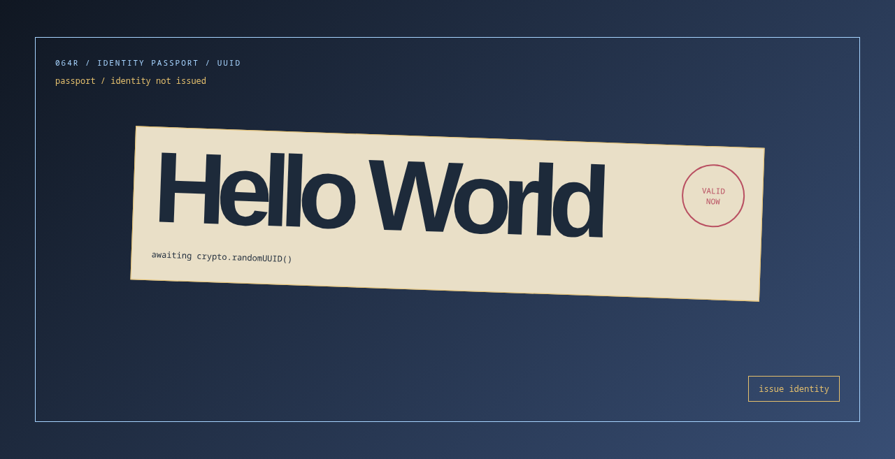](v2/luna-5.6/064R/064R.html) |  | [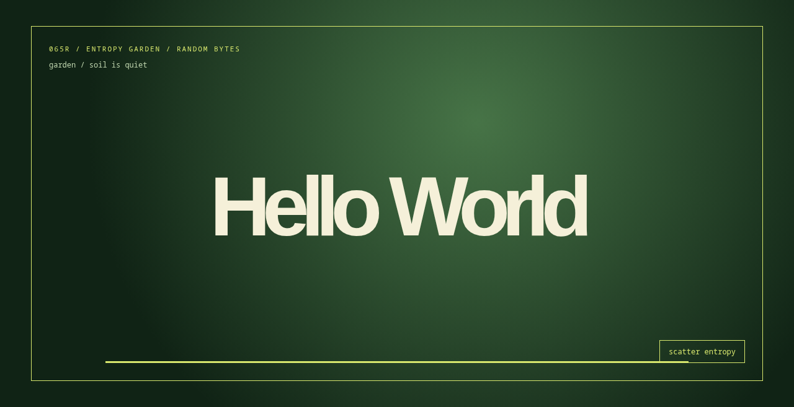](v2/luna-5.6/065R/065R.html) |
| :---: | :---: | :---: |
| **064R — Experiment 064R — Identity Passport** [Demo](v2/luna-5.6/064R/064R.html) · [Report](v2/luna-5.6/064R/report.md) · [Journal](v2/luna-5.6/064R/journal.md) | **065 — Random** [Demo](v2/luna-5.6/065/065.html) · [Report](v2/luna-5.6/065/report.md) · [Journal](v2/luna-5.6/065/journal.md) | **065R — Experiment 065R — Entropy Garden** [Demo](v2/luna-5.6/065R/065R.html) · [Report](v2/luna-5.6/065R/report.md) · [Journal](v2/luna-5.6/065R/journal.md) |

| [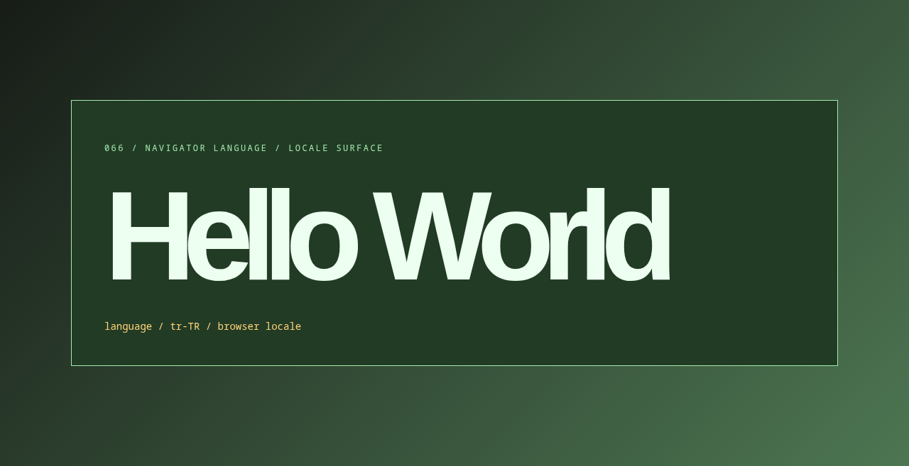](v2/luna-5.6/066/066.html) | [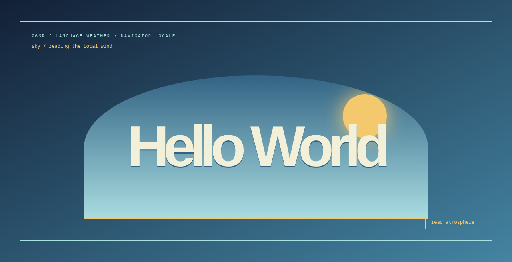](v2/luna-5.6/066R/066R.html) |  |
| :---: | :---: | :---: |
| **066 — Language** [Demo](v2/luna-5.6/066/066.html) · [Report](v2/luna-5.6/066/report.md) · [Journal](v2/luna-5.6/066/journal.md) | **066R — Experiment 066R — Language Weather** [Demo](v2/luna-5.6/066R/066R.html) · [Report](v2/luna-5.6/066R/report.md) · [Journal](v2/luna-5.6/066R/journal.md) | **067 — Orientation** [Demo](v2/luna-5.6/067/067.html) · [Report](v2/luna-5.6/067/report.md) · [Journal](v2/luna-5.6/067/journal.md) |

| [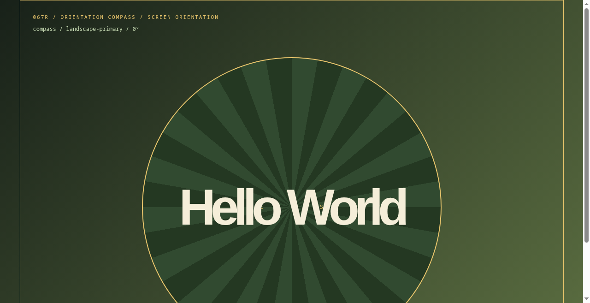](v2/luna-5.6/067R/067R.html) | [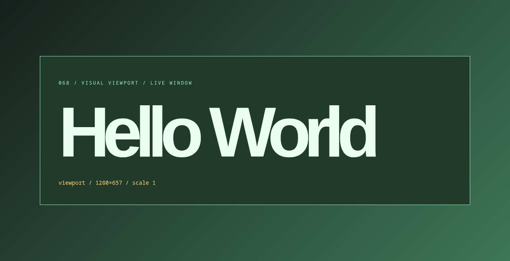](v2/luna-5.6/068/068.html) | [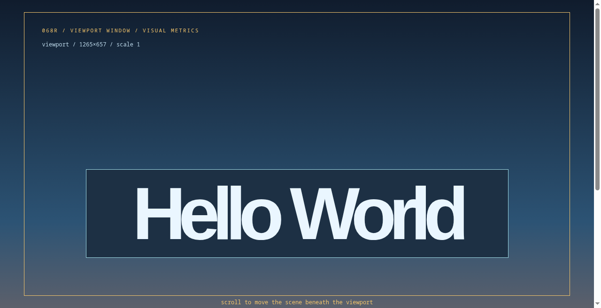](v2/luna-5.6/068R/068R.html) |
| :---: | :---: | :---: |
| **067R — Experiment 067R — Orientation Compass** [Demo](v2/luna-5.6/067R/067R.html) · [Report](v2/luna-5.6/067R/report.md) · [Journal](v2/luna-5.6/067R/journal.md) | **068 — Viewport** [Demo](v2/luna-5.6/068/068.html) · [Report](v2/luna-5.6/068/report.md) · [Journal](v2/luna-5.6/068/journal.md) | **068R — Experiment 068R — Viewport Window** [Demo](v2/luna-5.6/068R/068R.html) · [Report](v2/luna-5.6/068R/report.md) · [Journal](v2/luna-5.6/068R/journal.md) |

|  | [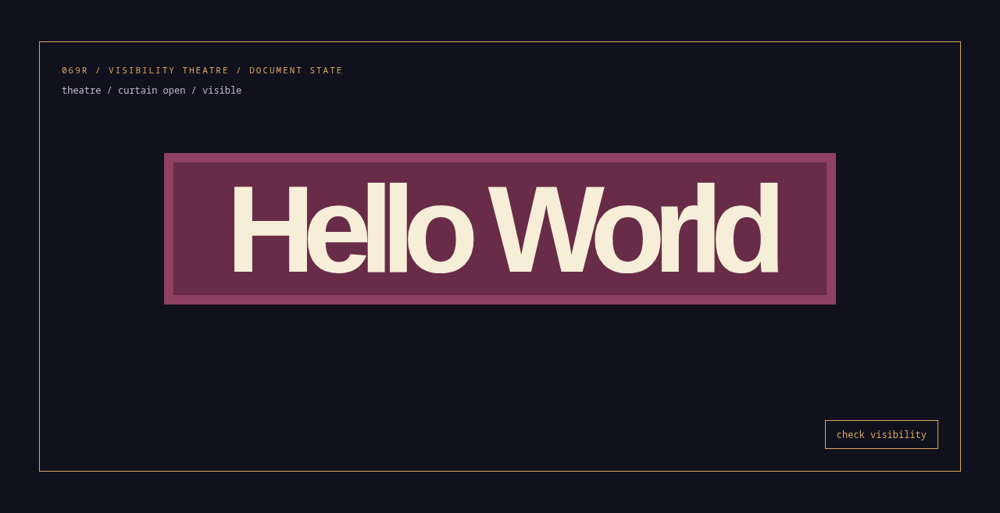](v2/luna-5.6/069R/069R.html) |  |
| :---: | :---: | :---: |
| **069 — Visibility** [Demo](v2/luna-5.6/069/069.html) · [Report](v2/luna-5.6/069/report.md) · [Journal](v2/luna-5.6/069/journal.md) | **069R — Experiment 069R — Visibility Theatre** [Demo](v2/luna-5.6/069R/069R.html) · [Report](v2/luna-5.6/069R/report.md) · [Journal](v2/luna-5.6/069R/journal.md) | **070 — Pointer** [Demo](v2/luna-5.6/070/070.html) · [Report](v2/luna-5.6/070/report.md) · [Journal](v2/luna-5.6/070/journal.md) |

| [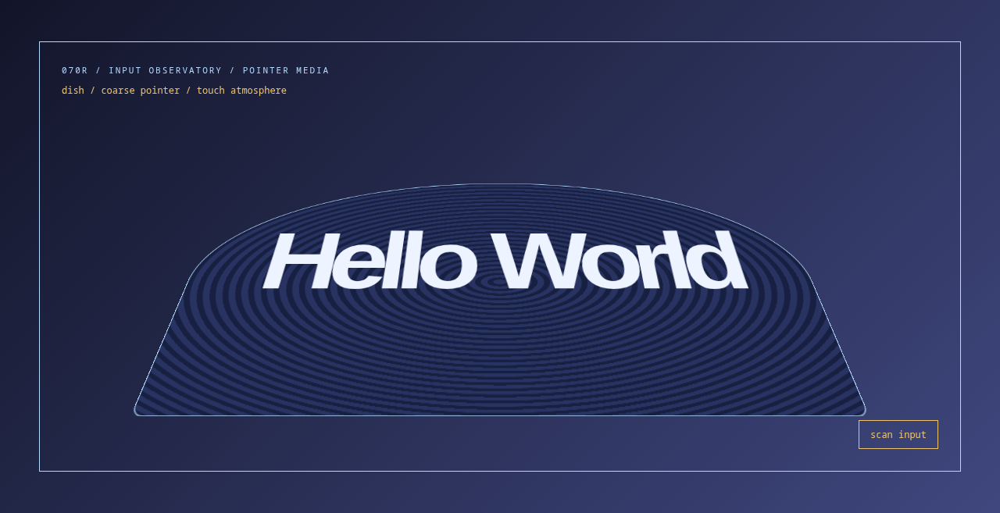](v2/luna-5.6/070R/070R.html) |  | [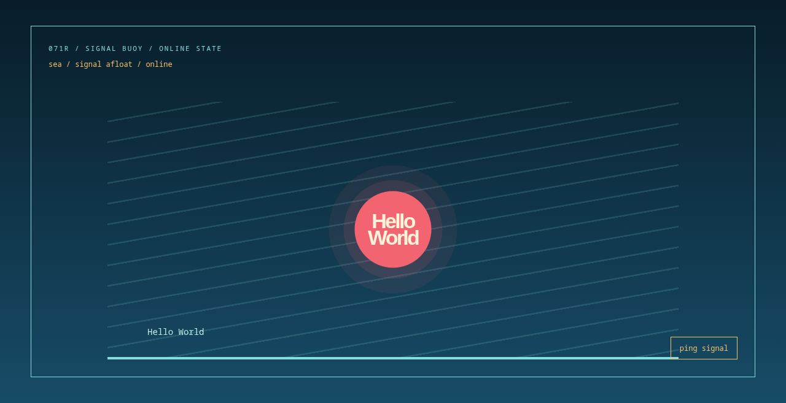](v2/luna-5.6/071R/071R.html) |
| :---: | :---: | :---: |
| **070R — Experiment 070R — Input Observatory** [Demo](v2/luna-5.6/070R/070R.html) · [Report](v2/luna-5.6/070R/report.md) · [Journal](v2/luna-5.6/070R/journal.md) | **071 — Online** [Demo](v2/luna-5.6/071/071.html) · [Report](v2/luna-5.6/071/report.md) · [Journal](v2/luna-5.6/071/journal.md) | **071R — Experiment 071R — Signal Buoy** [Demo](v2/luna-5.6/071R/071R.html) · [Report](v2/luna-5.6/071R/report.md) · [Journal](v2/luna-5.6/071R/journal.md) |

|  | [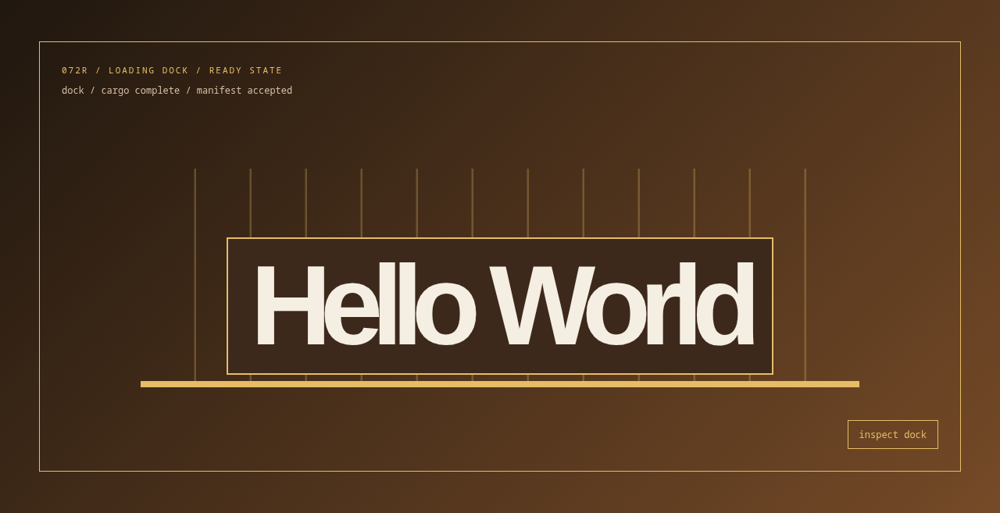](v2/luna-5.6/072R/072R.html) |  |
| :---: | :---: | :---: |
| **072 — Ready** [Demo](v2/luna-5.6/072/072.html) · [Report](v2/luna-5.6/072/report.md) · [Journal](v2/luna-5.6/072/journal.md) | **072R — Experiment 072R — Loading Dock** [Demo](v2/luna-5.6/072R/072R.html) · [Report](v2/luna-5.6/072R/report.md) · [Journal](v2/luna-5.6/072R/journal.md) | **073 — Origin** [Demo](v2/luna-5.6/073/073.html) · [Report](v2/luna-5.6/073/report.md) · [Journal](v2/luna-5.6/073/journal.md) |

| [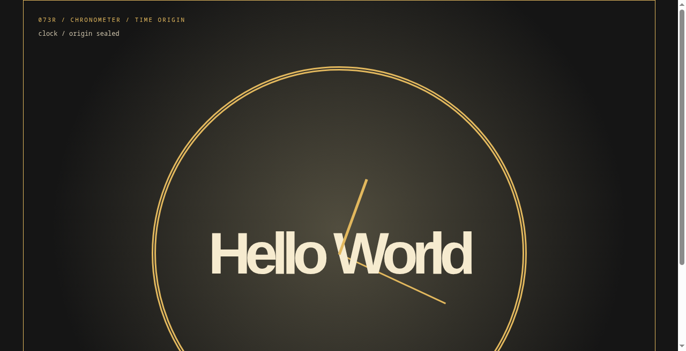](v2/luna-5.6/073R/073R.html) |  | [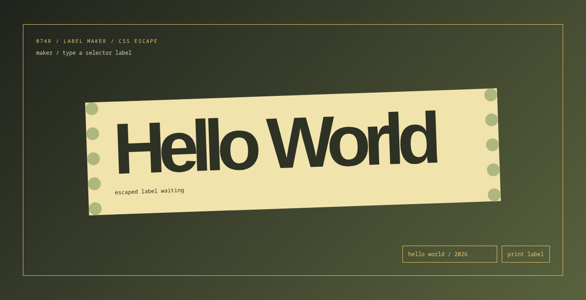](v2/luna-5.6/074R/074R.html) |
| :---: | :---: | :---: |
| **073R — Experiment 073R — Chronometer** [Demo](v2/luna-5.6/073R/073R.html) · [Report](v2/luna-5.6/073R/report.md) · [Journal](v2/luna-5.6/073R/journal.md) | **074 — Escape** [Demo](v2/luna-5.6/074/074.html) · [Report](v2/luna-5.6/074/report.md) · [Journal](v2/luna-5.6/074/journal.md) | **074R — Experiment 074R — Label Maker** [Demo](v2/luna-5.6/074R/074R.html) · [Report](v2/luna-5.6/074R/report.md) · [Journal](v2/luna-5.6/074R/journal.md) |

|  | [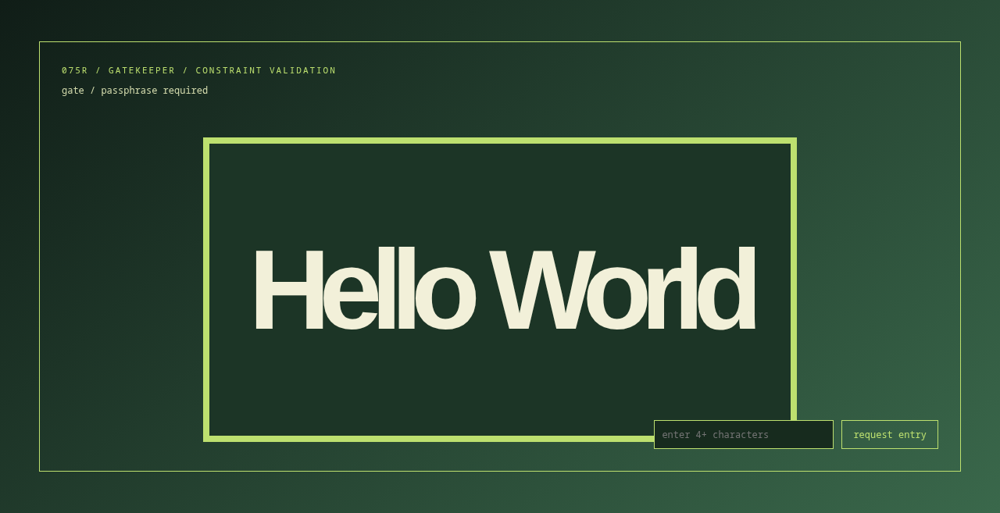](v2/luna-5.6/075R/075R.html) | [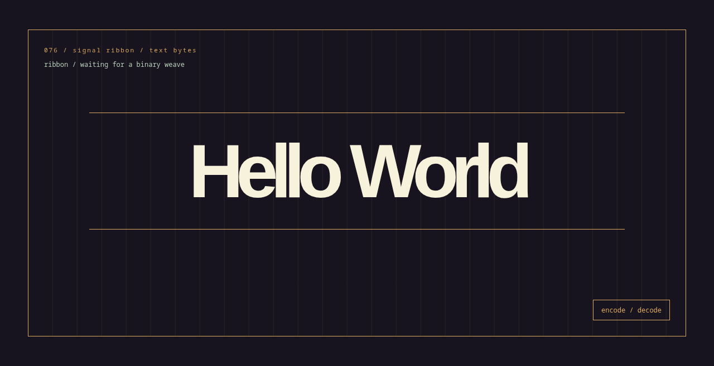](v2/luna-5.6/076/076.html) |
| :---: | :---: | :---: |
| **075 — Validity** [Demo](v2/luna-5.6/075/075.html) · [Report](v2/luna-5.6/075/report.md) · [Journal](v2/luna-5.6/075/journal.md) | **075R — Experiment 075R — Gatekeeper Form** [Demo](v2/luna-5.6/075R/075R.html) · [Report](v2/luna-5.6/075R/report.md) · [Journal](v2/luna-5.6/075R/journal.md) | **076 — Signal Ribbon** [Demo](v2/luna-5.6/076/076.html) · [Report](v2/luna-5.6/076/report.md) · [Journal](v2/luna-5.6/076/journal.md) |

| [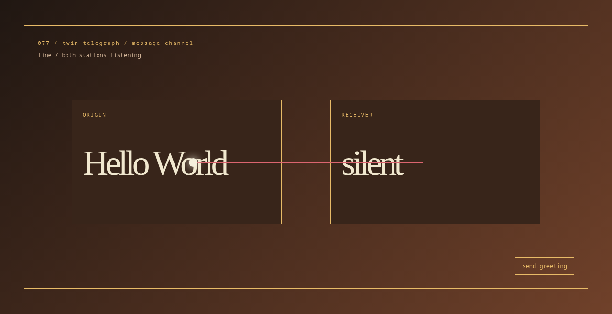](v2/luna-5.6/077/077.html) | [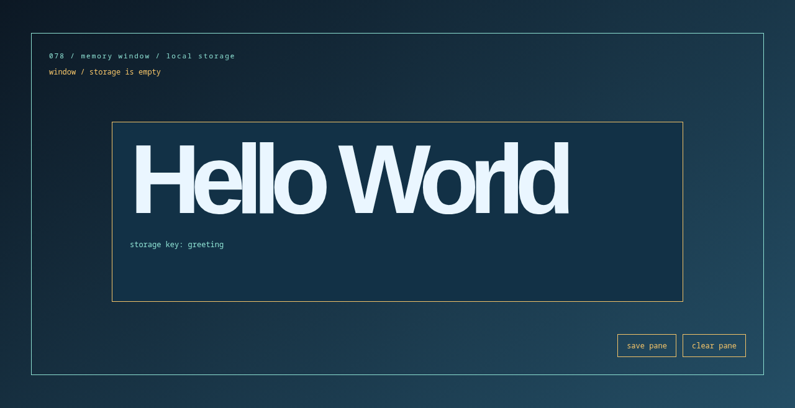](v2/luna-5.6/078/078.html) | [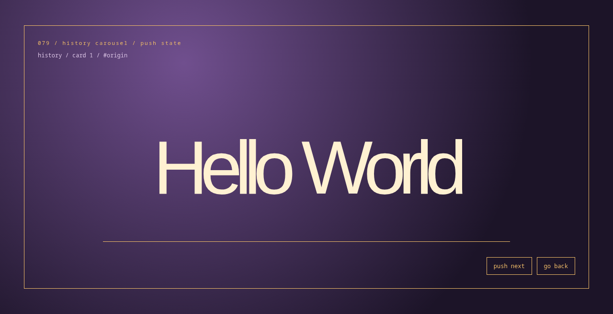](v2/luna-5.6/079/079.html) |
| :---: | :---: | :---: |
| **077 — Twin Telegraph** [Demo](v2/luna-5.6/077/077.html) · [Report](v2/luna-5.6/077/report.md) · [Journal](v2/luna-5.6/077/journal.md) | **078 — Memory Window** [Demo](v2/luna-5.6/078/078.html) · [Report](v2/luna-5.6/078/report.md) · [Journal](v2/luna-5.6/078/journal.md) | **079 — History Carousel** [Demo](v2/luna-5.6/079/079.html) · [Report](v2/luna-5.6/079/report.md) · [Journal](v2/luna-5.6/079/journal.md) |

| [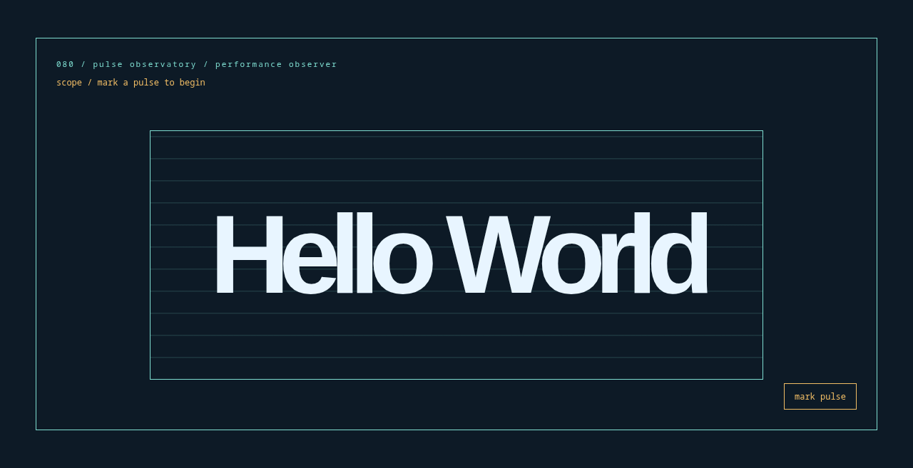](v2/luna-5.6/080/080.html) | [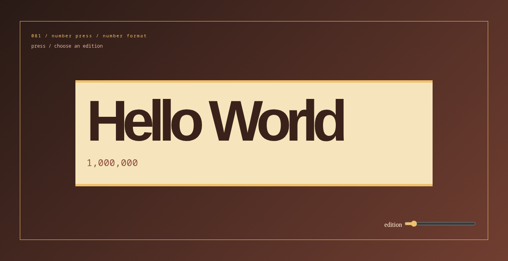](v2/luna-5.6/081/081.html) | [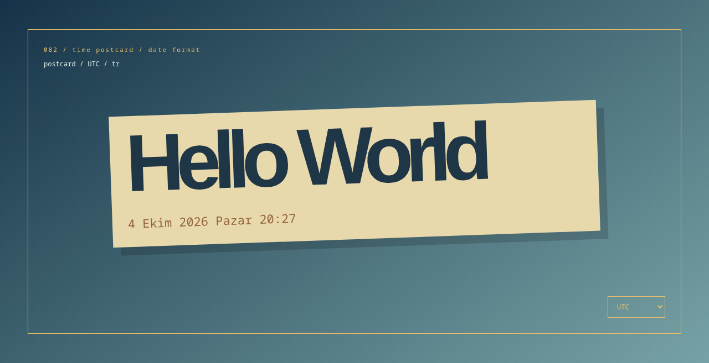](v2/luna-5.6/082/082.html) |
| :---: | :---: | :---: |
| **080 — Pulse Observatory** [Demo](v2/luna-5.6/080/080.html) · [Report](v2/luna-5.6/080/report.md) · [Journal](v2/luna-5.6/080/journal.md) | **081 — Number Press** [Demo](v2/luna-5.6/081/081.html) · [Report](v2/luna-5.6/081/report.md) · [Journal](v2/luna-5.6/081/journal.md) | **082 — Time Postcard** [Demo](v2/luna-5.6/082/082.html) · [Report](v2/luna-5.6/082/report.md) · [Journal](v2/luna-5.6/082/journal.md) |

| [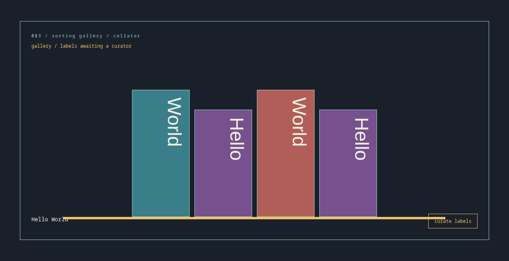](v2/luna-5.6/083/083.html) | [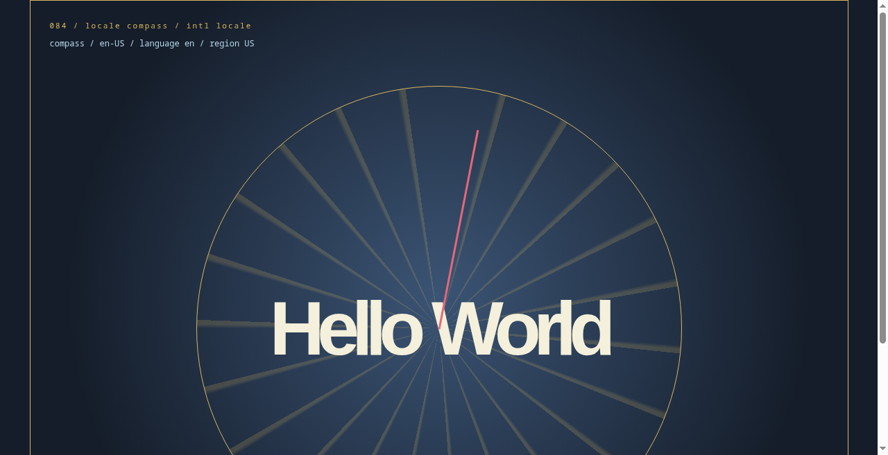](v2/luna-5.6/084/084.html) | [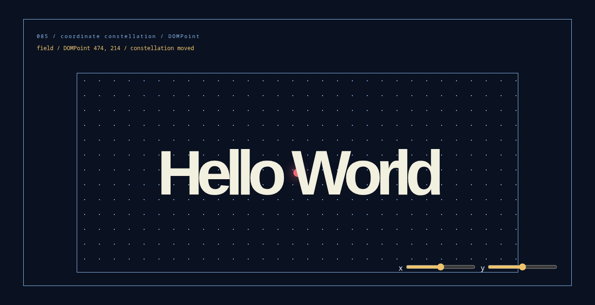](v2/luna-5.6/085/085.html) |
| :---: | :---: | :---: |
| **083 — Sorting Gallery** [Demo](v2/luna-5.6/083/083.html) · [Report](v2/luna-5.6/083/report.md) · [Journal](v2/luna-5.6/083/journal.md) | **084 — Locale Compass** [Demo](v2/luna-5.6/084/084.html) · [Report](v2/luna-5.6/084/report.md) · [Journal](v2/luna-5.6/084/journal.md) | **085 — Coordinate Constellation** [Demo](v2/luna-5.6/085/085.html) · [Report](v2/luna-5.6/085/report.md) · [Journal](v2/luna-5.6/085/journal.md) |

| [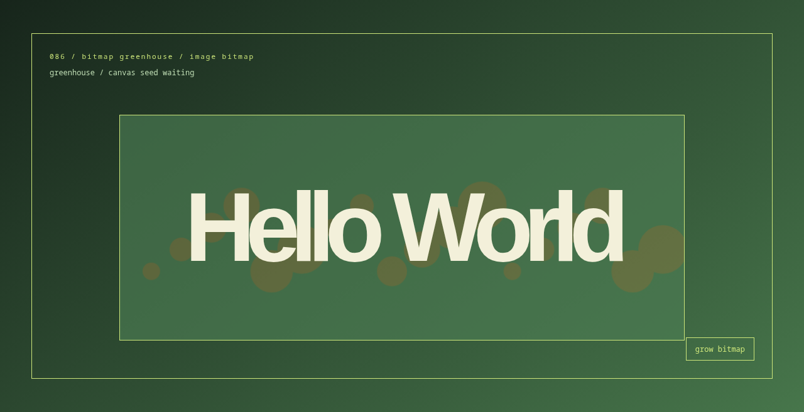](v2/luna-5.6/086/086.html) | [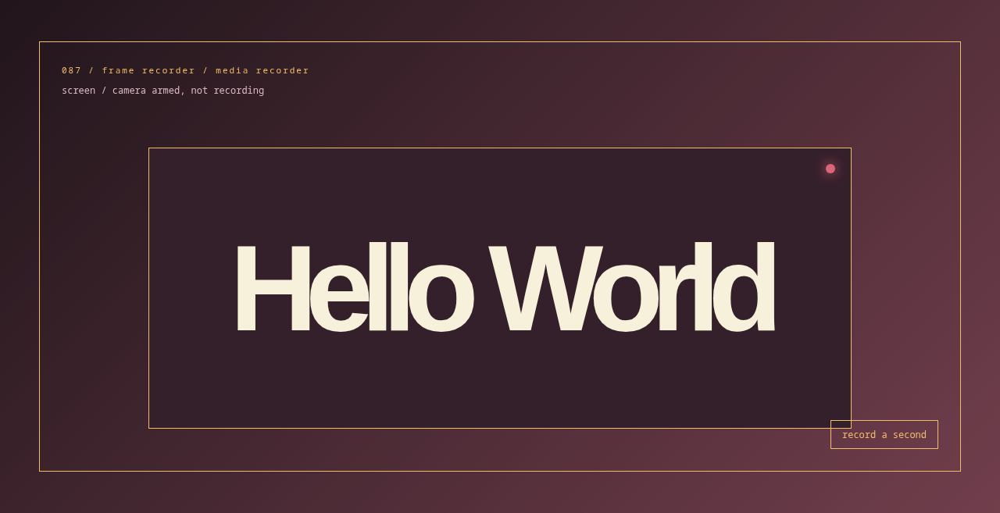](v2/luna-5.6/087/087.html) | [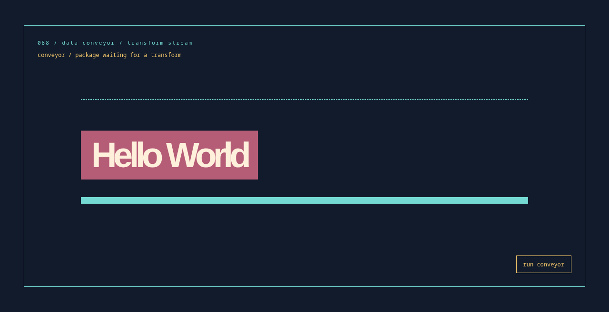](v2/luna-5.6/088/088.html) |
| :---: | :---: | :---: |
| **086 — Bitmap Greenhouse** [Demo](v2/luna-5.6/086/086.html) · [Report](v2/luna-5.6/086/report.md) · [Journal](v2/luna-5.6/086/journal.md) | **087 — Frame Recorder** [Demo](v2/luna-5.6/087/087.html) · [Report](v2/luna-5.6/087/report.md) · [Journal](v2/luna-5.6/087/journal.md) | **088 — Data Conveyor** [Demo](v2/luna-5.6/088/088.html) · [Report](v2/luna-5.6/088/report.md) · [Journal](v2/luna-5.6/088/journal.md) |

| [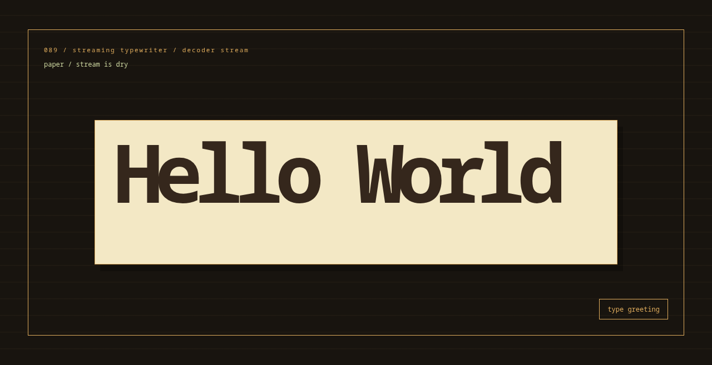](v2/luna-5.6/089/089.html) | [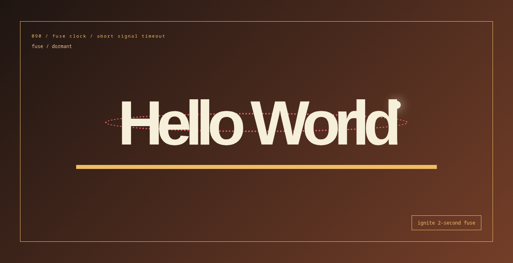](v2/luna-5.6/090/090.html) | [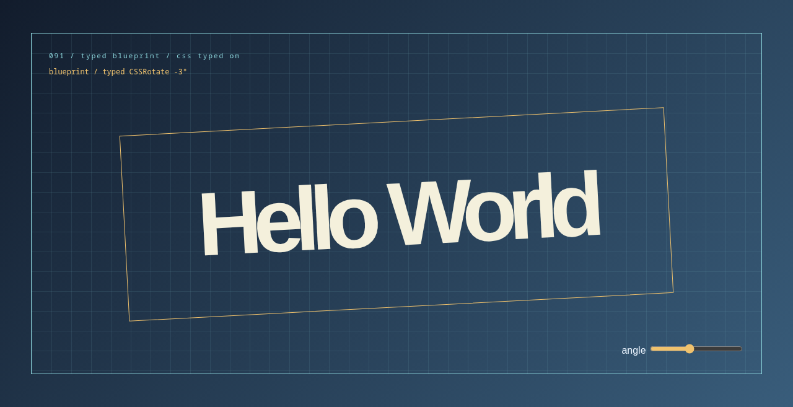](v2/luna-5.6/091/091.html) |
| :---: | :---: | :---: |
| **089 — Streaming Typewriter** [Demo](v2/luna-5.6/089/089.html) · [Report](v2/luna-5.6/089/report.md) · [Journal](v2/luna-5.6/089/journal.md) | **090 — Fuse Clock** [Demo](v2/luna-5.6/090/090.html) · [Report](v2/luna-5.6/090/report.md) · [Journal](v2/luna-5.6/090/journal.md) | **091 — Typed Blueprint** [Demo](v2/luna-5.6/091/091.html) · [Report](v2/luna-5.6/091/report.md) · [Journal](v2/luna-5.6/091/journal.md) |

| [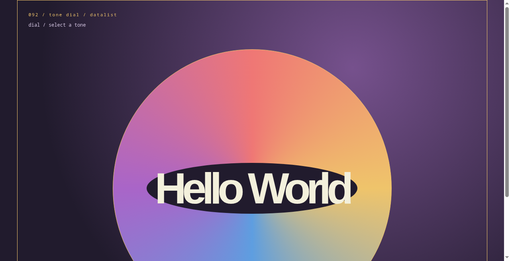](v2/luna-5.6/092/092.html) | [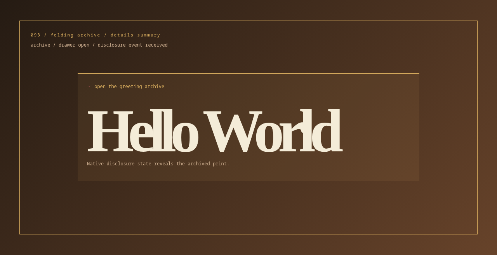](v2/luna-5.6/093/093.html) | [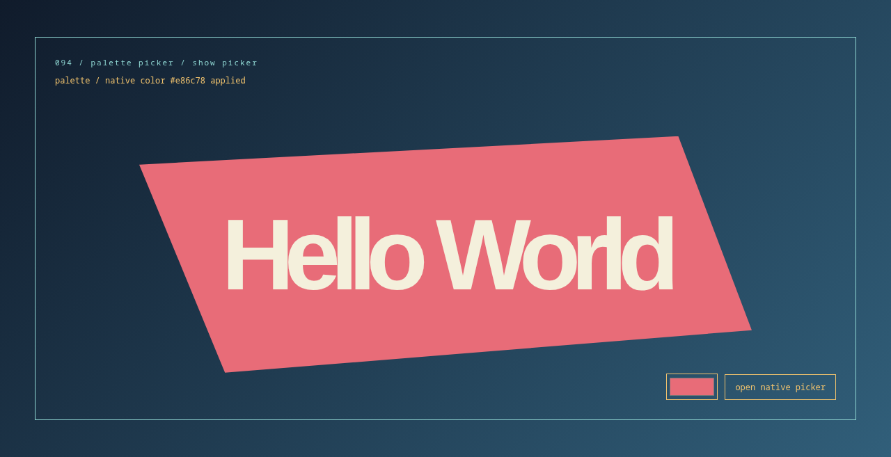](v2/luna-5.6/094/094.html) |
| :---: | :---: | :---: |
| **092 — Tone Dial** [Demo](v2/luna-5.6/092/092.html) · [Report](v2/luna-5.6/092/report.md) · [Journal](v2/luna-5.6/092/journal.md) | **093 — Folding Archive** [Demo](v2/luna-5.6/093/093.html) · [Report](v2/luna-5.6/093/report.md) · [Journal](v2/luna-5.6/093/journal.md) | **094 — Palette Picker** [Demo](v2/luna-5.6/094/094.html) · [Report](v2/luna-5.6/094/report.md) · [Journal](v2/luna-5.6/094/journal.md) |

| [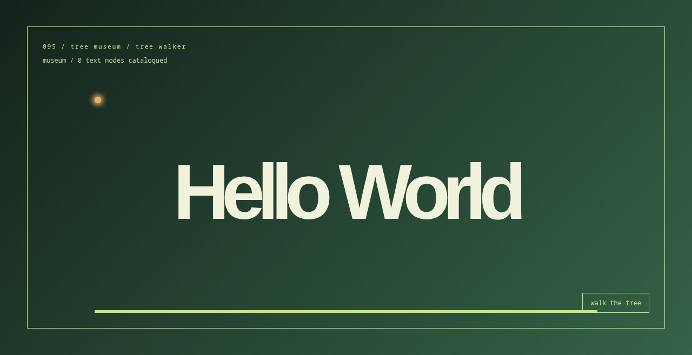](v2/luna-5.6/095/095.html) | [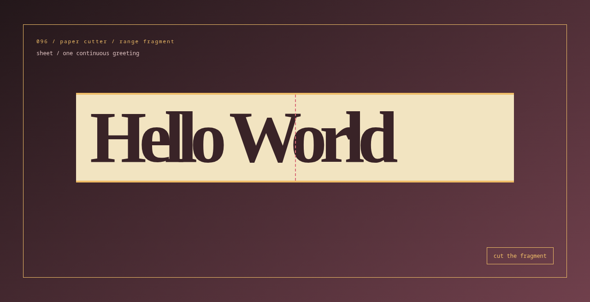](v2/luna-5.6/096/096.html) | [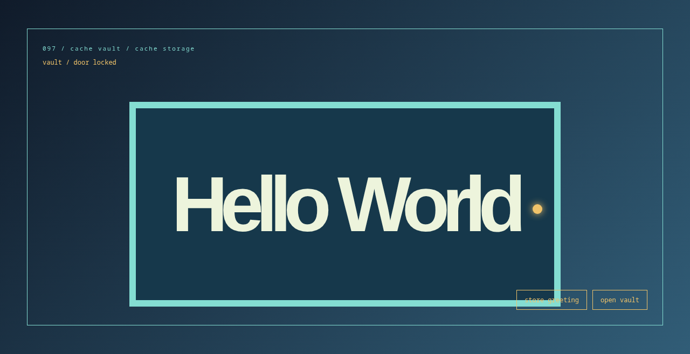](v2/luna-5.6/097/097.html) |
| :---: | :---: | :---: |
| **095 — Tree Museum** [Demo](v2/luna-5.6/095/095.html) · [Report](v2/luna-5.6/095/report.md) · [Journal](v2/luna-5.6/095/journal.md) | **096 — Paper Cutter** [Demo](v2/luna-5.6/096/096.html) · [Report](v2/luna-5.6/096/report.md) · [Journal](v2/luna-5.6/096/journal.md) | **097 — Cache Vault** [Demo](v2/luna-5.6/097/097.html) · [Report](v2/luna-5.6/097/report.md) · [Journal](v2/luna-5.6/097/journal.md) |

| [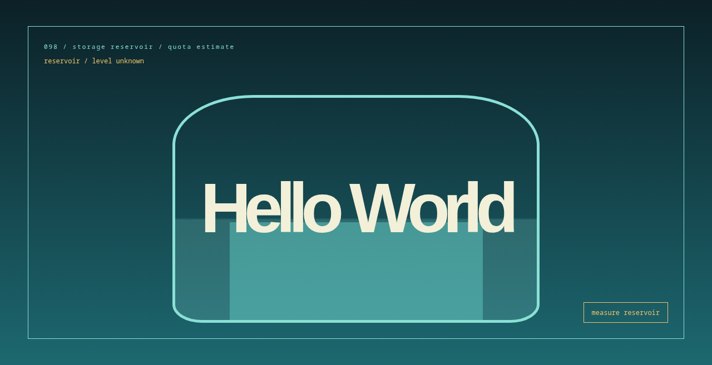](v2/luna-5.6/098/098.html) | [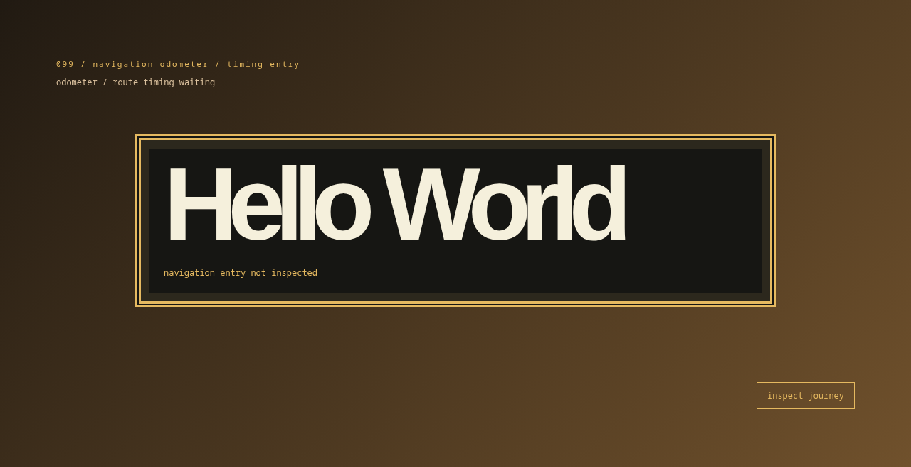](v2/luna-5.6/099/099.html) | [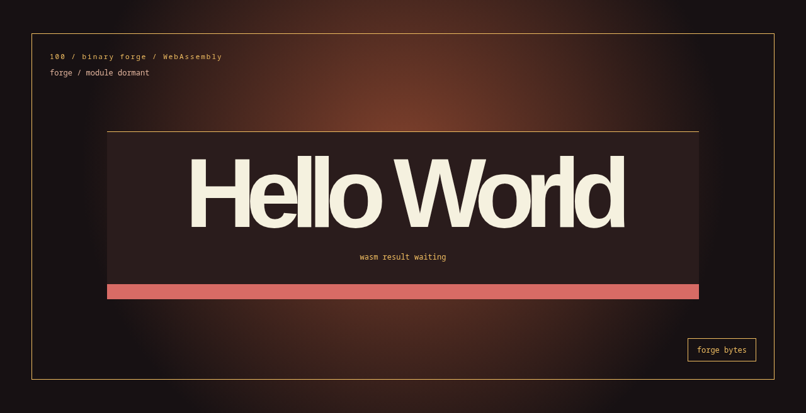](v2/luna-5.6/100/100.html) |
| :---: | :---: | :---: |
| **098 — Storage Reservoir** [Demo](v2/luna-5.6/098/098.html) · [Report](v2/luna-5.6/098/report.md) · [Journal](v2/luna-5.6/098/journal.md) | **099 — Navigation Odometer** [Demo](v2/luna-5.6/099/099.html) · [Report](v2/luna-5.6/099/report.md) · [Journal](v2/luna-5.6/099/journal.md) | **100 — Binary Forge** [Demo](v2/luna-5.6/100/100.html) · [Report](v2/luna-5.6/100/report.md) · [Journal](v2/luna-5.6/100/journal.md) |

## sol-6.1

**75 experiments**

|  | [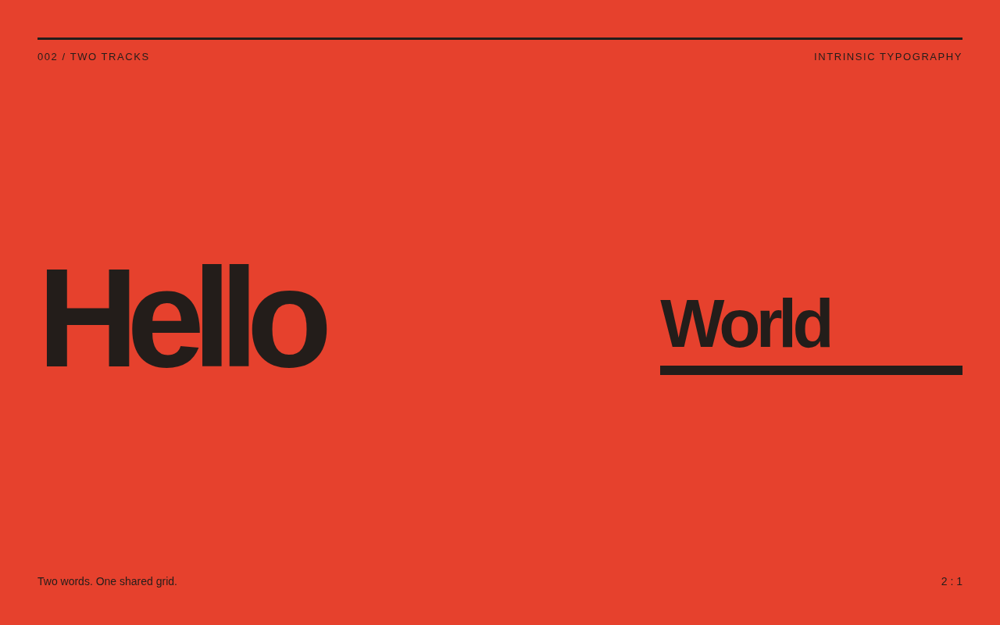](v2/sol-6.1/002/002.html) | [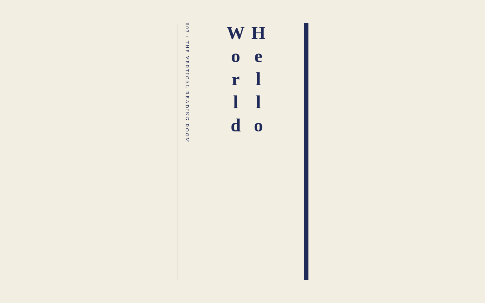](v2/sol-6.1/003/003.html) |
| :---: | :---: | :---: |
| **001 — Minimal Semantic HTML Baseline** [Demo](v2/sol-6.1/001/001.html) · [Report](v2/sol-6.1/001/report.md) · [Journal](v2/sol-6.1/001/journal.md) | **002 — 002 — Two Tracks** [Demo](v2/sol-6.1/002/002.html) · [Report](v2/sol-6.1/002/report.md) · [Journal](v2/sol-6.1/002/journal.md) | **003 — 003 — Spine** [Demo](v2/sol-6.1/003/003.html) · [Report](v2/sol-6.1/003/report.md) · [Journal](v2/sol-6.1/003/journal.md) |

| [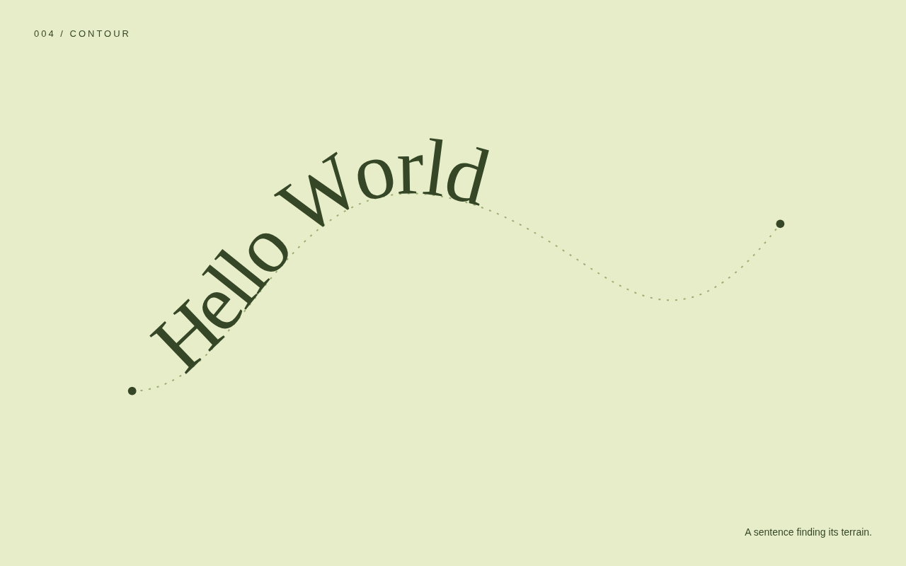](v2/sol-6.1/004/004.html) | [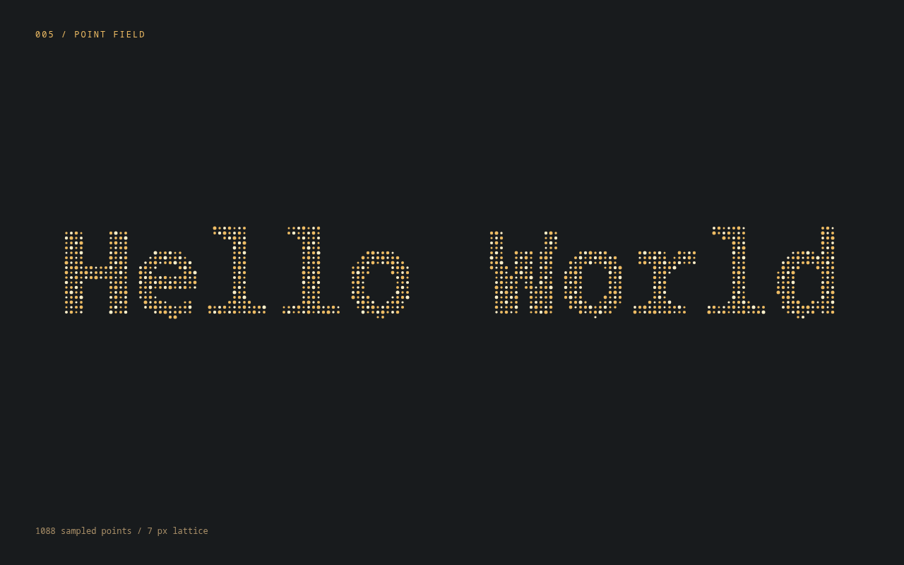](v2/sol-6.1/005/005.html) | [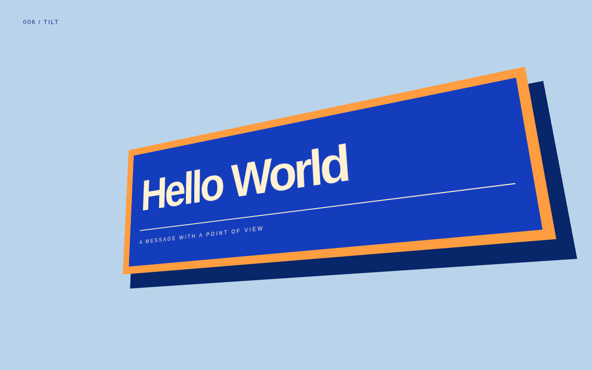](v2/sol-6.1/006/006.html) |
| :---: | :---: | :---: |
| **004 — 004 — Contour** [Demo](v2/sol-6.1/004/004.html) · [Report](v2/sol-6.1/004/report.md) · [Journal](v2/sol-6.1/004/journal.md) | **005 — 005 — Point Field** [Demo](v2/sol-6.1/005/005.html) · [Report](v2/sol-6.1/005/report.md) · [Journal](v2/sol-6.1/005/journal.md) | **006 — 006 — Tilt** [Demo](v2/sol-6.1/006/006.html) · [Report](v2/sol-6.1/006/report.md) · [Journal](v2/sol-6.1/006/journal.md) |

| [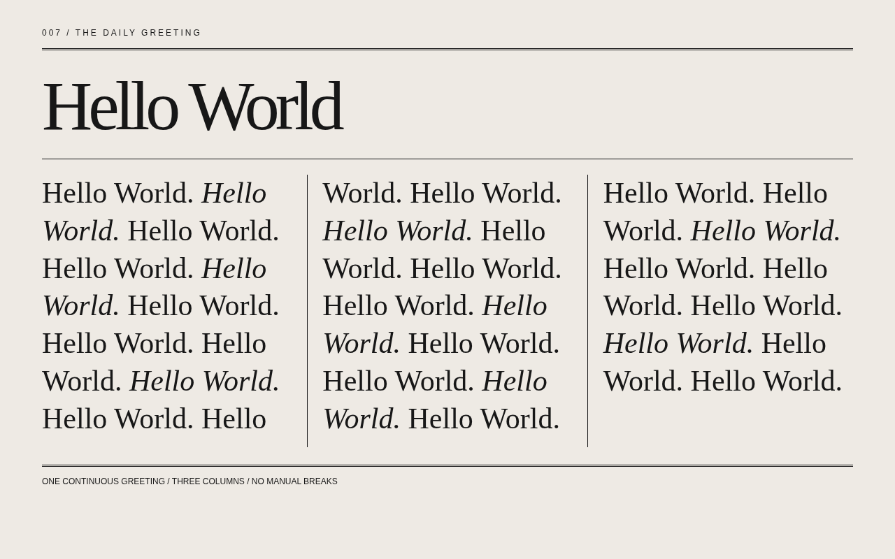](v2/sol-6.1/007/007.html) |  |  |
| :---: | :---: | :---: |
| **007 — 007 — Edition** [Demo](v2/sol-6.1/007/007.html) · [Report](v2/sol-6.1/007/report.md) · [Journal](v2/sol-6.1/007/journal.md) | **008 — 008 — Countermotion** [Demo](v2/sol-6.1/008/008.html) · [Report](v2/sol-6.1/008/report.md) · [Journal](v2/sol-6.1/008/journal.md) | **009 — 009 — Impression** [Demo](v2/sol-6.1/009/009.html) · [Report](v2/sol-6.1/009/report.md) · [Journal](v2/sol-6.1/009/journal.md) |

| [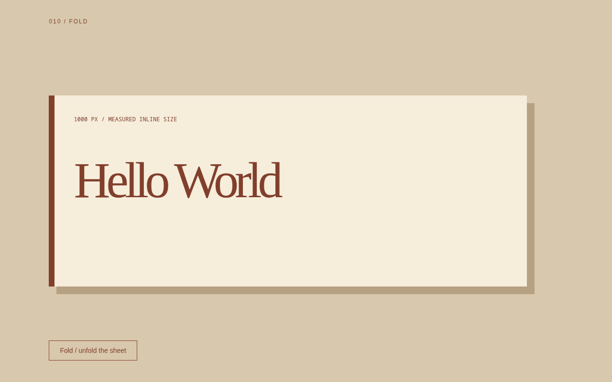](v2/sol-6.1/010/010.html) | [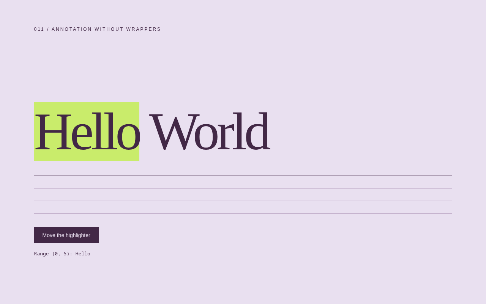](v2/sol-6.1/011/011.html) | [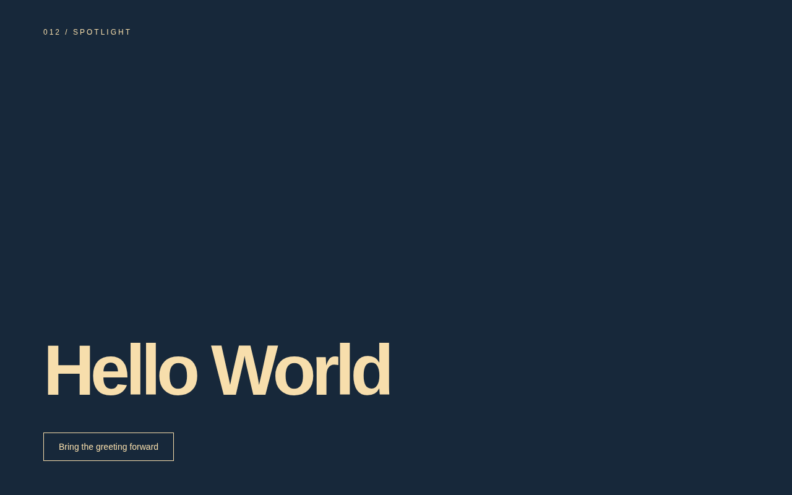](v2/sol-6.1/012/012.html) |
| :---: | :---: | :---: |
| **010 — 010 — Fold** [Demo](v2/sol-6.1/010/010.html) · [Report](v2/sol-6.1/010/report.md) · [Journal](v2/sol-6.1/010/journal.md) | **011 — 011 — Annotation** [Demo](v2/sol-6.1/011/011.html) · [Report](v2/sol-6.1/011/report.md) · [Journal](v2/sol-6.1/011/journal.md) | **012 — 012 — Spotlight** [Demo](v2/sol-6.1/012/012.html) · [Report](v2/sol-6.1/012/report.md) · [Journal](v2/sol-6.1/012/journal.md) |

| [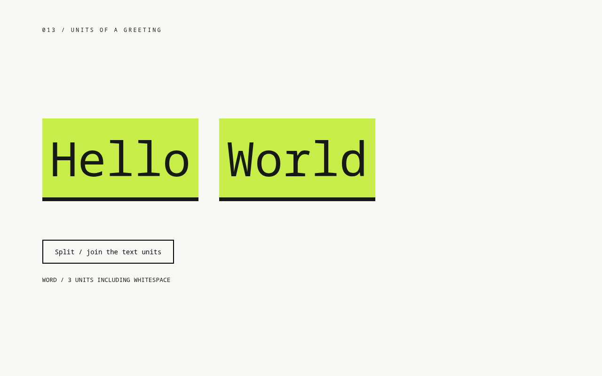](v2/sol-6.1/013/013.html) | [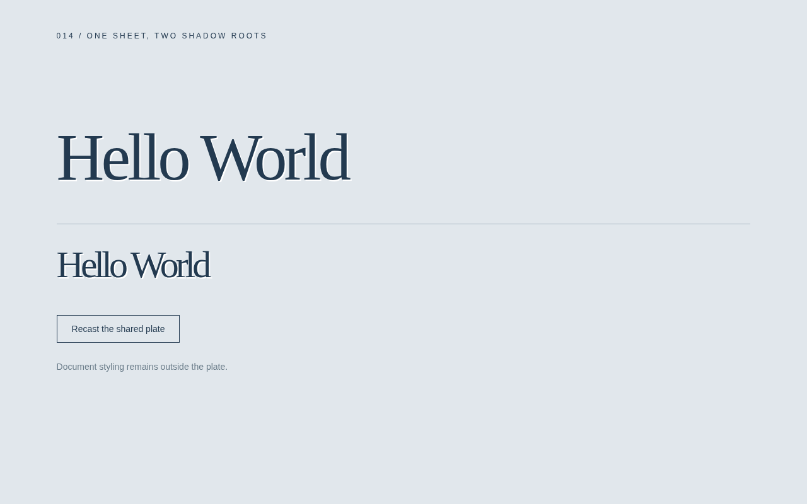](v2/sol-6.1/014/014.html) | [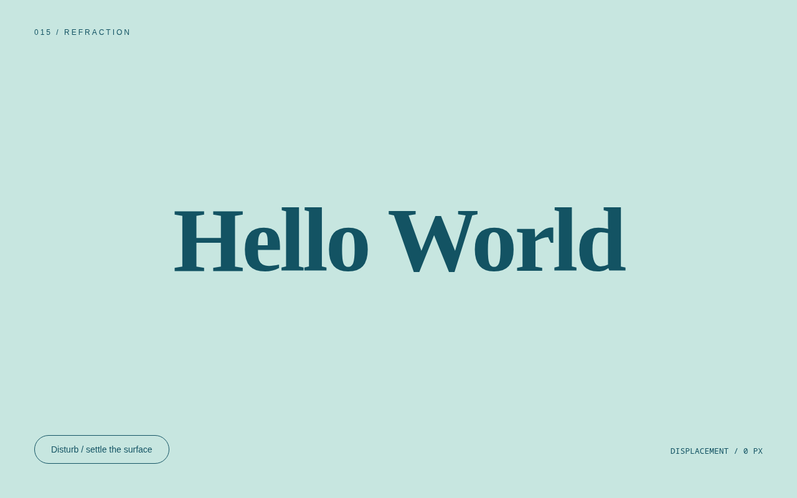](v2/sol-6.1/015/015.html) |
| :---: | :---: | :---: |
| **013 — 013 — Units** [Demo](v2/sol-6.1/013/013.html) · [Report](v2/sol-6.1/013/report.md) · [Journal](v2/sol-6.1/013/journal.md) | **014 — 014 — Shared Plate** [Demo](v2/sol-6.1/014/014.html) · [Report](v2/sol-6.1/014/report.md) · [Journal](v2/sol-6.1/014/journal.md) | **015 — 015 — Refraction** [Demo](v2/sol-6.1/015/015.html) · [Report](v2/sol-6.1/015/report.md) · [Journal](v2/sol-6.1/015/journal.md) |

| [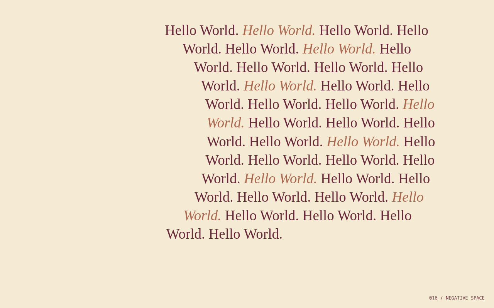](v2/sol-6.1/016/016.html) | [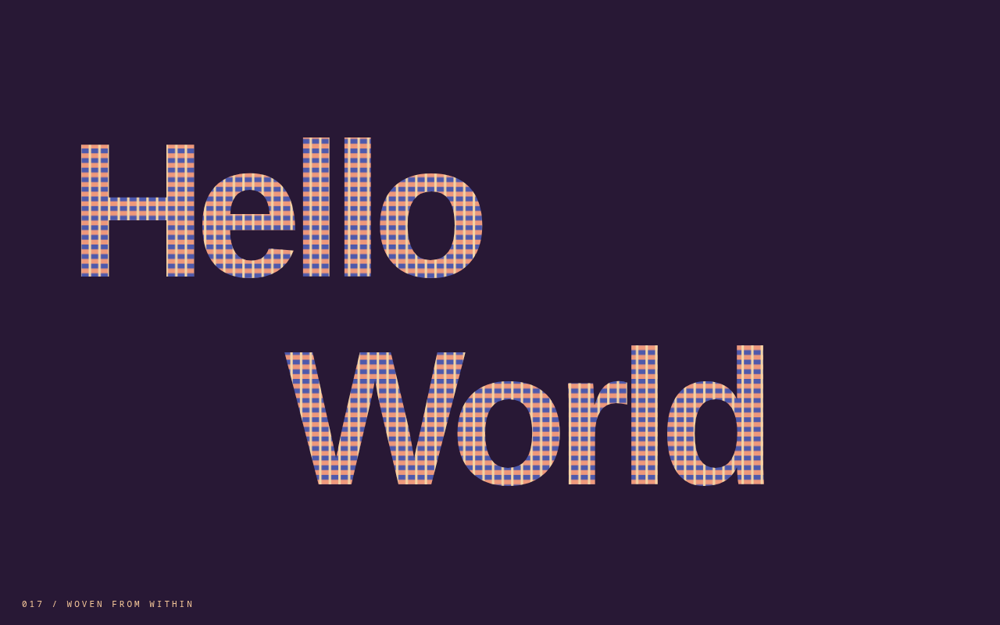](v2/sol-6.1/017/017.html) | [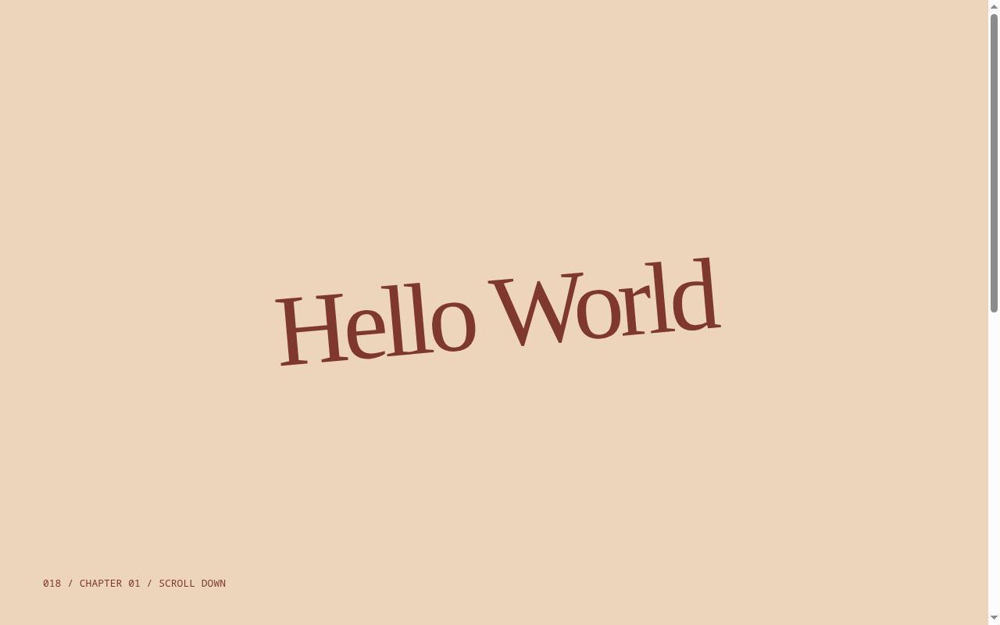](v2/sol-6.1/018/018.html) |
| :---: | :---: | :---: |
| **016 — 016 — Negative Space** [Demo](v2/sol-6.1/016/016.html) · [Report](v2/sol-6.1/016/report.md) · [Journal](v2/sol-6.1/016/journal.md) | **017 — 017 — Woven** [Demo](v2/sol-6.1/017/017.html) · [Report](v2/sol-6.1/017/report.md) · [Journal](v2/sol-6.1/017/journal.md) | **018 — 018 — Chapters** [Demo](v2/sol-6.1/018/018.html) · [Report](v2/sol-6.1/018/report.md) · [Journal](v2/sol-6.1/018/journal.md) |

| [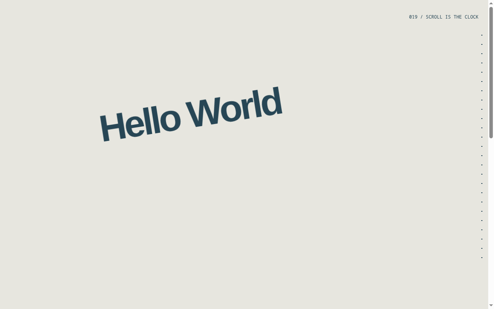](v2/sol-6.1/019/019.html) | [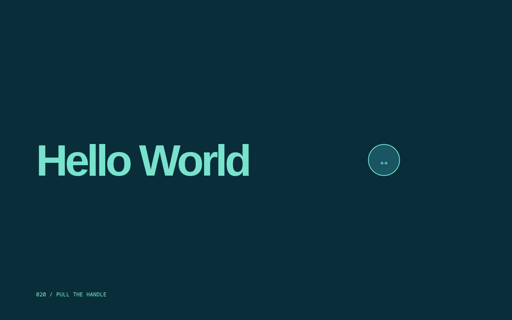](v2/sol-6.1/020/020.html) | [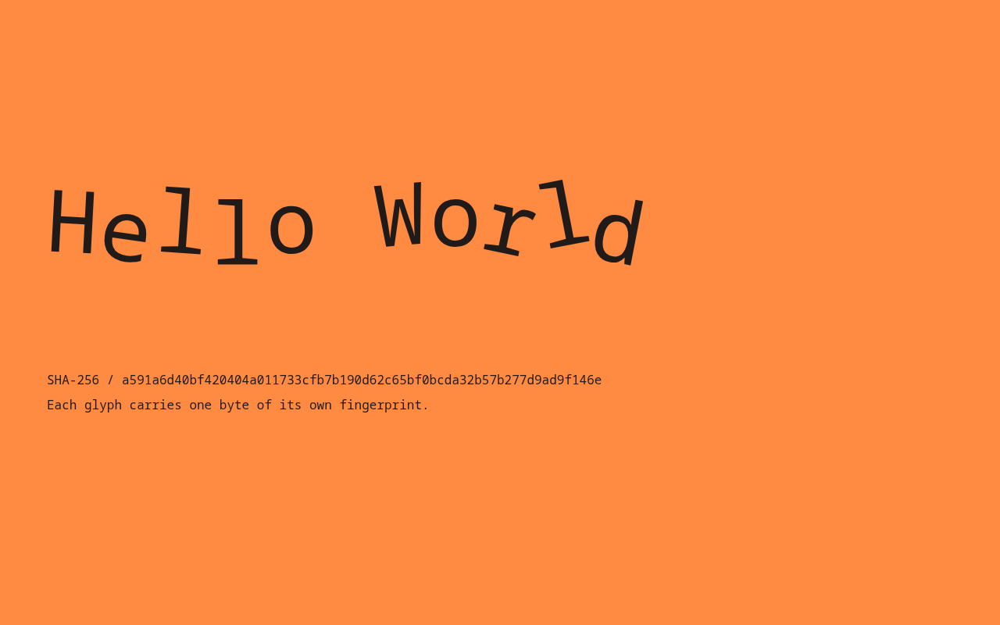](v2/sol-6.1/021/021.html) |
| :---: | :---: | :---: |
| **019 — 019 — Scroll Is the Clock** [Demo](v2/sol-6.1/019/019.html) · [Report](v2/sol-6.1/019/report.md) · [Journal](v2/sol-6.1/019/journal.md) | **020 — 020 — Pull** [Demo](v2/sol-6.1/020/020.html) · [Report](v2/sol-6.1/020/report.md) · [Journal](v2/sol-6.1/020/journal.md) | **021 — 021 — Fingerprint** [Demo](v2/sol-6.1/021/021.html) · [Report](v2/sol-6.1/021/report.md) · [Journal](v2/sol-6.1/021/journal.md) |

| [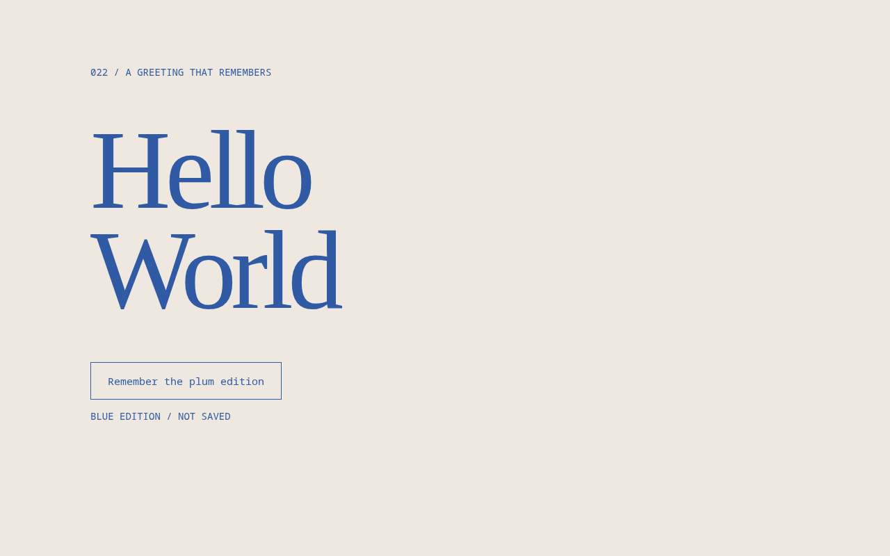](v2/sol-6.1/022/022.html) | [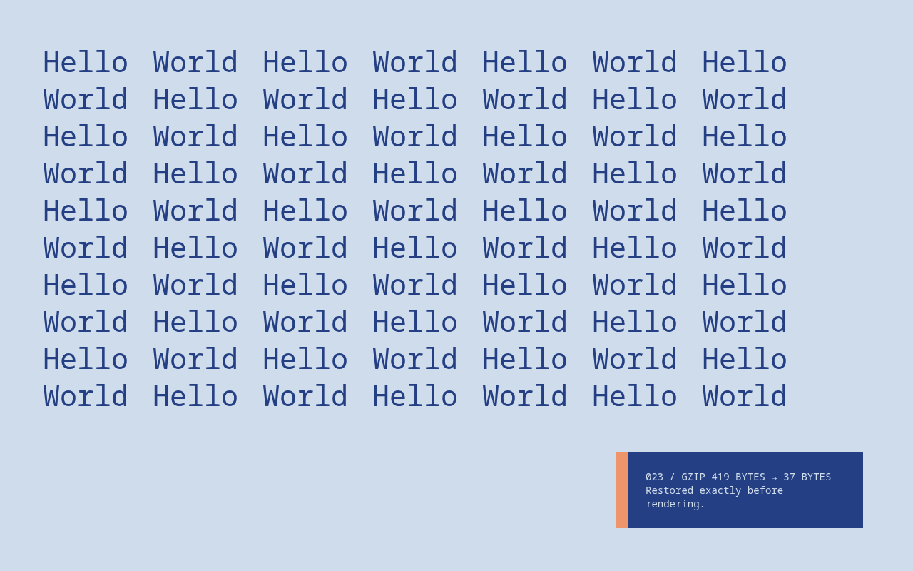](v2/sol-6.1/023/023.html) | [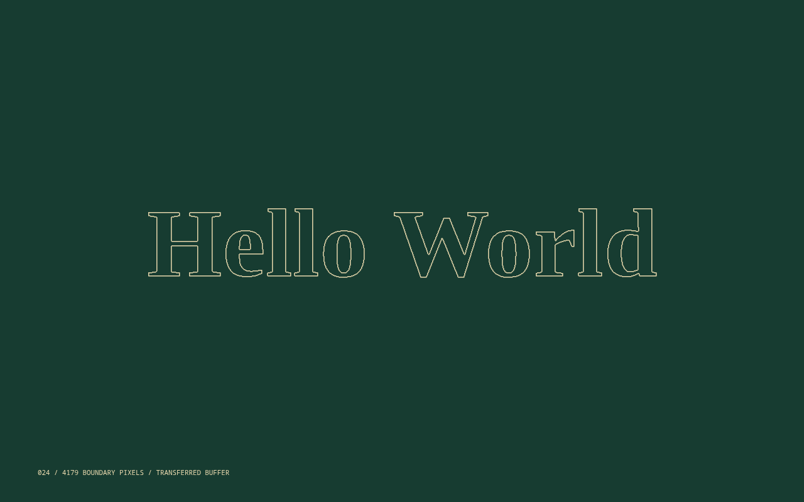](v2/sol-6.1/024/024.html) |
| :---: | :---: | :---: |
| **022 — 022 — Remembered** [Demo](v2/sol-6.1/022/022.html) · [Report](v2/sol-6.1/022/report.md) · [Journal](v2/sol-6.1/022/journal.md) | **023 — 023 — Packed** [Demo](v2/sol-6.1/023/023.html) · [Report](v2/sol-6.1/023/report.md) · [Journal](v2/sol-6.1/023/journal.md) | **024 — 024 — Boundary Worker** [Demo](v2/sol-6.1/024/024.html) · [Report](v2/sol-6.1/024/report.md) · [Journal](v2/sol-6.1/024/journal.md) |

| [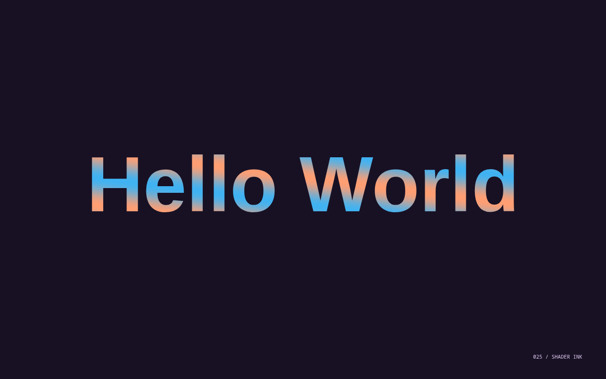](v2/sol-6.1/025/025.html) | [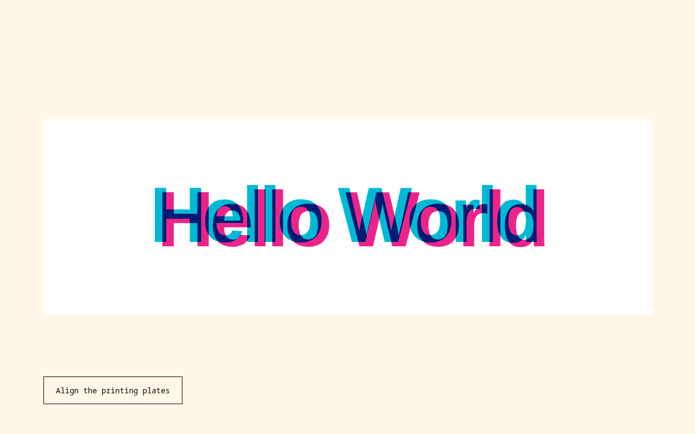](v2/sol-6.1/026/026.html) |  |
| :---: | :---: | :---: |
| **025 — 025 — Shader Ink** [Demo](v2/sol-6.1/025/025.html) · [Report](v2/sol-6.1/025/report.md) · [Journal](v2/sol-6.1/025/journal.md) | **026 — 026 — Registration** [Demo](v2/sol-6.1/026/026.html) · [Report](v2/sol-6.1/026/report.md) · [Journal](v2/sol-6.1/026/journal.md) | **027 — 027 — Slices** [Demo](v2/sol-6.1/027/027.html) · [Report](v2/sol-6.1/027/report.md) · [Journal](v2/sol-6.1/027/journal.md) |

| [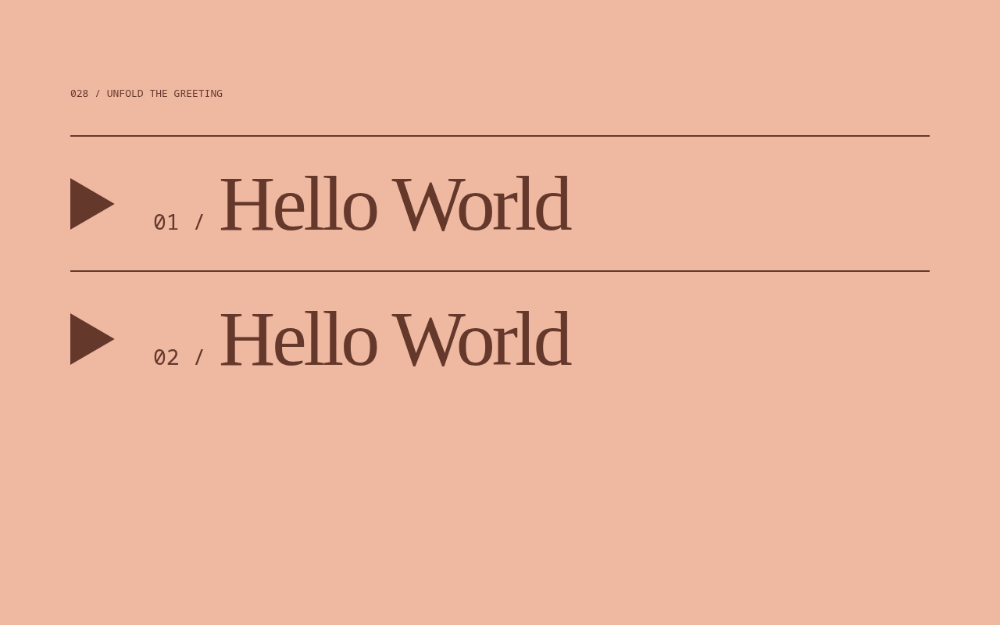](v2/sol-6.1/028/028.html) | [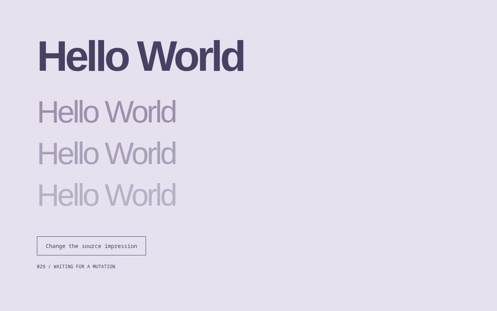](v2/sol-6.1/029/029.html) | [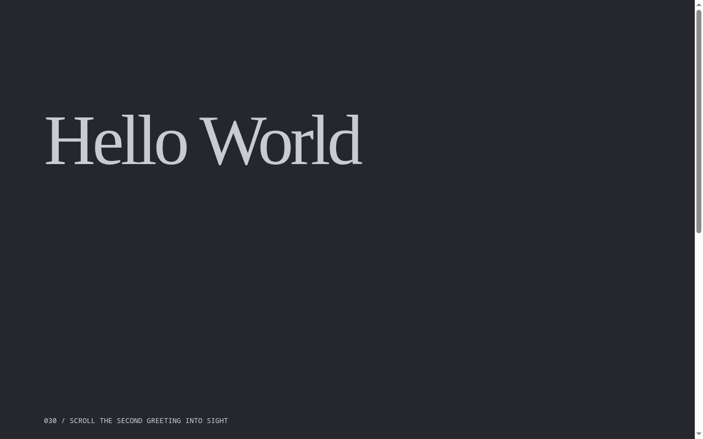](v2/sol-6.1/030/030.html) |
| :---: | :---: | :---: |
| **028 — 028 — Unfold** [Demo](v2/sol-6.1/028/028.html) · [Report](v2/sol-6.1/028/report.md) · [Journal](v2/sol-6.1/028/journal.md) | **029 — 029 — Echo Records** [Demo](v2/sol-6.1/029/029.html) · [Report](v2/sol-6.1/029/report.md) · [Journal](v2/sol-6.1/029/journal.md) | **030 — 030 — In Sight** [Demo](v2/sol-6.1/030/030.html) · [Report](v2/sol-6.1/030/report.md) · [Journal](v2/sol-6.1/030/journal.md) |

| [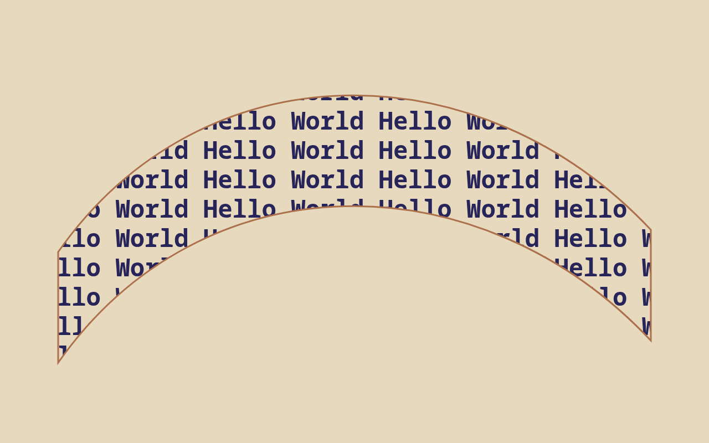](v2/sol-6.1/031/031.html) | [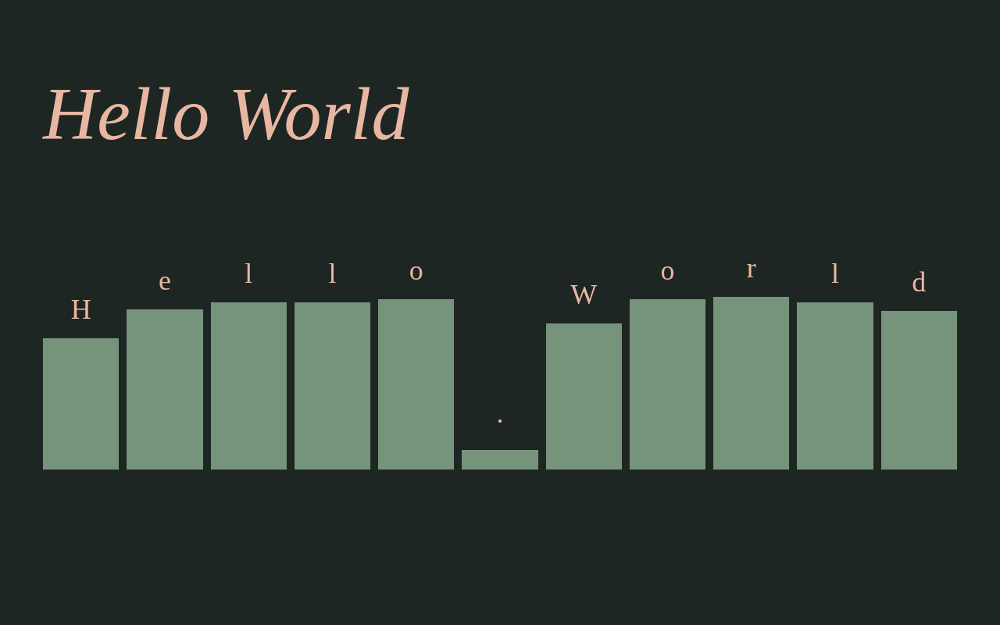](v2/sol-6.1/032/032.html) | [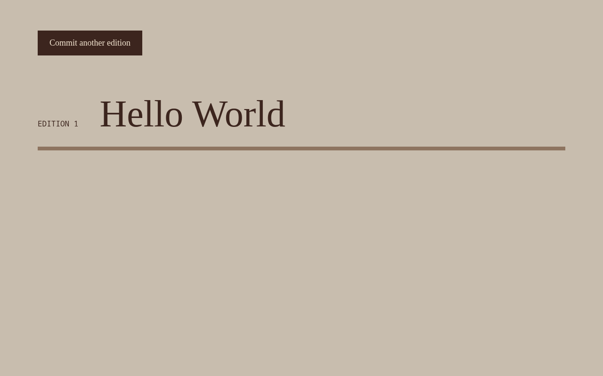](v2/sol-6.1/033/033.html) |
| :---: | :---: | :---: |
| **031 — 031 — Ribbon** [Demo](v2/sol-6.1/031/031.html) · [Report](v2/sol-6.1/031/report.md) · [Journal](v2/sol-6.1/031/journal.md) | **032 — 032 — Silent Score** [Demo](v2/sol-6.1/032/032.html) · [Report](v2/sol-6.1/032/report.md) · [Journal](v2/sol-6.1/032/journal.md) | **033 — 033 — Editions** [Demo](v2/sol-6.1/033/033.html) · [Report](v2/sol-6.1/033/report.md) · [Journal](v2/sol-6.1/033/journal.md) |

| [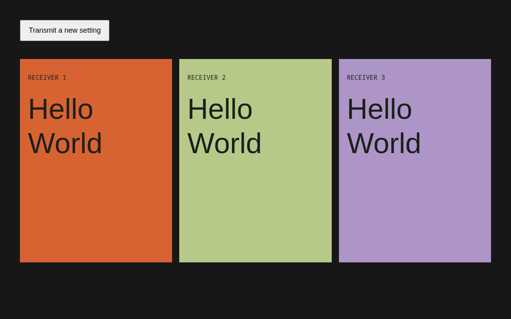](v2/sol-6.1/034/034.html) | [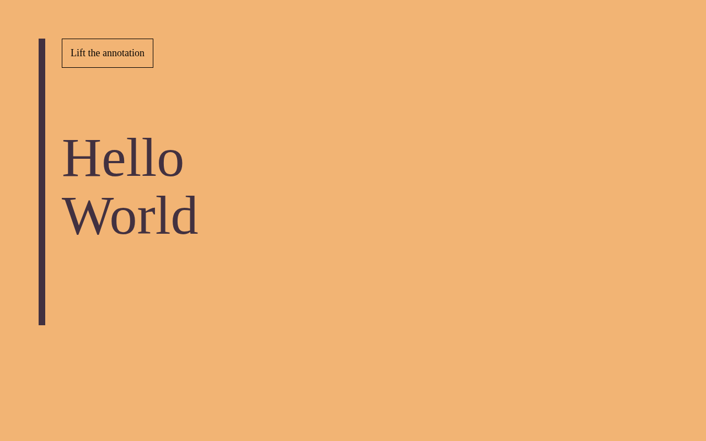](v2/sol-6.1/035/035.html) | [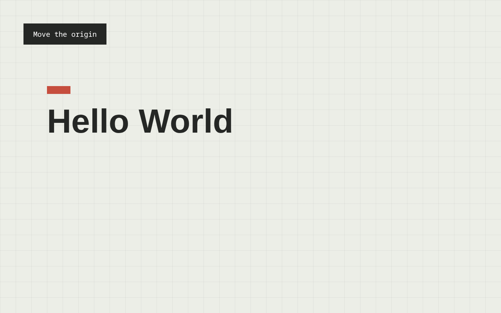](v2/sol-6.1/036/036.html) |
| :---: | :---: | :---: |
| **034 — 034 — Transmission** [Demo](v2/sol-6.1/034/034.html) · [Report](v2/sol-6.1/034/report.md) · [Journal](v2/sol-6.1/034/journal.md) | **035 — 035 — Outside the Box** [Demo](v2/sol-6.1/035/035.html) · [Report](v2/sol-6.1/035/report.md) · [Journal](v2/sol-6.1/035/journal.md) | **036 — 036 — Tether** [Demo](v2/sol-6.1/036/036.html) · [Report](v2/sol-6.1/036/report.md) · [Journal](v2/sol-6.1/036/journal.md) |

|  |  | [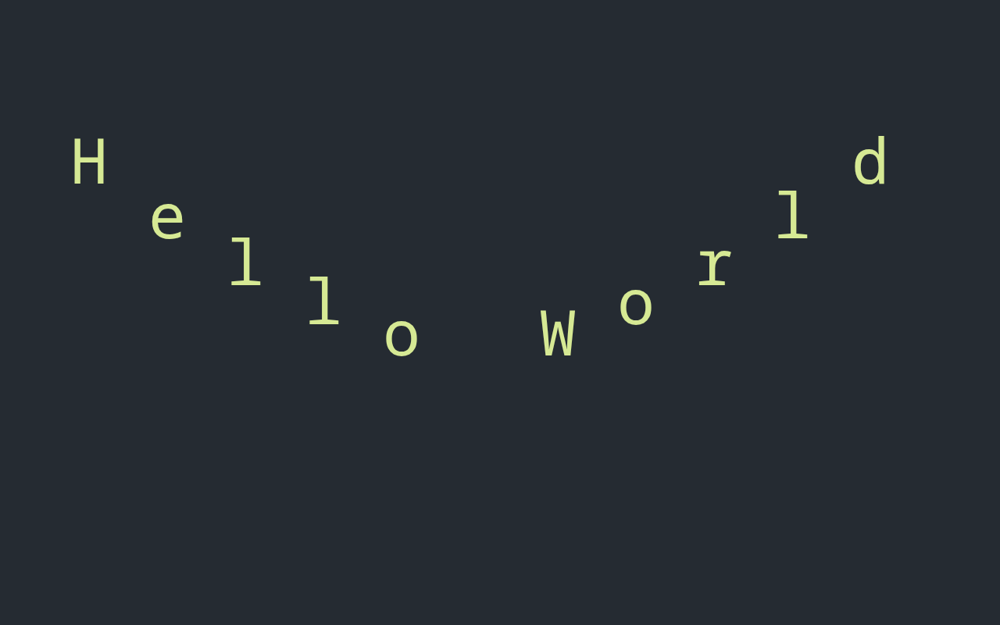](v2/sol-6.1/039/039.html) |
| :---: | :---: | :---: |
| **037 — 037 — Turning Ink** [Demo](v2/sol-6.1/037/037.html) · [Report](v2/sol-6.1/037/report.md) · [Journal](v2/sol-6.1/037/journal.md) | **038 — 038 — Remote Press** [Demo](v2/sol-6.1/038/038.html) · [Report](v2/sol-6.1/038/report.md) · [Journal](v2/sol-6.1/038/journal.md) | **039 — 039 — Letter Valley** [Demo](v2/sol-6.1/039/039.html) · [Report](v2/sol-6.1/039/report.md) · [Journal](v2/sol-6.1/039/journal.md) |

| [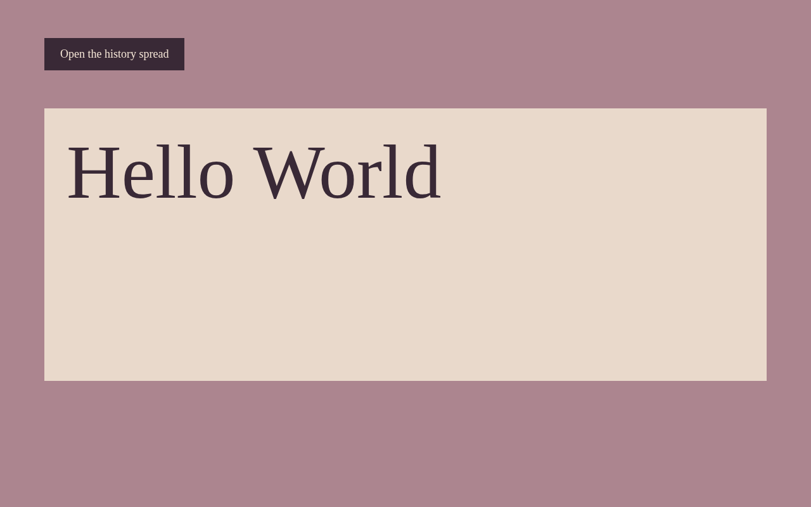](v2/sol-6.1/040/040.html) | [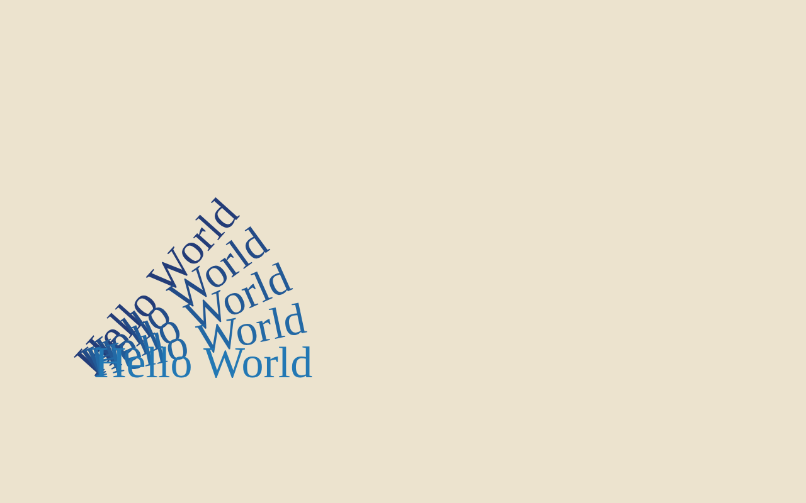](v2/sol-6.1/041/041.html) | [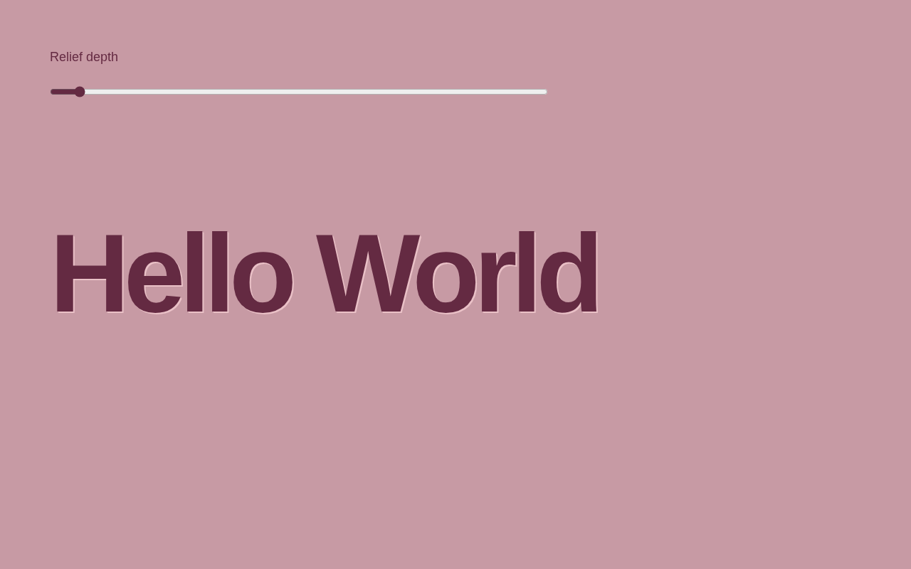](v2/sol-6.1/042/042.html) |
| :---: | :---: | :---: |
| **040 — 040 — Facing Pages** [Demo](v2/sol-6.1/040/040.html) · [Report](v2/sol-6.1/040/report.md) · [Journal](v2/sol-6.1/040/journal.md) | **041 — 041 — Fan** [Demo](v2/sol-6.1/041/041.html) · [Report](v2/sol-6.1/041/report.md) · [Journal](v2/sol-6.1/041/journal.md) | **042 — 042 — Relief** [Demo](v2/sol-6.1/042/042.html) · [Report](v2/sol-6.1/042/report.md) · [Journal](v2/sol-6.1/042/journal.md) |

| [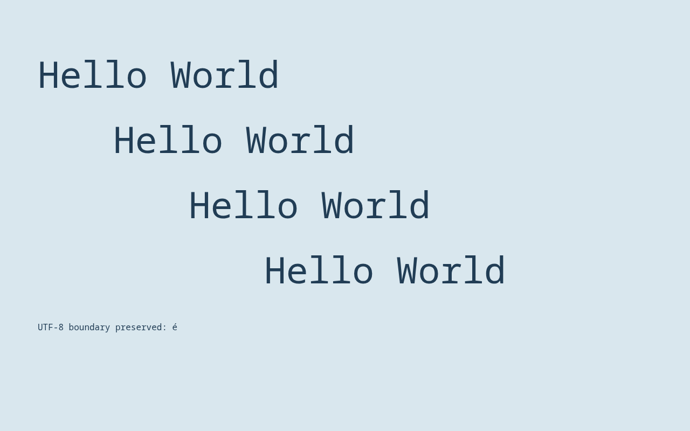](v2/sol-6.1/043/043.html) |  | [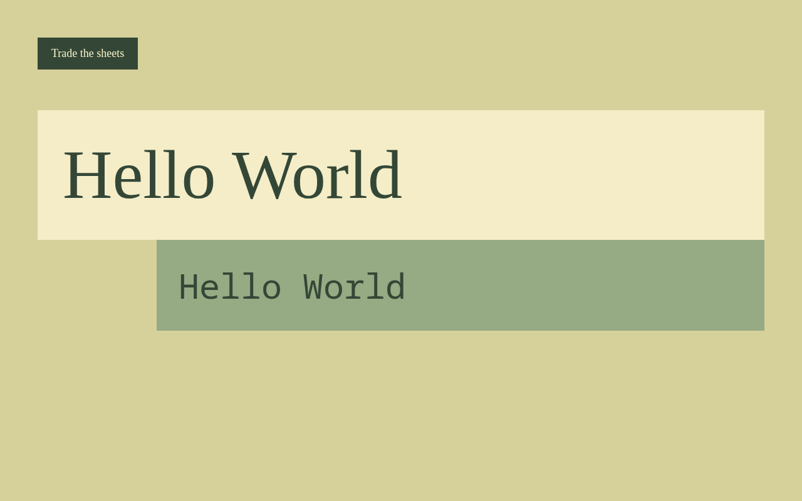](v2/sol-6.1/045/045.html) |
| :---: | :---: | :---: |
| **043 — 043 — Decoded Cascade** [Demo](v2/sol-6.1/043/043.html) · [Report](v2/sol-6.1/043/report.md) · [Journal](v2/sol-6.1/043/journal.md) | **044 — 044 — Stone Light** [Demo](v2/sol-6.1/044/044.html) · [Report](v2/sol-6.1/044/report.md) · [Journal](v2/sol-6.1/044/journal.md) | **045 — 045 — Distributed Sheets** [Demo](v2/sol-6.1/045/045.html) · [Report](v2/sol-6.1/045/report.md) · [Journal](v2/sol-6.1/045/journal.md) |

| [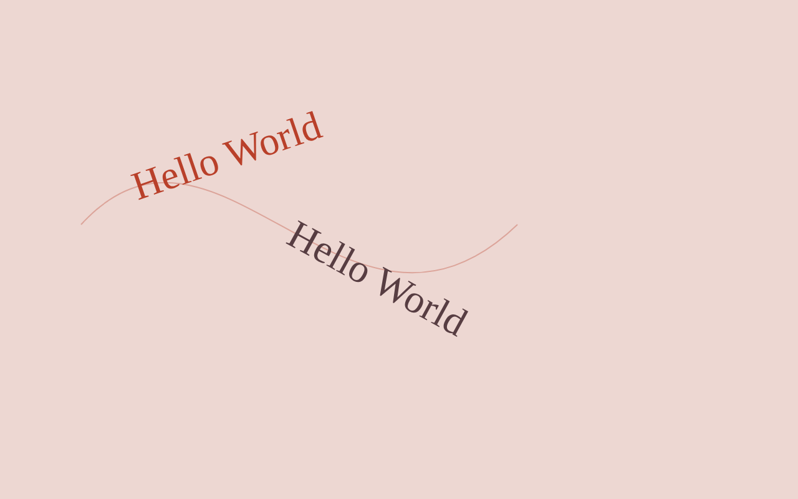](v2/sol-6.1/046/046.html) |  | [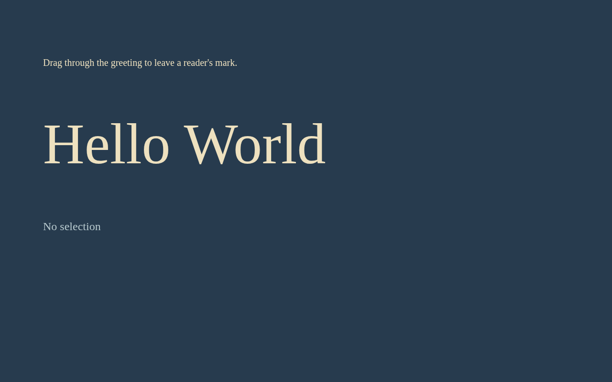](v2/sol-6.1/048/048.html) |
| :---: | :---: | :---: |
| **046 — 046 — Procession** [Demo](v2/sol-6.1/046/046.html) · [Report](v2/sol-6.1/046/report.md) · [Journal](v2/sol-6.1/046/journal.md) | **047 — 047 — Knockout** [Demo](v2/sol-6.1/047/047.html) · [Report](v2/sol-6.1/047/report.md) · [Journal](v2/sol-6.1/047/journal.md) | **048 — 048 — Reader's Mark** [Demo](v2/sol-6.1/048/048.html) · [Report](v2/sol-6.1/048/report.md) · [Journal](v2/sol-6.1/048/journal.md) |

| [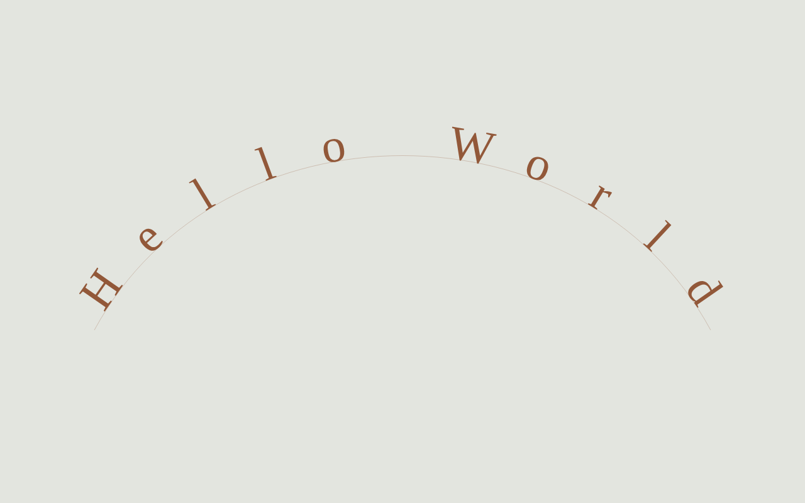](v2/sol-6.1/049/049.html) | [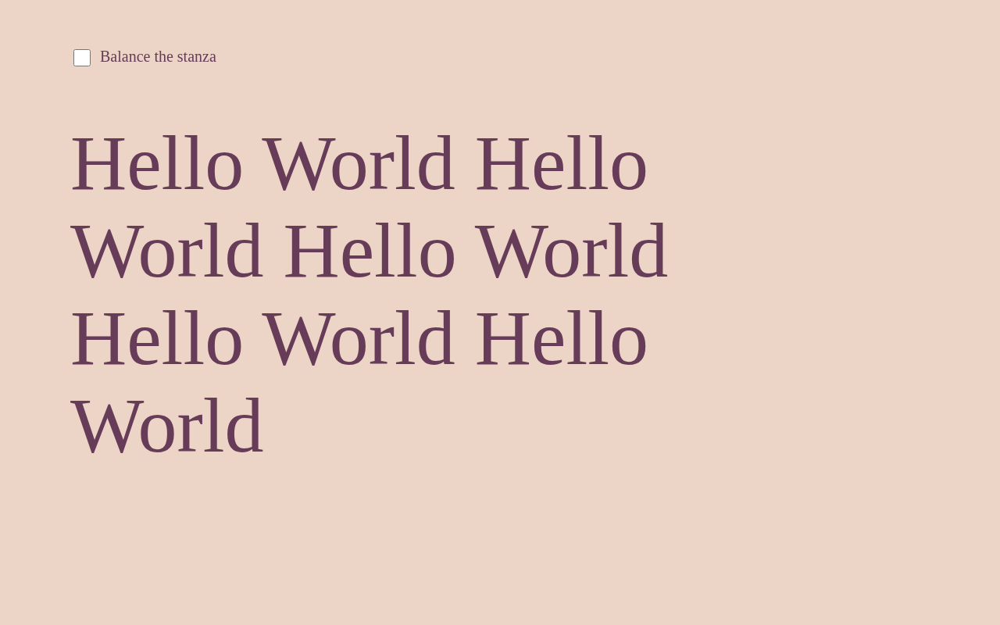](v2/sol-6.1/050/050.html) |  |
| :---: | :---: | :---: |
| **049 — 049 — Measured Arc** [Demo](v2/sol-6.1/049/049.html) · [Report](v2/sol-6.1/049/report.md) · [Journal](v2/sol-6.1/049/journal.md) | **050 — 050 — Balanced Stanza** [Demo](v2/sol-6.1/050/050.html) · [Report](v2/sol-6.1/050/report.md) · [Journal](v2/sol-6.1/050/journal.md) | **051 — 051 — Equal Spans** [Demo](v2/sol-6.1/051/051.html) · [Report](v2/sol-6.1/051/report.md) · [Journal](v2/sol-6.1/051/journal.md) |

| [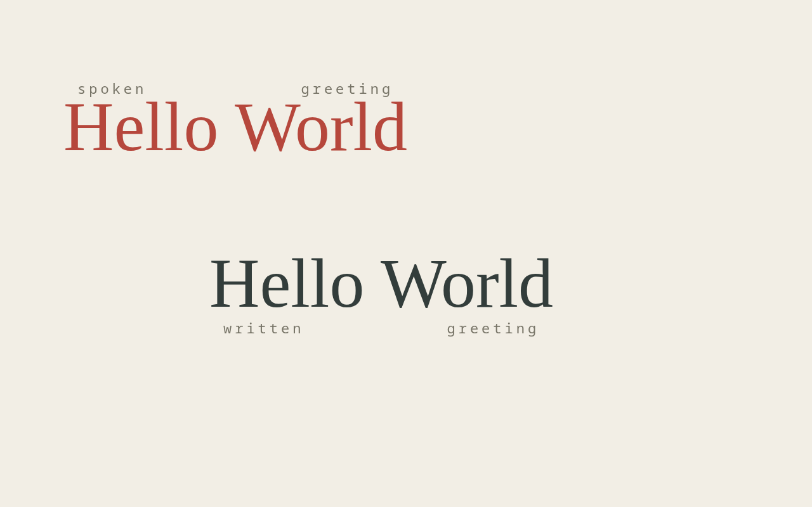](v2/sol-6.1/052/052.html) |  | [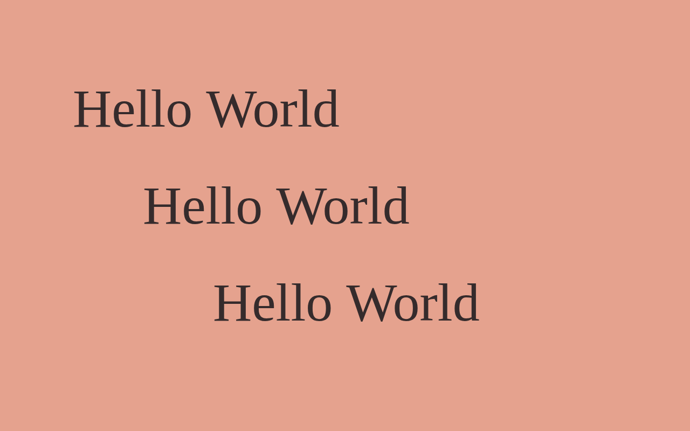](v2/sol-6.1/054/054.html) |
| :---: | :---: | :---: |
| **052 — 052 — Reading Notes** [Demo](v2/sol-6.1/052/052.html) · [Report](v2/sol-6.1/052/report.md) · [Journal](v2/sol-6.1/052/journal.md) | **053 — 053 — Expanded Ink** [Demo](v2/sol-6.1/053/053.html) · [Report](v2/sol-6.1/053/report.md) · [Journal](v2/sol-6.1/053/journal.md) | **054 — 054 — Proof Sheet** [Demo](v2/sol-6.1/054/054.html) · [Report](v2/sol-6.1/054/report.md) · [Journal](v2/sol-6.1/054/journal.md) |

| [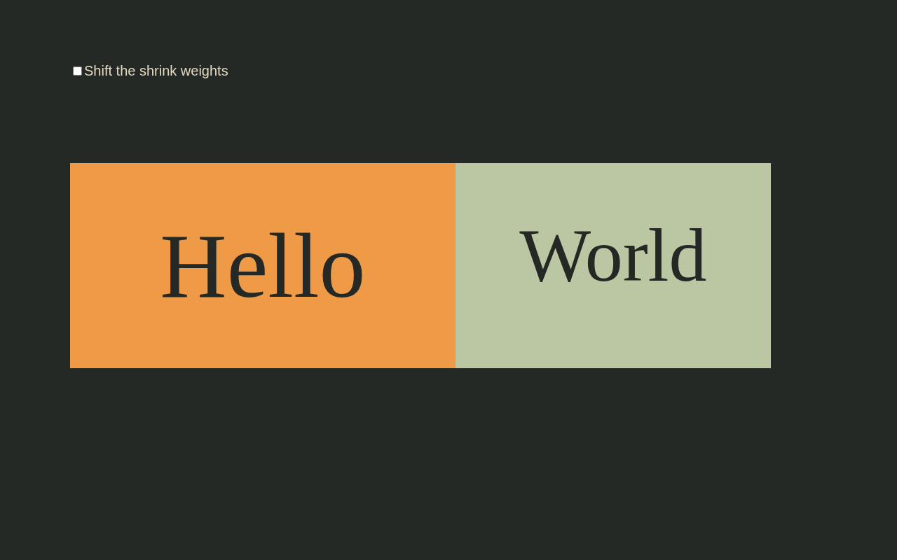](v2/sol-6.1/055/055.html) | [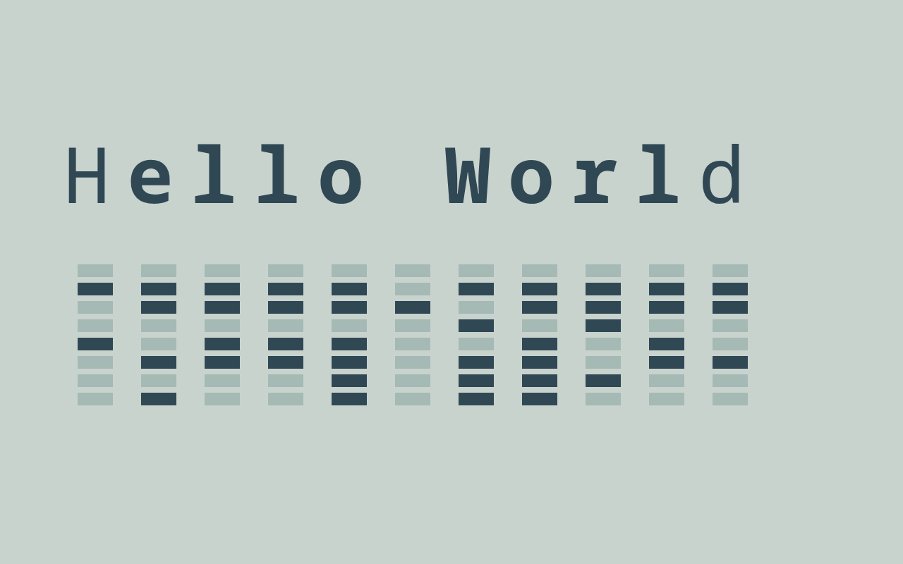](v2/sol-6.1/056/056.html) | [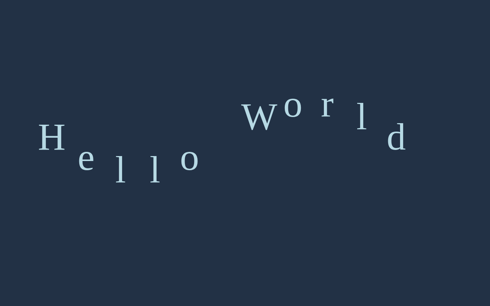](v2/sol-6.1/057/057.html) |
| :---: | :---: | :---: |
| **055 — 055 — Shared Space** [Demo](v2/sol-6.1/055/055.html) · [Report](v2/sol-6.1/055/report.md) · [Journal](v2/sol-6.1/055/journal.md) | **056 — 056 — Byte Weight** [Demo](v2/sol-6.1/056/056.html) · [Report](v2/sol-6.1/056/report.md) · [Journal](v2/sol-6.1/056/journal.md) | **057 — 057 — Delivered Score** [Demo](v2/sol-6.1/057/057.html) · [Report](v2/sol-6.1/057/report.md) · [Journal](v2/sol-6.1/057/journal.md) |

| [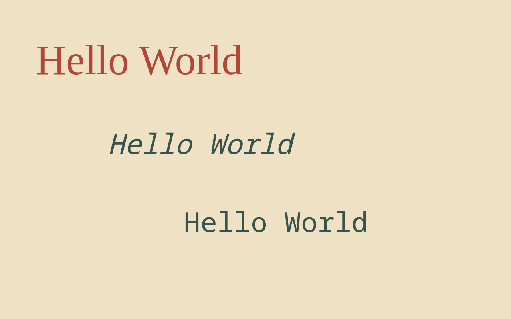](v2/sol-6.1/058/058.html) | [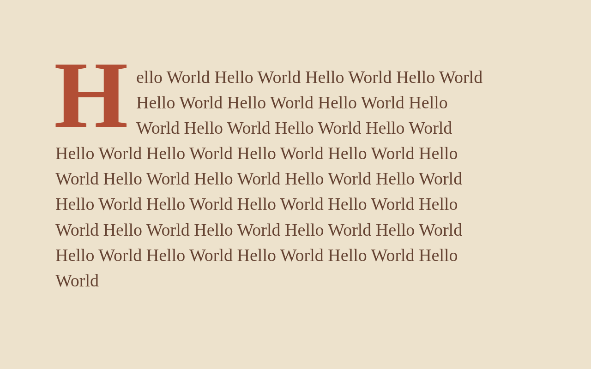](v2/sol-6.1/059/059.html) |  |
| :---: | :---: | :---: |
| **058 — 058 — Bounded Ink** [Demo](v2/sol-6.1/058/058.html) · [Report](v2/sol-6.1/058/report.md) · [Journal](v2/sol-6.1/058/journal.md) | **059 — 059 — Initial** [Demo](v2/sol-6.1/059/059.html) · [Report](v2/sol-6.1/059/report.md) · [Journal](v2/sol-6.1/059/journal.md) | **060 — 060 — Stitched** [Demo](v2/sol-6.1/060/060.html) · [Report](v2/sol-6.1/060/report.md) · [Journal](v2/sol-6.1/060/journal.md) |

| [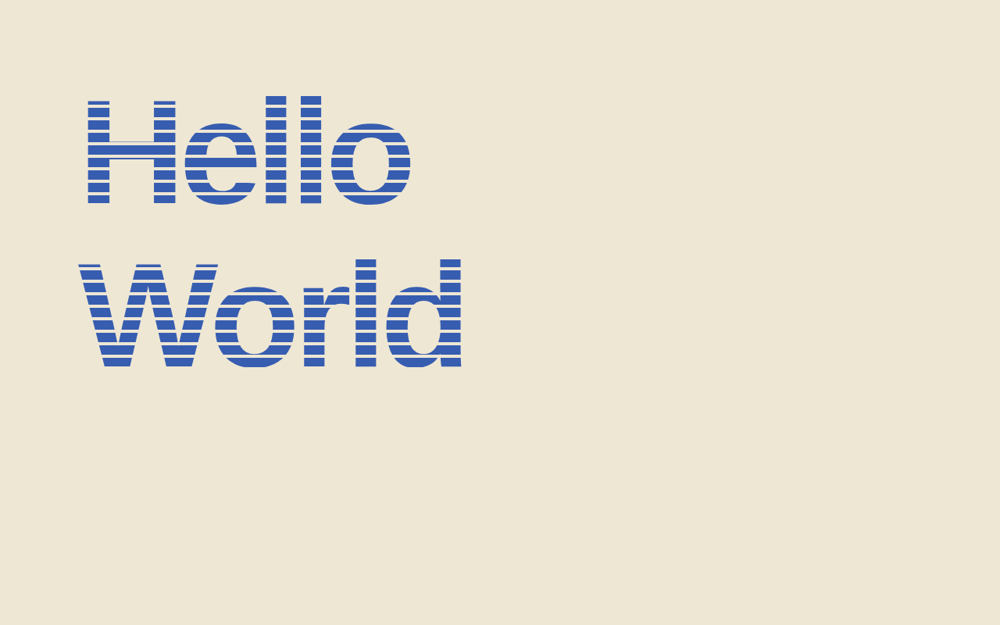](v2/sol-6.1/061/061.html) | [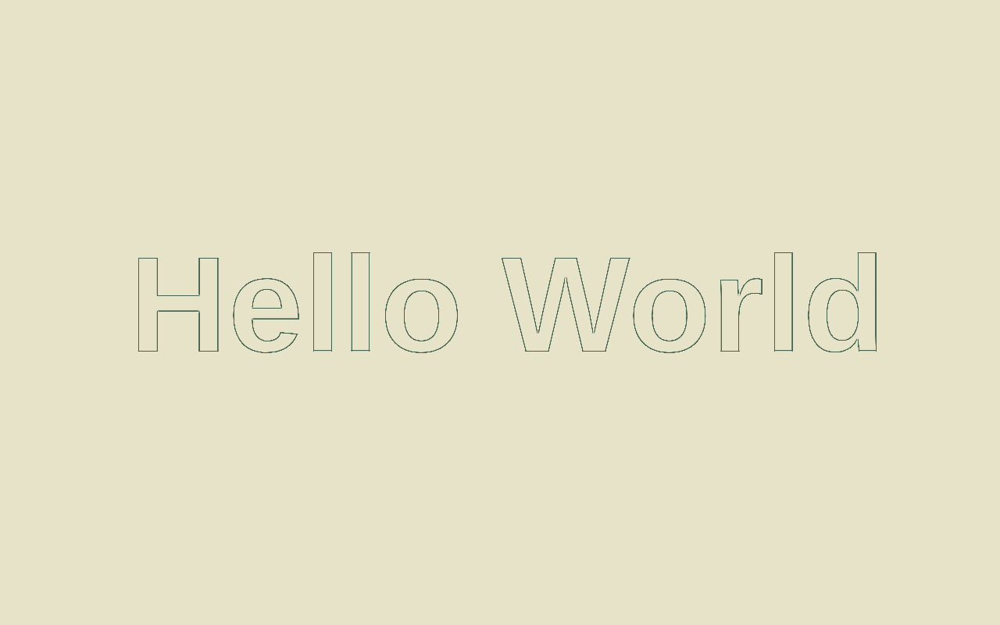](v2/sol-6.1/062/062.html) |  |
| :---: | :---: | :---: |
| **061 — 061 — Scan Cut** [Demo](v2/sol-6.1/061/061.html) · [Report](v2/sol-6.1/061/report.md) · [Journal](v2/sol-6.1/061/journal.md) | **062 — 062 — Kernel Ink** [Demo](v2/sol-6.1/062/062.html) · [Report](v2/sol-6.1/062/report.md) · [Journal](v2/sol-6.1/062/journal.md) | **063 — 063 — Focal Plane** [Demo](v2/sol-6.1/063/063.html) · [Report](v2/sol-6.1/063/report.md) · [Journal](v2/sol-6.1/063/journal.md) |

|  |  | [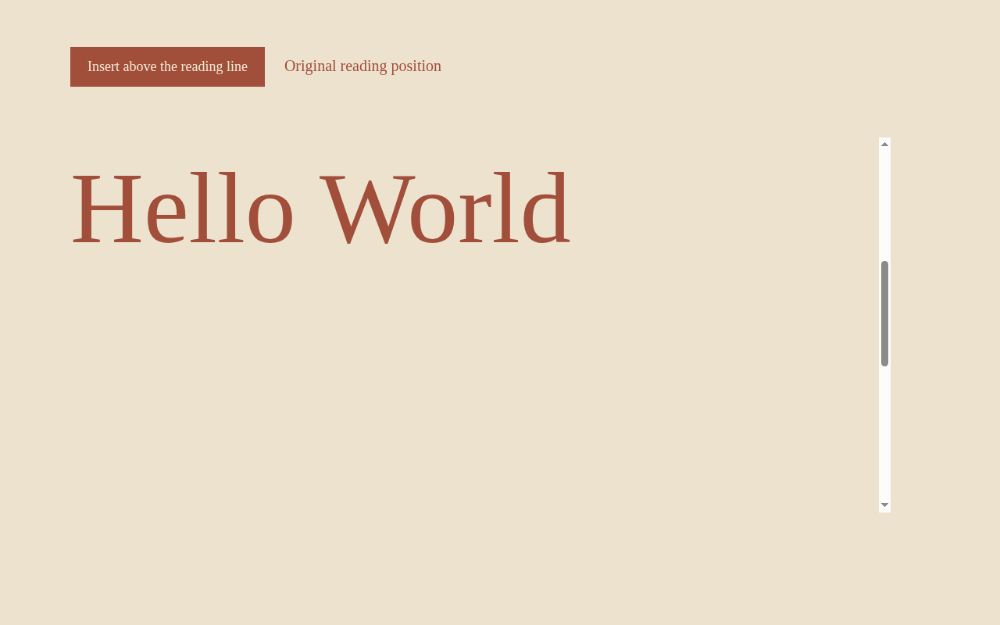](v2/sol-6.1/066/066.html) |
| :---: | :---: | :---: |
| **064 — 064 — Two Sides** [Demo](v2/sol-6.1/064/064.html) · [Report](v2/sol-6.1/064/report.md) · [Journal](v2/sol-6.1/064/journal.md) | **065 — 065 — Passage** [Demo](v2/sol-6.1/065/065.html) · [Report](v2/sol-6.1/065/report.md) · [Journal](v2/sol-6.1/065/journal.md) | **066 — 066 — Held Line** [Demo](v2/sol-6.1/066/066.html) · [Report](v2/sol-6.1/066/report.md) · [Journal](v2/sol-6.1/066/journal.md) |

| [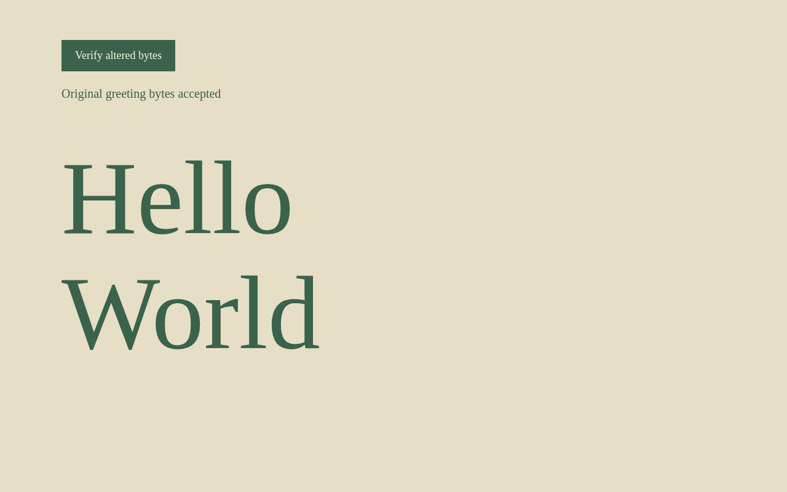](v2/sol-6.1/067/067.html) | [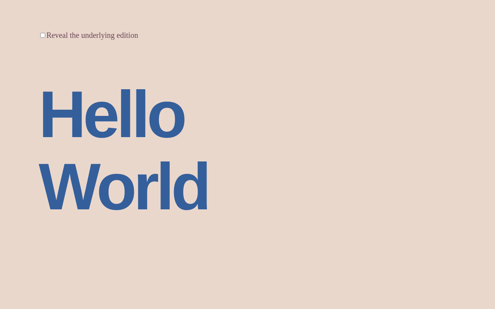](v2/sol-6.1/068/068.html) |  |
| :---: | :---: | :---: |
| **067 — 067 — Signed Ink** [Demo](v2/sol-6.1/067/067.html) · [Report](v2/sol-6.1/067/report.md) · [Journal](v2/sol-6.1/067/journal.md) | **068 — 068 — Underprint** [Demo](v2/sol-6.1/068/068.html) · [Report](v2/sol-6.1/068/report.md) · [Journal](v2/sol-6.1/068/journal.md) | **069 — 069 — Compact Spine** [Demo](v2/sol-6.1/069/069.html) · [Report](v2/sol-6.1/069/report.md) · [Journal](v2/sol-6.1/069/journal.md) |

| [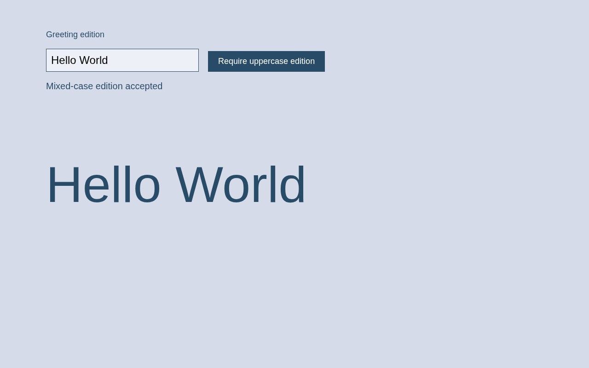](v2/sol-6.1/070/070.html) | [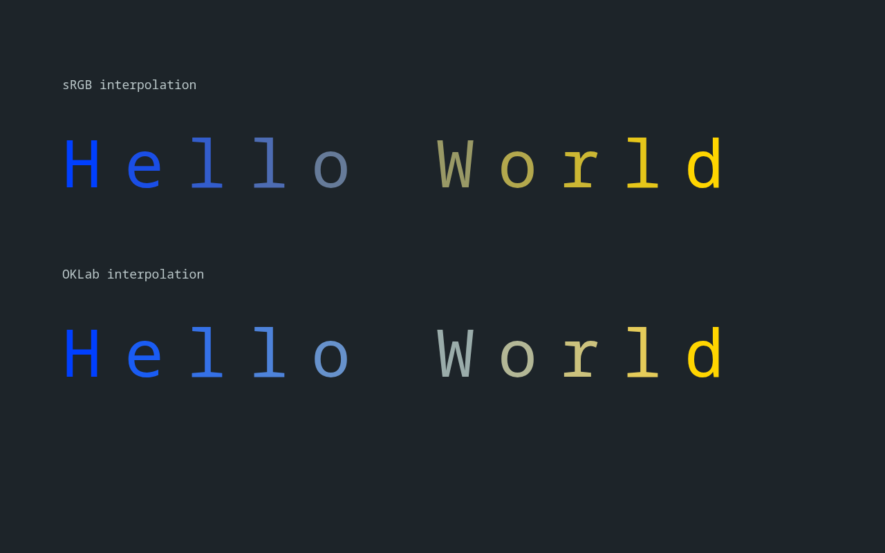](v2/sol-6.1/071/071.html) |  |
| :---: | :---: | :---: |
| **070 — 070 — Edition Gate** [Demo](v2/sol-6.1/070/070.html) · [Report](v2/sol-6.1/070/report.md) · [Journal](v2/sol-6.1/070/journal.md) | **071 — 071 — Two Color Paths** [Demo](v2/sol-6.1/071/071.html) · [Report](v2/sol-6.1/071/report.md) · [Journal](v2/sol-6.1/071/journal.md) | **072 — 072 — Rocking Inscription** [Demo](v2/sol-6.1/072/072.html) · [Report](v2/sol-6.1/072/report.md) · [Journal](v2/sol-6.1/072/journal.md) |

|  | [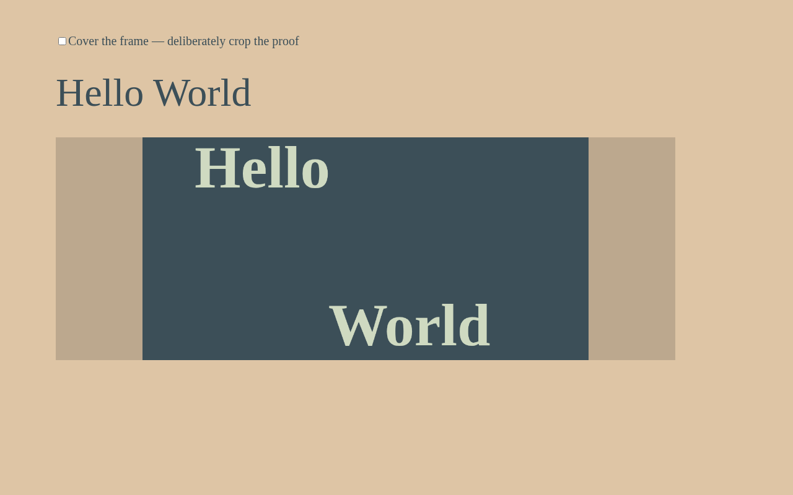](v2/sol-6.1/074/074.html) | [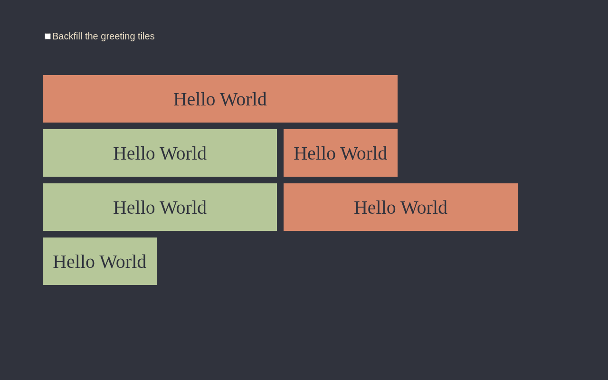](v2/sol-6.1/075/075.html) |
| :---: | :---: | :---: |
| **073 — 073 — Added Motion** [Demo](v2/sol-6.1/073/073.html) · [Report](v2/sol-6.1/073/report.md) · [Journal](v2/sol-6.1/073/journal.md) | **074 — 074 — Fit the Proof** [Demo](v2/sol-6.1/074/074.html) · [Report](v2/sol-6.1/074/report.md) · [Journal](v2/sol-6.1/074/journal.md) | **075 — 075 — Backfill** [Demo](v2/sol-6.1/075/075.html) · [Report](v2/sol-6.1/075/report.md) · [Journal](v2/sol-6.1/075/journal.md) |

