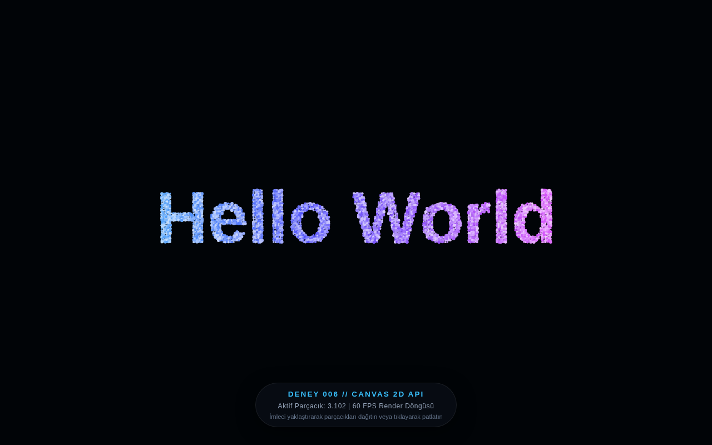

# Deney 006 Raporu: Canvas 2D API ve İnteraktif Parçacık Tipografisi

## 1. Deney Özeti
- **Deney No:** 006
- **Teknoloji:** HTML5 Canvas 2D API (`<canvas>`, `CanvasRenderingContext2D`, `requestAnimationFrame`, `getImageData`, parçacık fiziği)
- **Tarih:** 2026-09-29
- **Durum:** Tamamlandı (PASS)
- **Dosya:** [`src/006.html`](file:///home/duldul/Belgeler/hw_lab/src/006.html)

---

## 2. Hipotez ve Amaç
Vektörel SVG çizimlerinden sonra tarayıcının piksel manipülasyonu ve yüksek performanslı raster çizim yeteneklerini laboratuvara kazandırmak. "Hello World" metnini offscreen canvas üzerinde rasterize edip alfa piksellerini tarayarak her birini bağımsız fiziksel parçacık nesnesine dönüştürmek; ekran yenileme hızında (60+ FPS) akıcı, ışıltılı, imlece duyarlı bir kinetik tipografi sistemi inşa etmek.

---

## 3. Mimari ve Uygulama Detayları
- **Offscreen Piksel Örnekleme (`getImageData`):** Görünmez bir yardımcı tuvalde ekran genişliğine orantılı (örneğin 110px) kalın fontla "Hello World" çizilmiş; piksel alfa değerleri 3px ızgara adımıyla taranarak 3.102 adet aktif parçacık koordinatı elde edilmiştir.
- **Fizik Simülasyonu (Spring & Friction):** Her parçacık için hedef harf koordinatına (`originX`, `originY`) doğru yaylanma kuvveti (`spring = 0.05`), hız sönümleme (`friction = 0.88`) ve parıltılı canlılık katan mikro salınım (`wobblePhase`) hesaplanmaktadır.
- **İmleç İtme Alanı ve Patlama:** İmleç yaklaştığında parçacıklar ters orantılı itme kuvvetiyle savrulmakta, imleç uzaklaştığında elastik şekilde harf formuna geri toplanmaktadır. Fare tıklamasıyla radyal şok dalgası üretilir.
- **Zarif Hareket İzi:** `renderFrame` döngüsünde `ctx.fillStyle = 'rgba(5, 6, 11, 0.28)'` ile yapılan temizleme, parçacıkların arkasında zarif bir ışıltı ve hareket kuyruğu (motion blur trail) bırakır.
- **Erişilebilirlik ve Semantik:** `<canvas role="img" aria-label="Hello World İnteraktif Parçacık Tipografisi">Hello World</canvas>` yapısıyla hem ekran okuyucular hem de grafik desteği olmayan ortamlar için Hello World içeriği anlamsal olarak korunmuştur.

---

## 4. Test ve Doğrulama Bulguları

Çok kanallı doğrulama zinciri icra edilmiş ve tüm kategoriler başarıyla geçmiştir:

```
[SYNTAX]                PASS (validate.sh - HTML5 & JS V8 sözdizimi geçerli)
[DEPENDENCY]            PASS (dependency-check.sh - Sıfır harici istek/CDN)
[DOM_VISIBILITY]        PASS (canvas 1280x713px, semantik Hello World mevcut)
[GRAPHICS_RENDER]       PASS (Canvas 2D: Anlamlı piksel çizimi doğrulandı)
[VISUAL_REVIEW]         PASS (3.102 parçacıkla net, parıldayan Hello World tipografisi)
[RUNTIME]               PASS (Sıfır konsol hatası, istikrarlı 60 FPS)
[NETWORK]               PASS (Sıfır yetkisiz ağ transferi)
[PERMISSIONS]           PASS (İzin gerektirmeyen tamamen yerleşik API)
[NEW_TECHNOLOGY_ACTIVE] PASS (CanvasRenderingContext2D ve requestAnimationFrame aktif)
```

---

## 5. Ekran Görüntüsü ve Görsel İnceleme



Ekran görüntüsünde görüldüğü üzere:
- Camgöbeğinden macentaya uzanan spektral renk gradyanı ile 3.102 adet ışıltılı parçacık, "Hello World" harflerini son derece net, okunaklı ve estetik biçimde oluşturmaktadır.
- Alt kısımda deney telemetrisini ve etkileşim talimatını sunan modern HUD göstergesi yer almaktadır.
