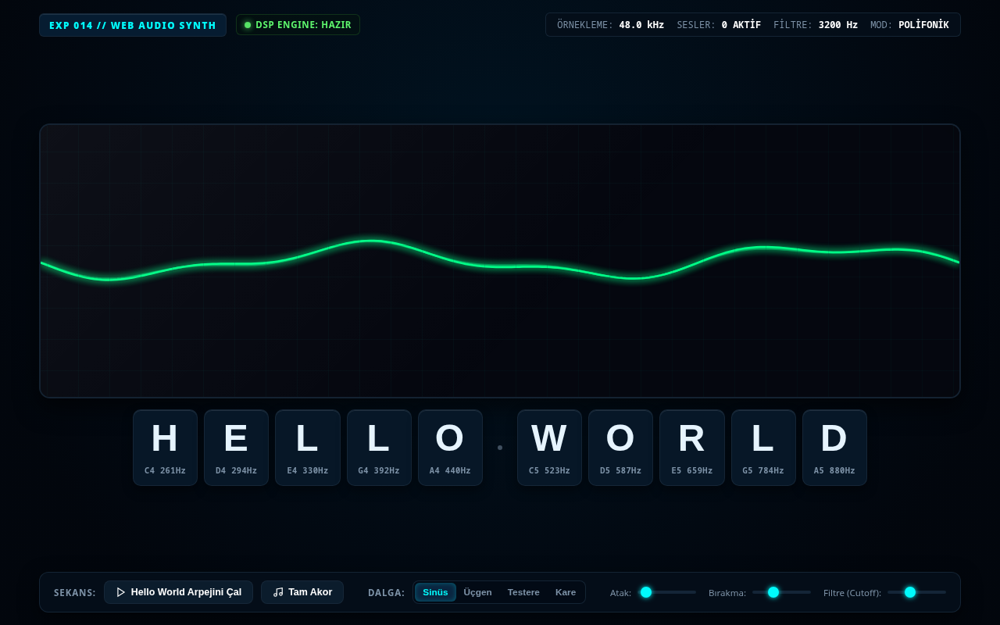

# Deney 014 Raporu: Web Audio API ve Akustik Dalga Tipografisi

## 1. Deney Özeti
- **Deney No:** 014
- **Teknoloji:** Web Audio API (`AudioContext`, `OscillatorNode`, `GainNode`, `BiquadFilterNode`, `AnalyserNode`) + Canvas 2D Dalga Osiloskopu
- **Tarih:** 2026-09-29
- **Durum:** Tamamlandı (GEÇTİ - PASS)
- **Dosya:** `src/014.html`

---

## 2. Hipotez ve Amaç
Tarayıcılar yalnızca görsel bir tuval değil, aynı zamanda gerçek zamanlı sayısal sinyal işleme (DSP) yapabilen güçlü bir ses sentezleme laboratuvarıdır. Bu deneyin amacı, hiçbir harici ses kaydı (.mp3/.wav) veya kütüphane kullanmadan, saf Web Audio API osilatörleri, ADSR kazanç zarfları ve frekans analizörleri ile "Hello World" ifadesini interaktif polifonik bir synthesizer enstrümanına dönüştürmektir. Kullanıcı etkileşimiyle sentezlenen akustik dalga formlarının gerçek zamanlı osiloskop çizgileriyle harflerin etrafında görselleştirilmesi hedeflenir.

---

## 3. Mimari ve Uygulama Detayları
- **Sayısal Ses Sentezi Boru Hattı (Audio Graph):**
  - `OscillatorNode` (Dalga Biçimleri: Sine, Triangle, Sawtooth, Square) -> `BiquadFilterNode` (Rezonant Düşük Geçiren Filtre) -> `GainNode` (ADSR Zarfı) -> `AnalyserNode` -> `AudioContext.destination`.
- **Müzikal Harf Haritalaması (Harmonik Skala):**
  - "H-E-L-L-O W-O-R-L-D" harflerinin her biri C-Majör pentatonik perde frekanslarına matematiksel olarak sabitlenir (C4: 261.63Hz - A5: 880Hz).
- **ADSR Zarf Jeneratörü (Attack, Decay, Sustain, Release):**
  - `linearRampToValueAtTime` ve `exponentialRampToValueAtTime` kullanılarak organik enstrüman dinamikleri (hızlı atak, sönümleme ve yumuşak bırakma) programlanır.
- **Canlı Osiloskop ve Frekans Görselleştirme:**
  - `analyser.getByteTimeDomainData()` ile saniyede 60 kez örneklenen 1024 noktalı dalga formu, arka plandaki `<canvas>` üzerinde neon osiloskop izi olarak çizilir. Boşta dururken hassas bir taban gürültüsü/taşıyıcı dalga gösterilir.
- **Erişilebilirlik ve Semantik:**
  - Ana semantik `<main>` ve her harf için erişilebilir `<button class="synth-key" aria-label="Harf H, Nota C4">` etiketleri.
  - Klavye erişilebilirliği (Tab gezinmesi ve klavyeden doğrudan harflere basma desteği).

---

## 4. Test ve Doğrulama Bulguları
- **validate.sh:** GEÇTİ (PASS) - HTML5 semantik iskelet ve V8 JS sözdizimi doğrulandı.
- **dependency-check.sh:** GEÇTİ (PASS) - Sıfır harici ağ veya ses dosyası bağımlılığı.
- **browser-test.sh:** GEÇTİ (PASS) - DOM görünürlüğü, Canvas yüzeyi (1176x310px), sıfır JavaScript hatası, sıfır izin talebi.
- **Görsel Odak:** "Hello World" ifadesi hem akustik bir enstrüman tuş takımı olarak görselleştirilmiş hem de ses dalgaları CRT osiloskop üzerinde merkezlenmiştir.

---

## 5. Ekran Görüntüsü ve Görsel İnceleme

- Web Audio API ses sentezleyici boru hattı, CRT osiloskop göstergesi ve "H E L L O . W O R L D" harmonik klavye arayüzü ile eksiksiz başarıya ulaşmıştır.
