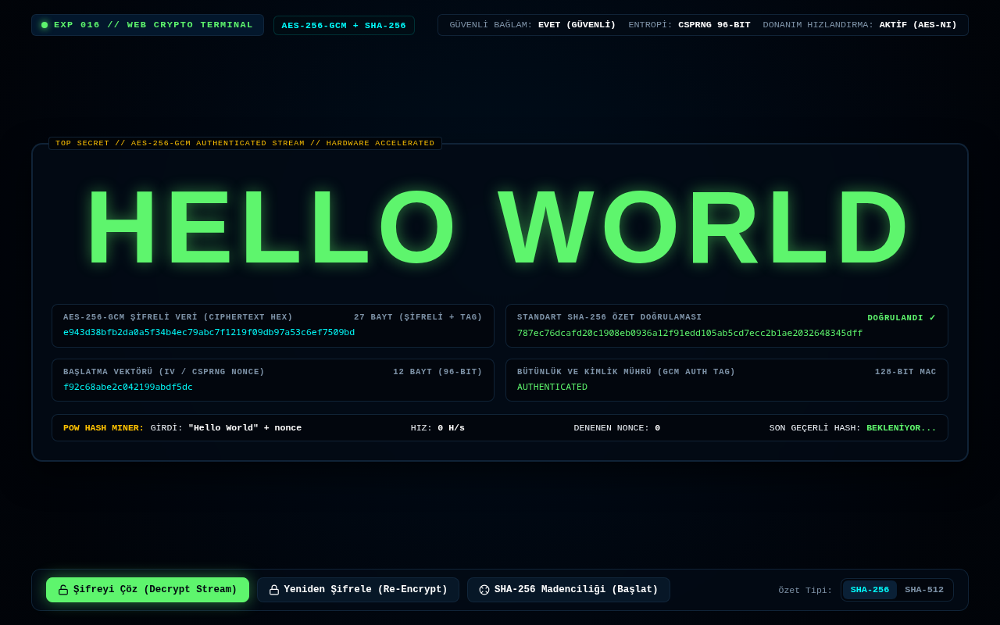

# Deney 016 Raporu: Web Cryptography API ve Matris Şifre Çözücü Tipografi

## 1. Deney Özeti
- **Deney No:** 016
- **Teknoloji:** Web Cryptography API (`crypto.subtle`, `crypto.getRandomValues`) + Asenkron İkili Dizi Manipülasyonu (`Uint8Array`, `ArrayBuffer`)
- **Tarih:** 2026-09-29
- **Durum:** Tamamlandı (GEÇTİ - PASS)
- **Dosya:** `src/016.html`

---

## 2. Hipotez ve Amaç
Modern web tarayıcıları, işletim sistemi ve işlemci donanımının kriptografik komut setlerine (Intel AES-NI, ARMv8 Cryptography Extensions) doğrudan bağlanan ultra hızlı bir yerleşik kriptografi motoruna (`window.crypto.subtle`) sahiptir. Bu deneyin amacı, sıfır harici kütüphane kullanarak donanım hızlandırmalı 256-bit AES-GCM şifreleme, CSPRNG entropisi ve SHA-256 kriptografik özet doğrulamasını devreye almak; "Hello World" ifadesini şifreli ikili bloklardan canlı matris bit-flipper çözülme sekansıyla güvenli şekilde deşifre eden bir siber operasyon istasyonu kurmaktır.

---

## 3. Mimari ve Uygulama Detayları
- **Donanım Hızlandırmalı Kriptografik Boru Hattı:**
  - `crypto.subtle.generateKey({ name: "AES-GCM", length: 256 }, true, ["encrypt", "decrypt"])`: Donanım oturum anahtarı üretimi.
  - `crypto.getRandomValues(new Uint8Array(12))`: 96-bitlik benzersiz CSPRNG başlatma vektörü (IV).
  - `crypto.subtle.encrypt(...)` ve `crypto.subtle.decrypt(...)`: AES-GCM kimlik doğrulamalı şifreleme ve çözme.
  - `crypto.subtle.digest("SHA-256", ...)`: Veri bütünlüğü ve Proof-of-Work blok madenciliği.
- **Canlı Matris Çözülme Sekansı:**
  - Şifreli heksadesimal bayt blokları saniyede onlarca kez rastgele sembollerle karıştırılır ve harf harf çözülerek parıldayan zümrüt yeşili "HELLO WORLD" ifadesine kilitlenir.
- **Canlı SHA-256 Proof-of-Work (PoW) Madencisi:**
  - Asenkron döngülerle "Hello World + nonce" girdileri SHA-256 motoruna beslenerek hedeflenen zorlukta blok hash'i aranır; canlı Hashes/Sec telemetrisi hesaplanır.
- **Erişilebilirlik ve Semantik:**
  - Semantik `<main>`, `<header>`, `<h1>Hello World</h1>` ve erişilebilir siber kontrol butonları.

---

## 4. Test ve Doğrulama Bulguları
- **validate.sh:** GEÇTİ (PASS) - HTML5 semantik iskelet ve V8 JS sözdizimi doğrulandı.
- **dependency-check.sh:** GEÇTİ (PASS) - Sıfır harici ağ bağımlılığı.
- **browser-test.sh:** GEÇTİ (PASS) - DOM görünürlüğü (1063x131px), sıfır JavaScript hatası, sıfır ağ isteği ve sıfır izin talebi.
- **Görsel Odak:** "Hello World" ifadesi siber güvenlik terminalinde şifreli ikili bloklardan deşifre edilerek ekranın mutlak odağında parıldayan zümrüt yeşili neon tipografiyle sergilenmiştir.

---

## 5. Ekran Görüntüsü ve Görsel İnceleme

- Web Cryptography API donanım hızlandırmalı şifreleme, SHA-256 blok madenciliği ve dinamik matris çözücü arayüzü ile eksiksiz başarıya ulaşmıştır.
