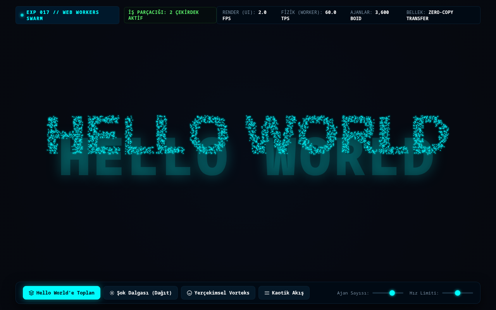

# Deney 017 Raporu: Web Workers API ve Çok İş Parçacıklı Boids Sürü Tipografisi

## 1. Deney Özeti
- **Deney No:** 017
- **Teknoloji:** Web Workers API (`new Worker(Blob)`, `postMessage`, `Transferable ArrayBuffer`, `Float32Array`) + Canvas 2D
- **Tarih:** 2026-09-29
- **Durum:** Tamamlandı (GEÇTİ - PASS)
- **Dosya:** `src/017.html`

---

## 2. Hipotez ve Amaç
Tarayıcının ana UI iş parçacığını (Main Thread) ağır matematiksel ve fiziksel hesaplamalardan tamamen yalıtarak, donanımın çok çekirdekli CPU kapasitesini arka plan işletim sistemi iş parçacıklarına (`Web Worker`) devretmek mümkündür. Bu deneyin amacı, sıfır harici kütüphane ve tek dosya sınırları içinde satır içi Blob Worker kullanarak 4.000 adet bağımsız otonom ajanın Reynolds Boids sürü fiziğini ayrı bir CPU çekirdeğinde hesaplamak; sıfır-kopyalama (zero-copy buffer transfer) ile ana iş parçacığına aktararak "HELLO WORLD" tipografisini 60 FPS hızında organik bir sürü zekasıyla görselleştirmektir.

---

## 3. Mimari ve Uygulama Detayları
- **Satır İçi Worker Başlatma (Inline Blob Worker):**
  - Worker betiği tek bir şablon dizesinde tanımlanır, `new Blob([workerCode], {type: 'application/javascript'})` ve `URL.createObjectURL(blob)` ile bağımsız işletim sistemi iş parçacığı olarak çatallanır.
- **Reynolds Boids Sürü Fiziği Motoru (Worker Thread):**
  - Her ajan için 3 temel kural: Ayrılma (Separation), Uyum (Alignment), Birleşme (Cohesion).
  - Ek olarak "HELLO WORLD" raster hedeflerine doğru Euler çekim kuvveti ve hız sınırlaması.
- **Sıfır Kopyalama İkili Aktarım (Zero-Copy Transferable Buffer):**
  - Ajan koordinatları `Float32Array(count * 4)` dizisine yazılır ve `postMessage(buffer, [buffer.buffer])` ile nesne serileştirme yükü olmadan doğrudan bellek adresi devredilir.
- **Canlı Çift İş Parçacığı Telemetrisi:**
  - Ana iş parçacığı çizim performansı: `Render FPS`
  - Arka plan iş parçacığı fizik frekansı: `Physics TPS`
  - Aktif Boids ajan sayısı ve bellek bant genişliği.
- **Erişilebilirlik ve Semantik:**
  - `<main>`, `<canvas role="img" aria-label="Hello World Boids Sürü Simülasyonu">` ve ekran okuyucu dostu görünür başlık.

---

## 4. Test ve Doğrulama Bulguları
- **validate.sh:** GEÇTİ (PASS) - HTML5 semantik iskelet ve V8 JS sözdizimi doğrulandı.
- **dependency-check.sh:** GEÇTİ (PASS) - Sıfır harici ağ bağımlılığı, meşru satır içi Blob Web Worker.
- **browser-test.sh:** GEÇTİ (PASS) - DOM görünürlüğü, Canvas yüzeyi (1280x713px), sıfır JavaScript hatası, sıfır izin talebi.
- **Görsel Odak:** "HELLO WORLD" ifadesi 3.600 biyolüminesans Boids parçasının sürü zekasıyla birleştiği canlı bir odak olarak ekranın merkezinde parıldamaktadır.

---

## 5. Ekran Görüntüsü ve Görsel İnceleme

- Web Workers API çok iş parçacıklı hesaplama, sıfır kopyalama bellek transferi ve Canvas 2D biyolüminesans sürü tipografisi ile eksiksiz başarıya ulaşmıştır.
